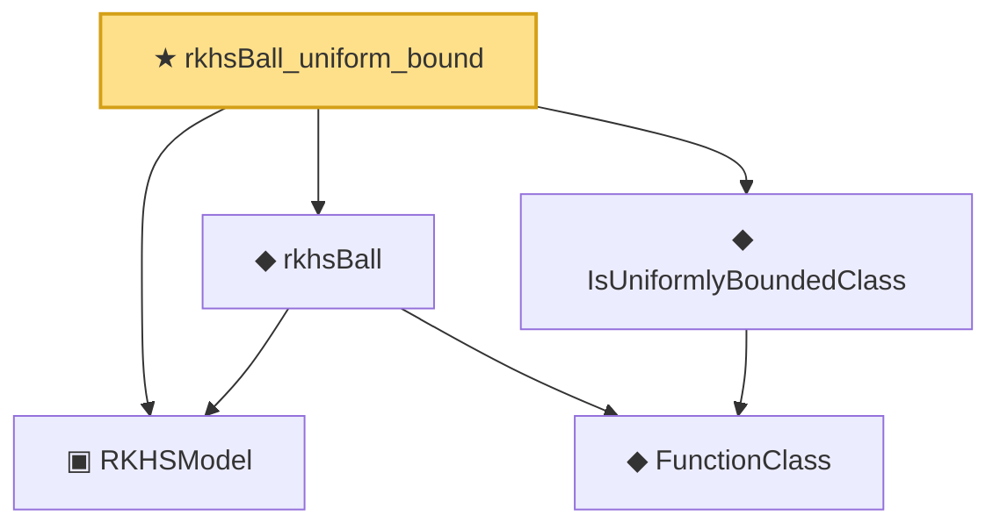

# Proof narrative — rkhsBall_uniform_bound

Root: **rkhsBall_uniform_bound** (theorem) `Statlib/Nonparametric/Approximation/RKHS.lean:20` · topic `Nonparametric`
Closure: 5 declarations across 3 files. Generated from `proof_graph.json` — no files were moved.

Reading order (foundations first, headline last):

  ▣ `RKHSModel` — structure · `Statlib/Nonparametric/Vocabulary/RKHS.lean:15`  _(also used by 6: rkhs_eval_bound, rkhsBall_lipschitz, rkhsBall_classApproximationError_le_of_exists, …)_
    ◆ `FunctionClass` — abbrev · `Statlib/Nonparametric/Vocabulary/FunctionClasses.lean:16`  _(also used by 20: holder_classApproximationError_le_of_net_member, kernel_smoother_classApproximationError_le_of_holder_bias_member, kernel_smoother_classApproximationError_le_of_holder_bias_rate, …)_
  ◆ `IsUniformlyBoundedClass` — def · `Statlib/Nonparametric/Vocabulary/FunctionClasses.lean:32`
  ◆ `rkhsBall` — def · `Statlib/Nonparametric/Vocabulary/RKHS.lean:23`  _(also used by 4: rkhsBall_lipschitz, rkhsBall_classApproximationError_le_of_exists, rkhsBall_classApproximationError_le_of_pointwise_candidate, …)_
★ `rkhsBall_uniform_bound` — theorem · `Statlib/Nonparametric/Approximation/RKHS.lean:20` **← headline**

## Dependency diagram

