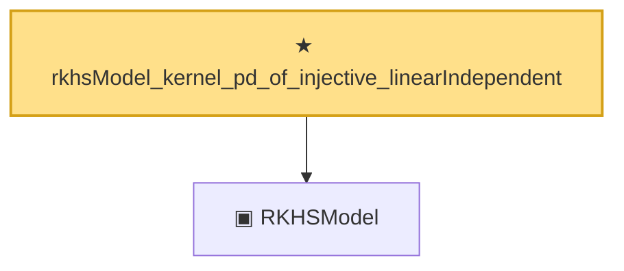

# Proof narrative — rkhsModel_kernel_pd_of_injective_linearIndependent

Root: **rkhsModel_kernel_pd_of_injective_linearIndependent** (theorem) `Statlib/Nonparametric/Vocabulary/RKHS.lean:81` · topic `Nonparametric`
Closure: 2 declarations across 1 files. Generated from `proof_graph.json` — no files were moved.

Reading order (foundations first, headline last):

  ▣ `RKHSModel` — structure · `Statlib/Nonparametric/Vocabulary/RKHS.lean:16`  _(also used by 29: rkhs_eval_bound, rkhsBall_uniform_bound, rkhsBall_lipschitz, …)_
★ `rkhsModel_kernel_pd_of_injective_linearIndependent` — theorem · `Statlib/Nonparametric/Vocabulary/RKHS.lean:81` **← headline**

## Dependency diagram

