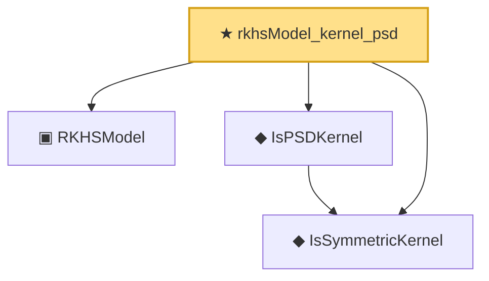

# Proof narrative — rkhsModel_kernel_psd

Root: **rkhsModel_kernel_psd** (theorem) `Statlib/Nonparametric/Vocabulary/RKHS.lean:51` · topic `Nonparametric`
Closure: 4 declarations across 2 files. Generated from `proof_graph.json` — no files were moved.

Reading order (foundations first, headline last):

  ▣ `RKHSModel` — structure · `Statlib/Nonparametric/Vocabulary/RKHS.lean:16`  _(also used by 29: rkhs_eval_bound, rkhsBall_uniform_bound, rkhsBall_lipschitz, …)_
  ◆ `IsSymmetricKernel` — def · `Statlib/Nonparametric/Vocabulary/KernelMethods.lean:17`  _(also used by 2: IsPDKernel, rkhsModel_kernel_symm)_
  ◆ `IsPSDKernel` — def · `Statlib/Nonparametric/Vocabulary/KernelMethods.lean:23`
★ `rkhsModel_kernel_psd` — theorem · `Statlib/Nonparametric/Vocabulary/RKHS.lean:51` **← headline**

## Dependency diagram

