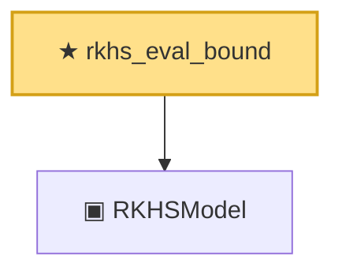

# Proof narrative — rkhs_eval_bound

Root: **rkhs_eval_bound** (theorem) `Statlib/Nonparametric/Approximation/RKHS.lean:14` · topic `Nonparametric`
Closure: 2 declarations across 2 files. Generated from `proof_graph.json` — no files were moved.

Reading order (foundations first, headline last):

  ▣ `RKHSModel` — structure · `Statlib/Nonparametric/Vocabulary/RKHS.lean:15`  _(also used by 7: rkhsBall_uniform_bound, rkhsBall_lipschitz, rkhsBall_classApproximationError_le_of_exists, …)_
★ `rkhs_eval_bound` — theorem · `Statlib/Nonparametric/Approximation/RKHS.lean:14` **← headline**

## Dependency diagram

