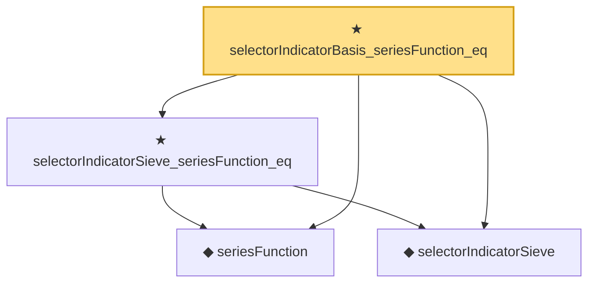

# Proof narrative — selectorIndicatorBasis_seriesFunction_eq

Root: **selectorIndicatorBasis_seriesFunction_eq** (theorem) `Statlib/Nonparametric/Approximation/Sieve.lean:436` · topic `Nonparametric`
Closure: 4 declarations across 2 files. Generated from `proof_graph.json` — no files were moved.

Reading order (foundations first, headline last):

  ◆ `seriesFunction` — noncomputable def · `Statlib/Nonparametric/Vocabulary/Sieve.lean:27`  _(also used by 38: holder_selectorIndicator_series_pointwise_bound, holder_selectorIndicator_series_integratedSquaredError_bound, finiteLinearSpan_classApproximationError_le_of_holder_selector_net, …)_
  ◆ `selectorIndicatorSieve` — def · `Statlib/Nonparametric/Approximation/Sieve.lean:401`  _(also used by 14: holder_selectorIndicator_series_pointwise_bound, holder_selectorIndicator_series_integratedSquaredError_bound, finiteLinearSpan_classApproximationError_le_of_holder_selector_net, …)_
  ★ `selectorIndicatorSieve_seriesFunction_eq` — theorem · `Statlib/Nonparametric/Approximation/Sieve.lean:428`  _(also used by 3: holder_selectorIndicator_series_pointwise_bound, finiteLinearSpan_classApproximationError_le_of_holder_selector_net, sieveApproximationError_le_of_holder_selector_net)_
★ `selectorIndicatorBasis_seriesFunction_eq` — theorem · `Statlib/Nonparametric/Approximation/Sieve.lean:436` **← headline**

## Dependency diagram

