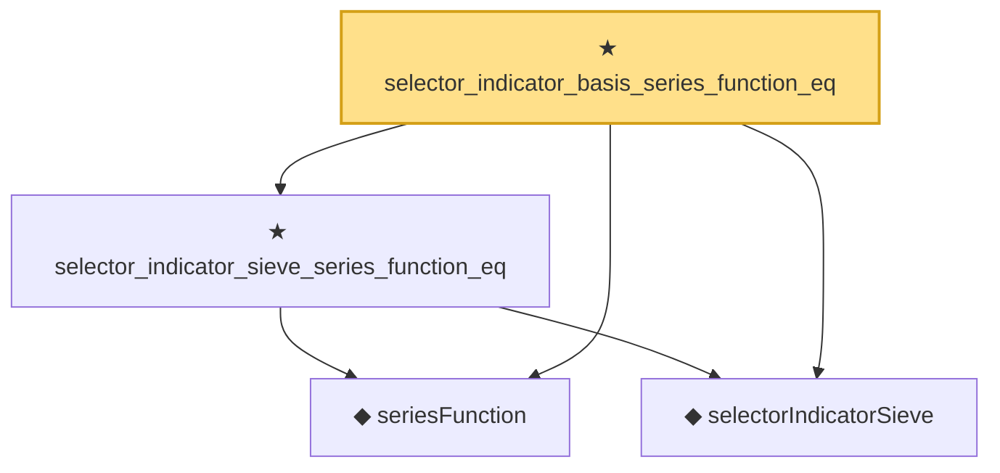

# Proof narrative — selector_indicator_basis_series_function_eq

Root: **selector_indicator_basis_series_function_eq** (theorem) `Statlib/Nonparametric/Approximation/Sieve.lean:494` · topic `Nonparametric`
Closure: 4 declarations across 2 files. Generated from `proof_graph.json` — no files were moved.

Reading order (foundations first, headline last):

  ◆ `seriesFunction` — noncomputable def · `Statlib/Nonparametric/Vocabulary/Sieve.lean:27`  _(also used by 67: selector_indicator_holder_series_pointwise_approximation_bound, selector_indicator_holder_series_integrated_squared_error_bound, selector_indicator_holder_class_approximation_error_le_of_net, …)_
  ◆ `selectorIndicatorSieve` — def · `Statlib/Nonparametric/Approximation/Sieve.lean:459`  _(also used by 16: selector_indicator_holder_series_pointwise_approximation_bound, selector_indicator_holder_series_integrated_squared_error_bound, selector_indicator_holder_class_approximation_error_le_of_net, …)_
  ★ `selector_indicator_sieve_series_function_eq` — theorem · `Statlib/Nonparametric/Approximation/Sieve.lean:486`  _(also used by 4: selector_indicator_holder_series_pointwise_approximation_bound, selector_indicator_holder_class_approximation_error_le_of_net, selector_indicator_holder_sieve_approximation_error_le_of_net, …)_
★ `selector_indicator_basis_series_function_eq` — theorem · `Statlib/Nonparametric/Approximation/Sieve.lean:494` **← headline**

## Dependency diagram

