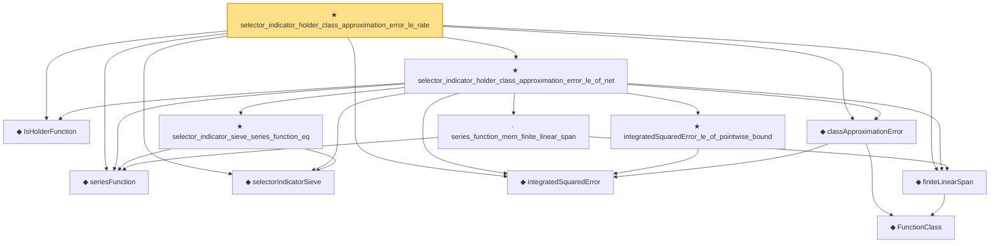

# Proof narrative — selector_indicator_holder_class_approximation_error_le_rate

Root: **selector_indicator_holder_class_approximation_error_le_rate** (theorem) `Statlib/Nonparametric/Approximation/Holder.lean:522` · topic `Nonparametric`
Closure: 12 declarations across 6 files. Generated from `proof_graph.json` — no files were moved.

Reading order (foundations first, headline last):

  ◆ `IsHolderFunction` — def · `Statlib/Nonparametric/Vocabulary/FunctionClasses.lean:44`  _(also used by 21: holder_net_sup_approximation_bound, holder_net_integrated_squared_error_bound, holder_class_approximation_error_le_of_net_member, …)_
  ◆ `seriesFunction` — noncomputable def · `Statlib/Nonparametric/Vocabulary/Sieve.lean:27`  _(also used by 65: selector_indicator_holder_series_pointwise_approximation_bound, selector_indicator_holder_series_integrated_squared_error_bound, selector_indicator_holder_sieve_approximation_error_le_of_net, …)_
  ◆ `selectorIndicatorSieve` — def · `Statlib/Nonparametric/Approximation/Sieve.lean:459`  _(also used by 15: selector_indicator_holder_series_pointwise_approximation_bound, selector_indicator_holder_series_integrated_squared_error_bound, selector_indicator_holder_sieve_approximation_error_le_of_net, …)_
  ◆ `integratedSquaredError` — noncomputable def · `Statlib/Nonparametric/Vocabulary/Risk.lean:60`  _(also used by 31: supNormBall_classApproximationError_self_le_zero, holder_net_integrated_squared_error_bound, holder_class_approximation_error_le_of_net_member, …)_
    ◆ `FunctionClass` — abbrev · `Statlib/Nonparametric/Vocabulary/FunctionClasses.lean:16`  _(also used by 23: holder_class_approximation_error_le_of_net_member, kernel_smoother_classApproximationError_le_of_holder_bias_member, kernel_smoother_classApproximationError_le_of_holder_bias_rate, …)_
  ◆ `finiteLinearSpan` — noncomputable def · `Statlib/Nonparametric/Vocabulary/Sieve.lean:23`  _(also used by 8: finite_linear_span_class_approximation_error_le_of_coefficients, finite_linear_span_class_approximation_error_le_of_pointwise_series_approximation, finite_linear_span_class_approximation_error_le_of_exists_pointwise_series_approximation, …)_
  ◆ `classApproximationError` — noncomputable def · `Statlib/Nonparametric/Vocabulary/Risk.lean:75`  _(also used by 20: supNormBall_classApproximationError_self_le_zero, holder_class_approximation_error_le_of_net_member, holder_ball_class_approximation_error_self_le_zero, …)_
    · `series_function_mem_finite_linear_span` — lemma · `Statlib/Nonparametric/Approximation/Sieve.lean:13`  _(also used by 5: finite_linear_span_class_approximation_error_le_of_coefficients, finite_linear_span_class_approximation_error_le_of_pointwise_series_approximation, finite_linear_span_class_approximation_error_le_of_exists_pointwise_series_approximation, …)_
    ★ `selector_indicator_sieve_series_function_eq` — theorem · `Statlib/Nonparametric/Approximation/Sieve.lean:486`  _(also used by 4: selector_indicator_holder_series_pointwise_approximation_bound, selector_indicator_holder_sieve_approximation_error_le_of_net, selector_indicator_basis_series_function_eq, …)_
    ★ `integratedSquaredError_le_of_pointwise_bound` — theorem · `Statlib/Nonparametric/Approximation/Metric.lean:10`  _(also used by 11: holder_net_integrated_squared_error_bound, holder_class_approximation_error_le_of_net_member, selector_indicator_holder_series_integrated_squared_error_bound, …)_
  ★ `selector_indicator_holder_class_approximation_error_le_of_net` — theorem · `Statlib/Nonparametric/Approximation/Holder.lean:172`
★ `selector_indicator_holder_class_approximation_error_le_rate` — theorem · `Statlib/Nonparametric/Approximation/Holder.lean:522` **← headline**

## Dependency diagram

