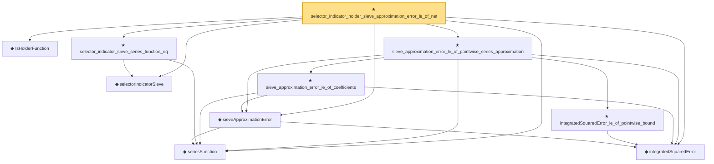

# Proof narrative — selector_indicator_holder_sieve_approximation_error_le_of_net

Root: **selector_indicator_holder_sieve_approximation_error_le_of_net** (theorem) `Statlib/Nonparametric/Approximation/Holder.lean:226` · topic `Nonparametric`
Closure: 10 declarations across 6 files. Generated from `proof_graph.json` — no files were moved.

Reading order (foundations first, headline last):

  ◆ `IsHolderFunction` — def · `Statlib/Nonparametric/Vocabulary/FunctionClasses.lean:44`  _(also used by 22: holder_net_sup_approximation_bound, holder_net_integrated_squared_error_bound, holder_class_approximation_error_le_of_net_member, …)_
  ◆ `seriesFunction` — noncomputable def · `Statlib/Nonparametric/Vocabulary/Sieve.lean:27`  _(also used by 64: selector_indicator_holder_series_pointwise_approximation_bound, selector_indicator_holder_series_integrated_squared_error_bound, selector_indicator_holder_class_approximation_error_le_of_net, …)_
  ◆ `selectorIndicatorSieve` — def · `Statlib/Nonparametric/Approximation/Sieve.lean:459`  _(also used by 16: selector_indicator_holder_series_pointwise_approximation_bound, selector_indicator_holder_series_integrated_squared_error_bound, selector_indicator_holder_class_approximation_error_le_of_net, …)_
  ◆ `integratedSquaredError` — noncomputable def · `Statlib/Nonparametric/Vocabulary/Risk.lean:60`  _(also used by 30: supNormBall_classApproximationError_self_le_zero, holder_net_integrated_squared_error_bound, holder_class_approximation_error_le_of_net_member, …)_
  ◆ `sieveApproximationError` — noncomputable def · `Statlib/Nonparametric/Vocabulary/Sieve.lean:42`  _(also used by 58: selector_indicator_uniform_sieve_holder_approximation_bound, exists_selector_indicator_sieve_holder_approximation_bound_of_finite_net, exists_selector_indicator_sieve_holder_approximation_bound_of_finite_measurable_cover, …)_
  ★ `selector_indicator_sieve_series_function_eq` — theorem · `Statlib/Nonparametric/Approximation/Sieve.lean:486`  _(also used by 4: selector_indicator_holder_series_pointwise_approximation_bound, selector_indicator_holder_class_approximation_error_le_of_net, selector_indicator_basis_series_function_eq, …)_
    ★ `integratedSquaredError_le_of_pointwise_bound` — theorem · `Statlib/Nonparametric/Approximation/Metric.lean:10`  _(also used by 11: holder_net_integrated_squared_error_bound, holder_class_approximation_error_le_of_net_member, selector_indicator_holder_series_integrated_squared_error_bound, …)_
    ★ `sieve_approximation_error_le_of_coefficients` — theorem · `Statlib/Nonparametric/Approximation/Sieve.lean:165`
  ★ `sieve_approximation_error_le_of_pointwise_series_approximation` — theorem · `Statlib/Nonparametric/Approximation/Sieve.lean:306`  _(also used by 3: sieve_approximation_error_le_of_exists_pointwise_series_approximation, unit_cube_bspline_sieve_approximation_error_bound_of_local_error, unit_cube_bspline_trace_uniform_sieve_holder_smooth_approximation_rate_of_projection)_
★ `selector_indicator_holder_sieve_approximation_error_le_of_net` — theorem · `Statlib/Nonparametric/Approximation/Holder.lean:226` **← headline**

## Dependency diagram

