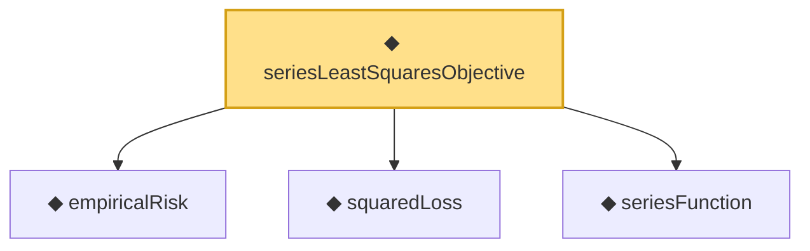

# Proof narrative — seriesLeastSquaresObjective

Root: **seriesLeastSquaresObjective** (noncomputable def) `Statlib/Nonparametric/Vocabulary/Sieve.lean:32` · topic `Nonparametric`
Closure: 4 declarations across 3 files. Generated from `proof_graph.json` — no files were moved.

Reading order (foundations first, headline last):

  ◆ `empiricalRisk` — noncomputable def · `Statlib/Nonparametric/Vocabulary/Risk.lean:29`  _(also used by 1: oneHiddenReLUEmpiricalRisk)_
  ◆ `squaredLoss` — def · `Statlib/Nonparametric/Vocabulary/Loss.lean:13`  _(also used by 2: oneHiddenReLUEmpiricalRisk, squaredPredictionRisk)_
  ◆ `seriesFunction` — noncomputable def · `Statlib/Nonparametric/Vocabulary/Sieve.lean:27`  _(also used by 39: holder_selectorIndicator_series_pointwise_bound, holder_selectorIndicator_series_integratedSquaredError_bound, finiteLinearSpan_classApproximationError_le_of_holder_selector_net, …)_
◆ `seriesLeastSquaresObjective` — noncomputable def · `Statlib/Nonparametric/Vocabulary/Sieve.lean:32` **← headline**

## Dependency diagram

