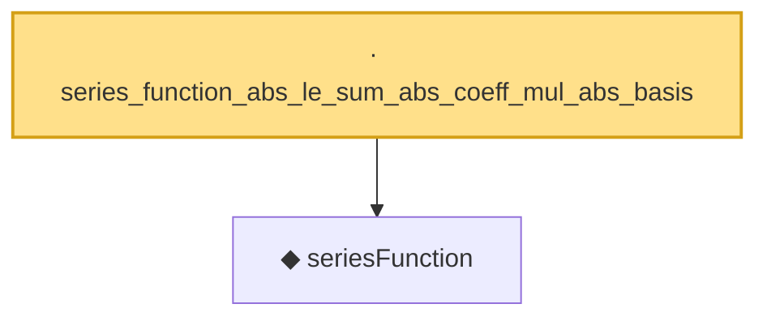

# Proof narrative — series_function_abs_le_sum_abs_coeff_mul_abs_basis

Root: **series_function_abs_le_sum_abs_coeff_mul_abs_basis** (lemma) `Statlib/Nonparametric/Approximation/Sieve.lean:18` · topic `Nonparametric`
Closure: 2 declarations across 2 files. Generated from `proof_graph.json` — no files were moved.

Reading order (foundations first, headline last):

  ◆ `seriesFunction` — noncomputable def · `Statlib/Nonparametric/Vocabulary/Sieve.lean:27`  _(also used by 68: selector_indicator_holder_series_pointwise_approximation_bound, selector_indicator_holder_series_integrated_squared_error_bound, selector_indicator_holder_class_approximation_error_le_of_net, …)_
· `series_function_abs_le_sum_abs_coeff_mul_abs_basis` — lemma · `Statlib/Nonparametric/Approximation/Sieve.lean:18` **← headline**

## Dependency diagram

