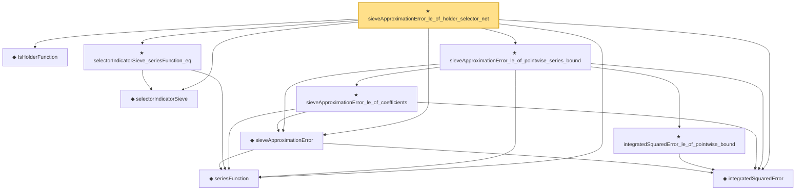

# Proof narrative — sieveApproximationError_le_of_holder_selector_net

Root: **sieveApproximationError_le_of_holder_selector_net** (theorem) `Statlib/Nonparametric/Approximation/Holder.lean:226` · topic `Nonparametric`
Closure: 10 declarations across 6 files. Generated from `proof_graph.json` — no files were moved.

Reading order (foundations first, headline last):

  ◆ `IsHolderFunction` — def · `Statlib/Nonparametric/Vocabulary/FunctionClasses.lean:44`  _(also used by 18: holder_net_approx_sup_bound, holder_net_integratedSquaredError_bound, holder_classApproximationError_le_of_net_member, …)_
  ◆ `seriesFunction` — noncomputable def · `Statlib/Nonparametric/Vocabulary/Sieve.lean:27`  _(also used by 35: holder_selectorIndicator_series_pointwise_bound, holder_selectorIndicator_series_integratedSquaredError_bound, finiteLinearSpan_classApproximationError_le_of_holder_selector_net, …)_
  ◆ `selectorIndicatorSieve` — def · `Statlib/Nonparametric/Approximation/Sieve.lean:401`  _(also used by 14: holder_selectorIndicator_series_pointwise_bound, holder_selectorIndicator_series_integratedSquaredError_bound, finiteLinearSpan_classApproximationError_le_of_holder_selector_net, …)_
  ◆ `integratedSquaredError` — noncomputable def · `Statlib/Nonparametric/Vocabulary/Risk.lean:60`  _(also used by 30: supNormBall_classApproximationError_self_le_zero, holder_net_integratedSquaredError_bound, holder_classApproximationError_le_of_net_member, …)_
  ◆ `sieveApproximationError` — noncomputable def · `Statlib/Nonparametric/Vocabulary/Sieve.lean:42`  _(also used by 24: holderBall_selectorIndicator_sieveApproximationError_uniform_bound, exists_selectorIndicatorSieve_for_holderBall_of_finite_net, exists_selectorIndicatorSieve_for_holderBall_of_finite_measurable_cover, …)_
  ★ `selectorIndicatorSieve_seriesFunction_eq` — theorem · `Statlib/Nonparametric/Approximation/Sieve.lean:428`  _(also used by 3: holder_selectorIndicator_series_pointwise_bound, finiteLinearSpan_classApproximationError_le_of_holder_selector_net, selectorIndicatorBasis_seriesFunction_eq)_
    ★ `integratedSquaredError_le_of_pointwise_bound` — theorem · `Statlib/Nonparametric/Approximation/Metric.lean:10`  _(also used by 11: holder_net_integratedSquaredError_bound, holder_classApproximationError_le_of_net_member, holder_selectorIndicator_series_integratedSquaredError_bound, …)_
    ★ `sieveApproximationError_le_of_coefficients` — theorem · `Statlib/Nonparametric/Approximation/Sieve.lean:107`
  ★ `sieveApproximationError_le_of_pointwise_series_bound` — theorem · `Statlib/Nonparametric/Approximation/Sieve.lean:248`  _(also used by 1: sieveApproximationError_le_of_exists_pointwise_series)_
★ `sieveApproximationError_le_of_holder_selector_net` — theorem · `Statlib/Nonparametric/Approximation/Holder.lean:226` **← headline**

## Dependency diagram

