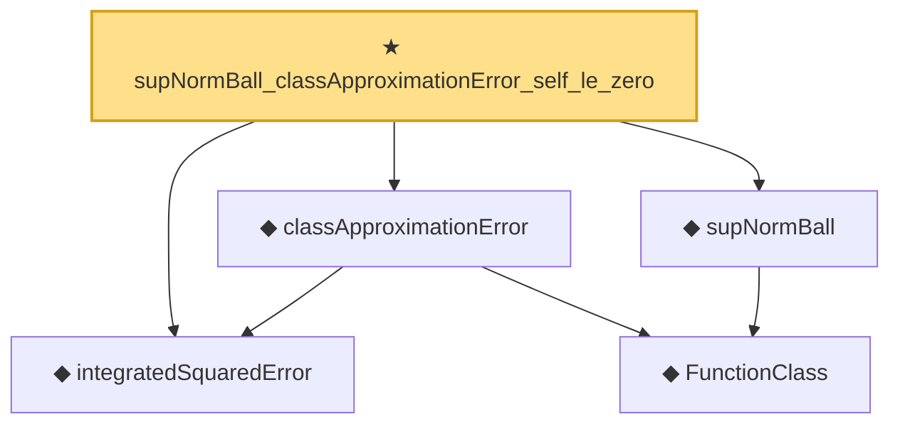

# Proof narrative — supNormBall_classApproximationError_self_le_zero

Root: **supNormBall_classApproximationError_self_le_zero** (theorem) `Statlib/Nonparametric/Approximation/FunctionClasses.lean:10` · topic `Nonparametric`
Closure: 5 declarations across 3 files. Generated from `proof_graph.json` — no files were moved.

Reading order (foundations first, headline last):

  ◆ `integratedSquaredError` — noncomputable def · `Statlib/Nonparametric/Vocabulary/Risk.lean:60`  _(also used by 33: holder_net_integratedSquaredError_bound, holder_classApproximationError_le_of_net_member, holderBall_classApproximationError_self_le_zero, …)_
    ◆ `FunctionClass` — abbrev · `Statlib/Nonparametric/Vocabulary/FunctionClasses.lean:16`  _(also used by 20: holder_classApproximationError_le_of_net_member, kernel_smoother_classApproximationError_le_of_holder_bias_member, kernel_smoother_classApproximationError_le_of_holder_bias_rate, …)_
  ◆ `supNormBall` — def · `Statlib/Nonparametric/Vocabulary/FunctionClasses.lean:52`
  ◆ `classApproximationError` — noncomputable def · `Statlib/Nonparametric/Vocabulary/Risk.lean:75`  _(also used by 21: holder_classApproximationError_le_of_net_member, holderBall_classApproximationError_self_le_zero, finiteLinearSpan_classApproximationError_le_of_holder_selector_net, …)_
★ `supNormBall_classApproximationError_self_le_zero` — theorem · `Statlib/Nonparametric/Approximation/FunctionClasses.lean:10` **← headline**

## Dependency diagram

