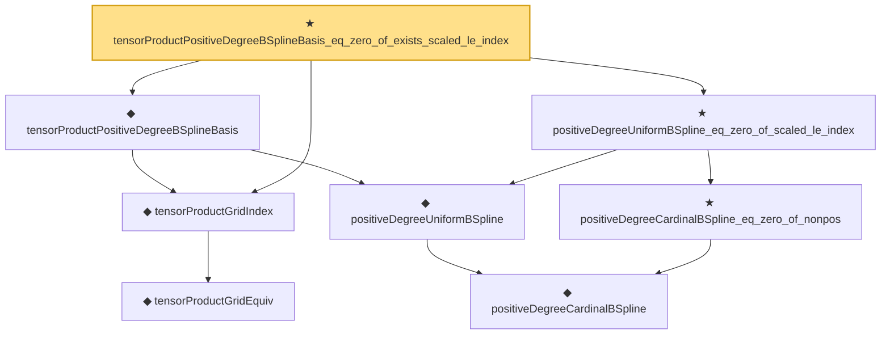

# Proof narrative — tensorProductPositiveDegreeBSplineBasis_eq_zero_of_exists_scaled_le_index

Root: **tensorProductPositiveDegreeBSplineBasis_eq_zero_of_exists_scaled_le_index** (theorem) `Statlib/Nonparametric/Approximation/SplineFacts.lean:298` · topic `Nonparametric`
Closure: 8 declarations across 2 files. Generated from `proof_graph.json` — no files were moved.

Reading order (foundations first, headline last):

    ◆ `tensorProductGridEquiv` — noncomputable def · `Statlib/Nonparametric/Vocabulary/Spline.lean:46`  _(also used by 9: unitCubePositiveDegreeExtendedBSplineBasis_linearIndependent_oneDim, sum_tensorProductPositiveDegreeExtendedBSplineBasis_eq_prod_sum, unitCubeBSplineTensorDual_polynomialReproduction, …)_
  ◆ `tensorProductGridIndex` — noncomputable def · `Statlib/Nonparametric/Vocabulary/Spline.lean:52`  _(also used by 21: tensorProductLinearBSplineBasis_continuous, tensorProductPositiveDegreeBSplineBasis_continuous, unitCubePositiveDegreeExtendedBSplineBasis_linearIndependent_oneDim, …)_
      ◆ `positiveDegreeCardinalBSpline` — noncomputable def · `Statlib/Nonparametric/Vocabulary/Spline.lean:82`  _(also used by 14: positiveDegreeCardinalBSpline_continuous, positiveDegreeCardinalBSpline_eq_zero_of_ge_degree_plus_two, positiveDegreeExtendedUniformBSpline_linearIndependent_on_Icc, …)_
    ◆ `positiveDegreeUniformBSpline` — noncomputable def · `Statlib/Nonparametric/Vocabulary/Spline.lean:89`  _(also used by 3: positiveDegreeUniformBSpline_continuous, tensorProductPositiveDegreeBSplineBasis_nonneg, tensorProductPositiveDegreeBSplineSystem)_
  ◆ `tensorProductPositiveDegreeBSplineBasis` — noncomputable def · `Statlib/Nonparametric/Vocabulary/Spline.lean:93`  _(also used by 5: tensor_product_positive_degree_bspline_holder_smooth_approximation_bound_of_projection_rate, tensor_product_positive_degree_bspline_holder_smooth_approximation_bound_of_projection_error, tensorProductPositiveDegreeBSplineBasis_continuous, …)_
    ★ `positiveDegreeCardinalBSpline_eq_zero_of_nonpos` — theorem · `Statlib/Nonparametric/Approximation/SplineFacts.lean:32`  _(also used by 6: positiveDegreeUniformBSplineIntShift_eq_zero_of_scaled_le_shift, tensorProductPositiveDegreeExtendedBSplineBasis_eq_zero_of_exists_scaled_le_shift, positiveDegreeCardinalBSpline_succ_eq_weighted_adjacent, …)_
  ★ `positiveDegreeUniformBSpline_eq_zero_of_scaled_le_index` — theorem · `Statlib/Nonparametric/Approximation/SplineFacts.lean:281`
★ `tensorProductPositiveDegreeBSplineBasis_eq_zero_of_exists_scaled_le_index` — theorem · `Statlib/Nonparametric/Approximation/SplineFacts.lean:298` **← headline**

## Dependency diagram

