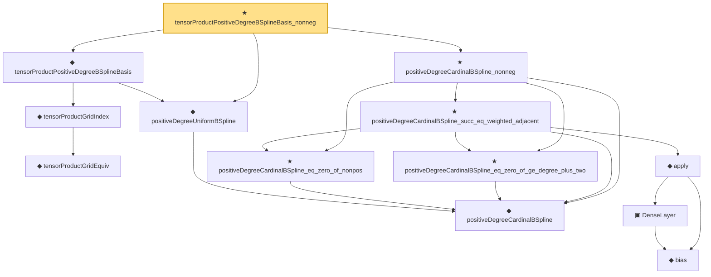

# Proof narrative — tensorProductPositiveDegreeBSplineBasis_nonneg

Root: **tensorProductPositiveDegreeBSplineBasis_nonneg** (theorem) `Statlib/Nonparametric/Approximation/SplineFacts.lean:1997` · topic `Nonparametric`
Closure: 13 declarations across 4 files. Generated from `proof_graph.json` — no files were moved.

Reading order (foundations first, headline last):

    ◆ `positiveDegreeCardinalBSpline` — noncomputable def · `Statlib/Nonparametric/Vocabulary/Spline.lean:82`  _(also used by 11: positiveDegreeCardinalBSpline_continuous, positiveDegreeExtendedUniformBSpline_linearIndependent_on_Icc, sum_positiveDegreeExtendedUniformBSpline_eq_one_of_mem_Icc, …)_
  ◆ `positiveDegreeUniformBSpline` — noncomputable def · `Statlib/Nonparametric/Vocabulary/Spline.lean:89`  _(also used by 3: positiveDegreeUniformBSpline_continuous, positiveDegreeUniformBSpline_eq_zero_of_scaled_le_index, tensorProductPositiveDegreeBSplineSystem)_
      ◆ `tensorProductGridEquiv` — noncomputable def · `Statlib/Nonparametric/Vocabulary/Spline.lean:46`  _(also used by 9: unitCubePositiveDegreeExtendedBSplineBasis_linearIndependent_oneDim, sum_tensorProductPositiveDegreeExtendedBSplineBasis_eq_prod_sum, unitCubeBSplineTensorDual_polynomialReproduction, …)_
    ◆ `tensorProductGridIndex` — noncomputable def · `Statlib/Nonparametric/Vocabulary/Spline.lean:52`  _(also used by 22: tensorProductLinearBSplineBasis_continuous, tensorProductPositiveDegreeBSplineBasis_continuous, tensorProductPositiveDegreeBSplineBasis_eq_zero_of_exists_scaled_le_index, …)_
  ◆ `tensorProductPositiveDegreeBSplineBasis` — noncomputable def · `Statlib/Nonparametric/Vocabulary/Spline.lean:93`  _(also used by 5: tensor_product_positive_degree_bspline_holder_smooth_approximation_bound_of_projection_rate, tensor_product_positive_degree_bspline_holder_smooth_approximation_bound_of_projection_error, tensorProductPositiveDegreeBSplineBasis_continuous, …)_
    ★ `positiveDegreeCardinalBSpline_eq_zero_of_nonpos` — theorem · `Statlib/Nonparametric/Approximation/SplineFacts.lean:32`  _(also used by 5: positiveDegreeUniformBSpline_eq_zero_of_scaled_le_index, positiveDegreeUniformBSplineIntShift_eq_zero_of_scaled_le_shift, tensorProductPositiveDegreeExtendedBSplineBasis_eq_zero_of_exists_scaled_le_shift, …)_
    ★ `positiveDegreeCardinalBSpline_eq_zero_of_ge_degree_plus_two` — theorem · `Statlib/Nonparametric/Approximation/SplineFacts.lean:52`  _(also used by 5: positiveDegreeUniformBSplineIntShift_eq_zero_of_shift_add_degree_plus_two_le_scaled, positiveDegreeExtendedUniformBSpline_eq_zero_of_shift_add_degree_plus_two_le_scaled, tensorProductPositiveDegreeExtendedBSplineBasis_eq_zero_of_exists_shift_add_degree_plus_two_le_scaled, …)_
        ◆ `bias` — noncomputable def · `Statlib/Nonparametric/Vocabulary/Estimator.lean:28`  _(also used by 24: exists_fullyConnectedReLUNet_mul_approx_on_box, exists_fullyConnectedReLUNet_linear_combination_two, exists_fullyConnectedReLUNet_coordinate_mul_approx_on_box, …)_
        ▣ `DenseLayer` — structure · `Statlib/Nonparametric/Vocabulary/NeuralNetwork.lean:23`  _(also used by 16: exists_fullyConnectedReLUNet_finite_linear_combination_approx, exists_fullyConnectedReLUNet_product_of_depth_one_approximants_on_box, exists_fullyConnectedReLUNet_finite_centered_monomial_polynomial_approx_on_box, …)_
      ◆ `apply` — noncomputable def · `Statlib/Nonparametric/Vocabulary/NeuralNetwork.lean:30`  _(also used by 79: unit_cube_grid_finite_measurable_cover, kernel_holder_bias_integratedSquaredError_bound, classApproximationError_le_of_exists_pointwise_bound, …)_
    ★ `positiveDegreeCardinalBSpline_succ_eq_weighted_adjacent` — theorem · `Statlib/Nonparametric/Approximation/SplineFacts.lean:1228`  _(also used by 3: sum_positiveDegreeExtendedUniformBSpline_eq_one_of_mem_Icc, positiveDegreeCardinalBSpline_marsdenIdentity, positiveDegreeCardinalBSpline_ne_zero_of_pos)_
  ★ `positiveDegreeCardinalBSpline_nonneg` — theorem · `Statlib/Nonparametric/Approximation/SplineFacts.lean:1937`  _(also used by 2: tensorProductPositiveDegreeExtendedBSplineBasis_nonneg, positiveDegreeCardinalBSpline_ne_zero_of_pos)_
★ `tensorProductPositiveDegreeBSplineBasis_nonneg` — theorem · `Statlib/Nonparametric/Approximation/SplineFacts.lean:1997` **← headline**

## Dependency diagram

