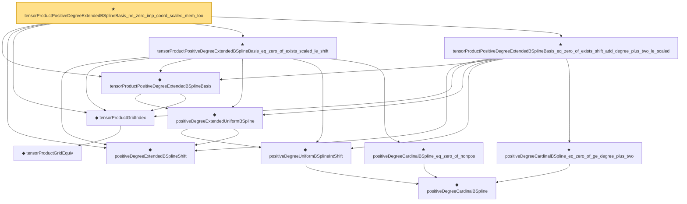

# Proof narrative — tensorProductPositiveDegreeExtendedBSplineBasis_ne_zero_imp_coord_scaled_mem_Ioo

Root: **tensorProductPositiveDegreeExtendedBSplineBasis_ne_zero_imp_coord_scaled_mem_Ioo** (theorem) `Statlib/Nonparametric/Approximation/SplineFacts.lean:1198` · topic `Nonparametric`
Closure: 12 declarations across 2 files. Generated from `proof_graph.json` — no files were moved.

Reading order (foundations first, headline last):

      ◆ `positiveDegreeCardinalBSpline` — noncomputable def · `Statlib/Nonparametric/Vocabulary/Spline.lean:82`  _(also used by 13: positiveDegreeCardinalBSpline_continuous, positiveDegreeExtendedUniformBSpline_linearIndependent_on_Icc, positiveDegreeCardinalBSpline_succ_eq_weighted_adjacent, …)_
    ◆ `positiveDegreeUniformBSplineIntShift` — noncomputable def · `Statlib/Nonparametric/Vocabulary/Spline.lean:113`  _(also used by 11: positiveDegreeUniformBSplineIntShift_continuous, positiveDegreeUniformBSplineIntShift_eq_zero_of_scaled_le_shift, positiveDegreeUniformBSplineIntShift_eq_zero_of_shift_add_degree_plus_two_le_scaled, …)_
  ◆ `positiveDegreeExtendedBSplineShift` — def · `Statlib/Nonparametric/Vocabulary/Spline.lean:120`  _(also used by 11: positiveDegreeExtendedUniformBSpline_continuous, positiveDegreeExtendedUniformBSpline_eq_zero_of_shift_add_degree_plus_two_le_scaled, positiveDegreeExtendedUniformBSpline_ne_zero_imp_scaled_mem_Ioo, …)_
    ◆ `positiveDegreeExtendedUniformBSpline` — noncomputable def · `Statlib/Nonparametric/Vocabulary/Spline.lean:126`  _(also used by 16: positiveDegreeExtendedUniformBSpline_continuous, positiveDegreeExtendedUniformBSpline_eq_zero_of_shift_add_degree_plus_two_le_scaled, positiveDegreeExtendedUniformBSpline_ne_zero_imp_scaled_mem_Ioo, …)_
      ◆ `tensorProductGridEquiv` — noncomputable def · `Statlib/Nonparametric/Vocabulary/Spline.lean:46`  _(also used by 9: unitCubePositiveDegreeExtendedBSplineBasis_linearIndependent_oneDim, sum_tensorProductPositiveDegreeExtendedBSplineBasis_eq_prod_sum, unitCubeBSplineTensorDual_polynomialReproduction, …)_
  ◆ `tensorProductGridIndex` — noncomputable def · `Statlib/Nonparametric/Vocabulary/Spline.lean:52`  _(also used by 19: tensorProductLinearBSplineBasis_continuous, tensorProductPositiveDegreeBSplineBasis_continuous, tensorProductPositiveDegreeBSplineBasis_eq_zero_of_exists_scaled_le_index, …)_
  ◆ `tensorProductPositiveDegreeExtendedBSplineBasis` — noncomputable def · `Statlib/Nonparametric/Vocabulary/Spline.lean:133`  _(also used by 13: unitCubePositiveDegreeExtendedBSplineBasis_linearIndependent_oneDim, tensorProductPositiveDegreeExtendedBSplineBasis_continuous, tensorProductPositiveDegreeExtendedBSplineBasis_nonneg, …)_
    ★ `positiveDegreeCardinalBSpline_eq_zero_of_nonpos` — theorem · `Statlib/Nonparametric/Approximation/SplineFacts.lean:32`  _(also used by 6: positiveDegreeUniformBSpline_eq_zero_of_scaled_le_index, positiveDegreeUniformBSplineIntShift_eq_zero_of_scaled_le_shift, positiveDegreeCardinalBSpline_succ_eq_weighted_adjacent, …)_
  ★ `tensorProductPositiveDegreeExtendedBSplineBasis_eq_zero_of_exists_scaled_le_shift` — theorem · `Statlib/Nonparametric/Approximation/SplineFacts.lean:1165`  _(also used by 1: unitCubePositiveDegreeExtendedBSplineBasis_ne_zero_imp_coord_scaled_mem_Ioo)_
    ★ `positiveDegreeCardinalBSpline_eq_zero_of_ge_degree_plus_two` — theorem · `Statlib/Nonparametric/Approximation/SplineFacts.lean:52`  _(also used by 6: positiveDegreeUniformBSplineIntShift_eq_zero_of_shift_add_degree_plus_two_le_scaled, positiveDegreeExtendedUniformBSpline_eq_zero_of_shift_add_degree_plus_two_le_scaled, positiveDegreeCardinalBSpline_succ_eq_weighted_adjacent, …)_
  ★ `tensorProductPositiveDegreeExtendedBSplineBasis_eq_zero_of_exists_shift_add_degree_plus_two_le_scaled` — theorem · `Statlib/Nonparametric/Approximation/SplineFacts.lean:1181`  _(also used by 1: unitCubePositiveDegreeExtendedBSplineBasis_ne_zero_imp_coord_scaled_mem_Ioo)_
★ `tensorProductPositiveDegreeExtendedBSplineBasis_ne_zero_imp_coord_scaled_mem_Ioo` — theorem · `Statlib/Nonparametric/Approximation/SplineFacts.lean:1198` **← headline**

## Dependency diagram

