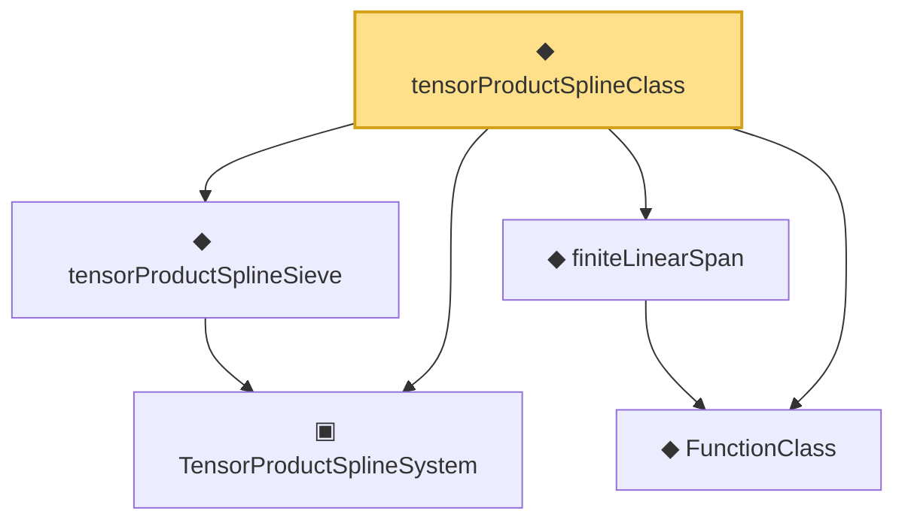

# Proof narrative — tensorProductSplineClass

Root: **tensorProductSplineClass** (noncomputable def) `Statlib/Nonparametric/Vocabulary/Spline.lean:165` · topic `Nonparametric`
Closure: 5 declarations across 3 files. Generated from `proof_graph.json` — no files were moved.

Reading order (foundations first, headline last):

  ▣ `TensorProductSplineSystem` — structure · `Statlib/Nonparametric/Vocabulary/Spline.lean:21`  _(also used by 21: tensor_product_spline_sieve_series_function_measurable, tensor_product_spline_sieve_holder_smooth_approximation_bound_of_exists_pointwise_series, tensor_product_spline_sieve_holder_smooth_approximation_bound_of_pointwise_approximation, …)_
  ◆ `FunctionClass` — abbrev · `Statlib/Nonparametric/Vocabulary/FunctionClasses.lean:16`  _(also used by 23: holder_class_approximation_error_le_of_net_member, kernel_smoother_classApproximationError_le_of_holder_bias_member, kernel_smoother_classApproximationError_le_of_holder_bias_rate, …)_
  ◆ `finiteLinearSpan` — noncomputable def · `Statlib/Nonparametric/Vocabulary/Sieve.lean:23`  _(also used by 10: selector_indicator_holder_class_approximation_error_le_of_net, selector_indicator_holder_class_approximation_error_le_rate, series_function_mem_finite_linear_span, …)_
  ◆ `tensorProductSplineSieve` — def · `Statlib/Nonparametric/Vocabulary/Spline.lean:158`  _(also used by 53: tensor_product_spline_sieve_series_function_measurable, unit_cube_bspline_sieve_approximation_error_bound_of_local_error, unit_cube_bspline_uniform_sieve_holder_approximation_error_bound_of_local_error, …)_
◆ `tensorProductSplineClass` — noncomputable def · `Statlib/Nonparametric/Vocabulary/Spline.lean:165` **← headline**

## Dependency diagram

