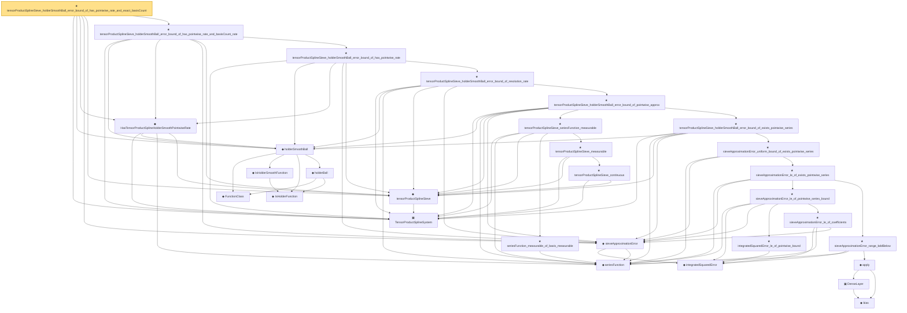

# Proof narrative — tensorProductSplineSieve_holderSmoothBall_error_bound_of_has_pointwise_rate_and_exact_basisCount

Root: **tensorProductSplineSieve_holderSmoothBall_error_bound_of_has_pointwise_rate_and_exact_basisCount** (theorem) `Statlib/Nonparametric/Approximation/Spline.lean:176` · topic `Nonparametric`
Closure: 30 declarations across 9 files. Generated from `proof_graph.json` — no files were moved.

Reading order (foundations first, headline last):

  ▣ `TensorProductSplineSystem` — structure · `Statlib/Nonparametric/Vocabulary/Spline.lean:19`  _(also used by 3: HasTensorProductSplineHolderSmoothProjectionRate, hasTensorProductSplineHolderSmoothPointwiseRate_of_projectionRate, tensorProductSplineClass)_
    ◆ `FunctionClass` — abbrev · `Statlib/Nonparametric/Vocabulary/FunctionClasses.lean:16`  _(also used by 20: holder_classApproximationError_le_of_net_member, kernel_smoother_classApproximationError_le_of_holder_bias_member, kernel_smoother_classApproximationError_le_of_holder_bias_rate, …)_
    ◆ `IsHolderFunction` — def · `Statlib/Nonparametric/Vocabulary/FunctionClasses.lean:44`  _(also used by 16: holder_net_approx_sup_bound, holder_net_integratedSquaredError_bound, holder_classApproximationError_le_of_net_member, …)_
    ◆ `IsHolderSmoothFunction` — def · `Statlib/Nonparametric/Vocabulary/FunctionClasses.lean:69`
    ◆ `holderBall` — def · `Statlib/Nonparametric/Vocabulary/FunctionClasses.lean:56`  _(also used by 9: holderBall_classApproximationError_self_le_zero, holderBall_selectorIndicator_sieveApproximationError_uniform_bound, exists_selectorIndicatorSieve_for_holderBall_of_finite_net, …)_
  ◆ `holderSmoothBall` — def · `Statlib/Nonparametric/Vocabulary/FunctionClasses.lean:82`  _(also used by 9: HasTensorProductSplineHolderSmoothProjectionRate, HasWaveletHolderSmoothPointwiseRate, HasWaveletHolderSmoothProjectionRate, …)_
    ◆ `seriesFunction` — noncomputable def · `Statlib/Nonparametric/Vocabulary/Sieve.lean:27`  _(also used by 28: holder_selectorIndicator_series_pointwise_bound, holder_selectorIndicator_series_integratedSquaredError_bound, finiteLinearSpan_classApproximationError_le_of_holder_selector_net, …)_
  ◆ `tensorProductSplineSieve` — def · `Statlib/Nonparametric/Vocabulary/Spline.lean:29`  _(also used by 2: HasTensorProductSplineHolderSmoothProjectionRate, tensorProductSplineClass)_
  ◆ `HasTensorProductSplineHolderSmoothPointwiseRate` — def · `Statlib/Nonparametric/Approximation/Spline.lean:17`  _(also used by 1: hasTensorProductSplineHolderSmoothPointwiseRate_of_projectionRate)_
    ◆ `integratedSquaredError` — noncomputable def · `Statlib/Nonparametric/Vocabulary/Risk.lean:60`  _(also used by 30: supNormBall_classApproximationError_self_le_zero, holder_net_integratedSquaredError_bound, holder_classApproximationError_le_of_net_member, …)_
  ◆ `sieveApproximationError` — noncomputable def · `Statlib/Nonparametric/Vocabulary/Sieve.lean:42`  _(also used by 17: sieveApproximationError_le_of_holder_selector_net, holderBall_selectorIndicator_sieveApproximationError_uniform_bound, exists_selectorIndicatorSieve_for_holderBall_of_finite_net, …)_
            ★ `seriesFunction_measurable_of_basis_measurable` — theorem · `Statlib/Nonparametric/Approximation/Sieve.lean:98`  _(also used by 1: waveletSieve_seriesFunction_measurable_of_system)_
            ★ `tensorProductSplineSieve_continuous` — theorem · `Statlib/Nonparametric/Vocabulary/Spline.lean:40`
            ★ `tensorProductSplineSieve_measurable` — theorem · `Statlib/Nonparametric/Vocabulary/Spline.lean:45`
          ★ `tensorProductSplineSieve_seriesFunction_measurable` — theorem · `Statlib/Nonparametric/Approximation/Spline.lean:50`
            ★ `integratedSquaredError_le_of_pointwise_bound` — theorem · `Statlib/Nonparametric/Approximation/Metric.lean:10`  _(also used by 11: holder_net_integratedSquaredError_bound, holder_classApproximationError_le_of_net_member, holder_selectorIndicator_series_integratedSquaredError_bound, …)_
            ★ `sieveApproximationError_le_of_coefficients` — theorem · `Statlib/Nonparametric/Approximation/Sieve.lean:107`
            ★ `sieveApproximationError_le_of_pointwise_series_bound` — theorem · `Statlib/Nonparametric/Approximation/Sieve.lean:248`  _(also used by 1: sieveApproximationError_le_of_holder_selector_net)_
            ◆ `bias` — noncomputable def · `Statlib/Nonparametric/Vocabulary/Estimator.lean:28`
            ▣ `DenseLayer` — structure · `Statlib/Nonparametric/Vocabulary/NeuralNetwork.lean:23`  _(also used by 2: reluApply, OneHiddenReLUNet)_
            ◆ `apply` — noncomputable def · `Statlib/Nonparametric/Vocabulary/NeuralNetwork.lean:30`  _(also used by 12: unitCube_grid_finite_measurable_cover, kernel_holder_bias_integratedSquaredError_bound, classApproximationError_le_of_exists_pointwise_bound, …)_
            ★ `sieveApproximationError_range_bddBelow` — theorem · `Statlib/Nonparametric/Approximation/Sieve.lean:121`
            ★ `sieveApproximationError_le_of_exists_pointwise_series` — theorem · `Statlib/Nonparametric/Approximation/Sieve.lean:269`
            ★ `sieveApproximationError_uniform_bound_of_exists_pointwise_series` — theorem · `Statlib/Nonparametric/Approximation/Sieve.lean:285`  _(also used by 3: holderBall_selectorIndicator_sieveApproximationError_uniform_bound, exists_sieveApproximationError_uniform_bound_of_exists_pointwise_series, waveletSieve_holderSmoothBall_error_bound_of_exists_pointwise_series)_
          ★ `tensorProductSplineSieve_holderSmoothBall_error_bound_of_exists_pointwise_series` — theorem · `Statlib/Nonparametric/Approximation/Spline.lean:61`
        ★ `tensorProductSplineSieve_holderSmoothBall_error_bound_of_pointwise_approx` — theorem · `Statlib/Nonparametric/Approximation/Spline.lean:80`
      ★ `tensorProductSplineSieve_holderSmoothBall_error_bound_of_resolution_rate` — theorem · `Statlib/Nonparametric/Approximation/Spline.lean:110`
    ★ `tensorProductSplineSieve_holderSmoothBall_error_bound_of_has_pointwise_rate` — theorem · `Statlib/Nonparametric/Approximation/Spline.lean:134`
  ★ `tensorProductSplineSieve_holderSmoothBall_error_bound_of_has_pointwise_rate_and_basisCount_rate` — theorem · `Statlib/Nonparametric/Approximation/Spline.lean:151`
★ `tensorProductSplineSieve_holderSmoothBall_error_bound_of_has_pointwise_rate_and_exact_basisCount` — theorem · `Statlib/Nonparametric/Approximation/Spline.lean:176` **← headline**

## Dependency diagram

