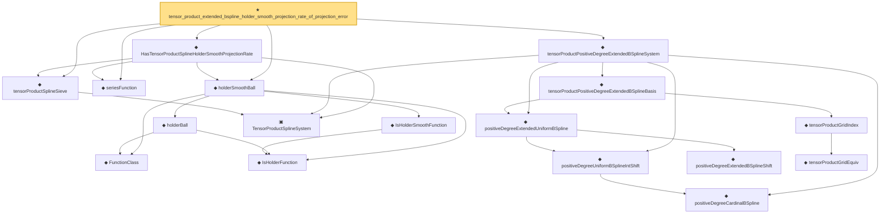

# Proof narrative — tensor_product_extended_bspline_holder_smooth_projection_rate_of_projection_error

Root: **tensor_product_extended_bspline_holder_smooth_projection_rate_of_projection_error** (theorem) `Statlib/Nonparametric/Approximation/Spline.lean:1474` · topic `Nonparametric`
Closure: 18 declarations across 4 files. Generated from `proof_graph.json` — no files were moved.

Reading order (foundations first, headline last):

    ◆ `FunctionClass` — abbrev · `Statlib/Nonparametric/Vocabulary/FunctionClasses.lean:16`  _(also used by 23: holder_class_approximation_error_le_of_net_member, kernel_smoother_classApproximationError_le_of_holder_bias_member, kernel_smoother_classApproximationError_le_of_holder_bias_rate, …)_
    ◆ `IsHolderFunction` — def · `Statlib/Nonparametric/Vocabulary/FunctionClasses.lean:44`  _(also used by 20: holder_net_sup_approximation_bound, holder_net_integrated_squared_error_bound, holder_class_approximation_error_le_of_net_member, …)_
    ◆ `IsHolderSmoothFunction` — def · `Statlib/Nonparametric/Vocabulary/FunctionClasses.lean:73`  _(also used by 2: unit_cube_bspline_zero_order_holder_projection_rate_of_support_node, tensor_product_linear_bspline_holder_projection_rate_of_local_partition)_
    ◆ `holderBall` — def · `Statlib/Nonparametric/Vocabulary/FunctionClasses.lean:60`  _(also used by 14: holder_ball_class_approximation_error_self_le_zero, selector_indicator_uniform_sieve_holder_approximation_bound, exists_selector_indicator_sieve_holder_approximation_bound_of_finite_net, …)_
  ◆ `holderSmoothBall` — def · `Statlib/Nonparametric/Vocabulary/FunctionClasses.lean:86`  _(also used by 75: holderSmoothBall_taylor_remainder_bound_on_box, holderSmoothBall_finite_centered_coordinate_polynomial_error_on_norm_ball, exists_fullyConnectedReLUNet_holderSmooth_local_approx_on_centered_box_with_size_bound, …)_
  ◆ `seriesFunction` — noncomputable def · `Statlib/Nonparametric/Vocabulary/Sieve.lean:27`  _(also used by 67: selector_indicator_holder_series_pointwise_approximation_bound, selector_indicator_holder_series_integrated_squared_error_bound, selector_indicator_holder_class_approximation_error_le_of_net, …)_
    ▣ `TensorProductSplineSystem` — structure · `Statlib/Nonparametric/Vocabulary/Spline.lean:21`  _(also used by 20: tensor_product_spline_sieve_series_function_measurable, tensor_product_spline_sieve_holder_smooth_approximation_bound_of_exists_pointwise_series, tensor_product_spline_sieve_holder_smooth_approximation_bound_of_pointwise_approximation, …)_
  ◆ `tensorProductSplineSieve` — def · `Statlib/Nonparametric/Vocabulary/Spline.lean:158`  _(also used by 52: tensor_product_spline_sieve_series_function_measurable, unit_cube_bspline_sieve_approximation_error_bound_of_local_error, unit_cube_bspline_uniform_sieve_holder_approximation_error_bound_of_local_error, …)_
    ◆ `positiveDegreeCardinalBSpline` — noncomputable def · `Statlib/Nonparametric/Vocabulary/Spline.lean:82`  _(also used by 14: positiveDegreeCardinalBSpline_continuous, positiveDegreeCardinalBSpline_eq_zero_of_nonpos, positiveDegreeCardinalBSpline_eq_zero_of_ge_degree_plus_two, …)_
    ◆ `positiveDegreeUniformBSplineIntShift` — noncomputable def · `Statlib/Nonparametric/Vocabulary/Spline.lean:113`  _(also used by 12: positiveDegreeUniformBSplineIntShift_continuous, positiveDegreeUniformBSplineIntShift_eq_zero_of_scaled_le_shift, positiveDegreeUniformBSplineIntShift_eq_zero_of_shift_add_degree_plus_two_le_scaled, …)_
        ◆ `positiveDegreeExtendedBSplineShift` — def · `Statlib/Nonparametric/Vocabulary/Spline.lean:120`  _(also used by 14: positiveDegreeExtendedUniformBSpline_continuous, positiveDegreeExtendedUniformBSpline_eq_zero_of_shift_add_degree_plus_two_le_scaled, positiveDegreeExtendedUniformBSpline_ne_zero_imp_scaled_mem_Ioo, …)_
    ◆ `positiveDegreeExtendedUniformBSpline` — noncomputable def · `Statlib/Nonparametric/Vocabulary/Spline.lean:126`  _(also used by 17: positiveDegreeExtendedUniformBSpline_continuous, positiveDegreeExtendedUniformBSpline_eq_zero_of_shift_add_degree_plus_two_le_scaled, positiveDegreeExtendedUniformBSpline_ne_zero_imp_scaled_mem_Ioo, …)_
        ◆ `tensorProductGridEquiv` — noncomputable def · `Statlib/Nonparametric/Vocabulary/Spline.lean:46`  _(also used by 9: unitCubePositiveDegreeExtendedBSplineBasis_linearIndependent_oneDim, sum_tensorProductPositiveDegreeExtendedBSplineBasis_eq_prod_sum, unitCubeBSplineTensorDual_polynomialReproduction, …)_
      ◆ `tensorProductGridIndex` — noncomputable def · `Statlib/Nonparametric/Vocabulary/Spline.lean:52`  _(also used by 22: tensorProductLinearBSplineBasis_continuous, tensorProductPositiveDegreeBSplineBasis_continuous, tensorProductPositiveDegreeBSplineBasis_eq_zero_of_exists_scaled_le_index, …)_
    ◆ `tensorProductPositiveDegreeExtendedBSplineBasis` — noncomputable def · `Statlib/Nonparametric/Vocabulary/Spline.lean:133`  _(also used by 15: unitCubePositiveDegreeExtendedBSplineBasis_linearIndependent_oneDim, tensorProductPositiveDegreeExtendedBSplineBasis_continuous, tensorProductPositiveDegreeExtendedBSplineBasis_eq_zero_of_exists_scaled_le_shift, …)_
  ◆ `tensorProductPositiveDegreeExtendedBSplineSystem` — noncomputable def · `Statlib/Nonparametric/Vocabulary/Spline.lean:142`  _(also used by 3: tensor_product_extended_bspline_holder_smooth_approximation_rate_of_projection, tensor_product_extended_bspline_holder_smooth_approximation_grid_rate_of_projection_error, tensor_product_extended_bspline_holder_smooth_approximation_rate_of_projection_error)_
  ◆ `HasTensorProductSplineHolderSmoothProjectionRate` — def · `Statlib/Nonparametric/Vocabulary/Spline.lean:250`  _(also used by 7: tensor_product_spline_sieve_holder_smooth_approximation_exact_basis_count_of_projection_rate, tensor_product_spline_basis_holder_smooth_approximation_bound_of_projection_rate, tensor_product_linear_bspline_holder_projection_rate_of_local_partition, …)_
★ `tensor_product_extended_bspline_holder_smooth_projection_rate_of_projection_error` — theorem · `Statlib/Nonparametric/Approximation/Spline.lean:1474` **← headline**

## Dependency diagram

