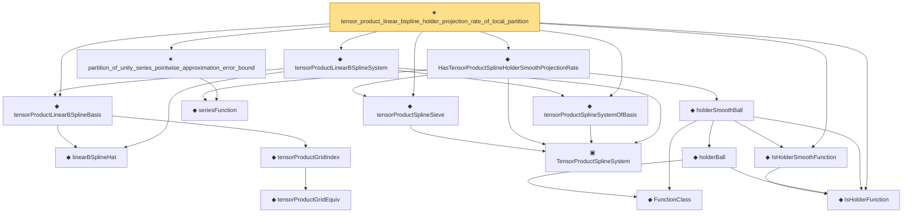

# Proof narrative — tensor_product_linear_bspline_holder_projection_rate_of_local_partition

Root: **tensor_product_linear_bspline_holder_projection_rate_of_local_partition** (theorem) `Statlib/Nonparametric/Approximation/Spline.lean:1286` · topic `Nonparametric`
Closure: 17 declarations across 5 files. Generated from `proof_graph.json` — no files were moved.

Reading order (foundations first, headline last):

    ◆ `linearBSplineHat` — noncomputable def · `Statlib/Nonparametric/Vocabulary/Spline.lean:59`  _(also used by 1: linearBSplineHat_continuous)_
      ◆ `tensorProductGridEquiv` — noncomputable def · `Statlib/Nonparametric/Vocabulary/Spline.lean:46`  _(also used by 9: unitCubePositiveDegreeExtendedBSplineBasis_linearIndependent_oneDim, sum_tensorProductPositiveDegreeExtendedBSplineBasis_eq_prod_sum, unitCubeBSplineTensorDual_polynomialReproduction, …)_
    ◆ `tensorProductGridIndex` — noncomputable def · `Statlib/Nonparametric/Vocabulary/Spline.lean:52`  _(also used by 22: tensorProductLinearBSplineBasis_continuous, tensorProductPositiveDegreeBSplineBasis_continuous, tensorProductPositiveDegreeBSplineBasis_eq_zero_of_exists_scaled_le_index, …)_
  ◆ `tensorProductLinearBSplineBasis` — noncomputable def · `Statlib/Nonparametric/Vocabulary/Spline.lean:63`  _(also used by 2: tensor_product_linear_bspline_holder_smooth_approximation_bound_of_projection_error, tensorProductLinearBSplineBasis_continuous)_
    ▣ `TensorProductSplineSystem` — structure · `Statlib/Nonparametric/Vocabulary/Spline.lean:21`  _(also used by 19: tensor_product_spline_sieve_series_function_measurable, tensor_product_spline_sieve_holder_smooth_approximation_bound_of_exists_pointwise_series, tensor_product_spline_sieve_holder_smooth_approximation_bound_of_pointwise_approximation, …)_
      ◆ `FunctionClass` — abbrev · `Statlib/Nonparametric/Vocabulary/FunctionClasses.lean:16`  _(also used by 23: holder_class_approximation_error_le_of_net_member, kernel_smoother_classApproximationError_le_of_holder_bias_member, kernel_smoother_classApproximationError_le_of_holder_bias_rate, …)_
  ◆ `IsHolderFunction` — def · `Statlib/Nonparametric/Vocabulary/FunctionClasses.lean:44`  _(also used by 19: holder_net_sup_approximation_bound, holder_net_integrated_squared_error_bound, holder_class_approximation_error_le_of_net_member, …)_
  ◆ `IsHolderSmoothFunction` — def · `Statlib/Nonparametric/Vocabulary/FunctionClasses.lean:73`  _(also used by 1: unit_cube_bspline_zero_order_holder_projection_rate_of_support_node)_
      ◆ `holderBall` — def · `Statlib/Nonparametric/Vocabulary/FunctionClasses.lean:60`  _(also used by 14: holder_ball_class_approximation_error_self_le_zero, selector_indicator_uniform_sieve_holder_approximation_bound, exists_selector_indicator_sieve_holder_approximation_bound_of_finite_net, …)_
    ◆ `holderSmoothBall` — def · `Statlib/Nonparametric/Vocabulary/FunctionClasses.lean:86`  _(also used by 76: holderSmoothBall_taylor_remainder_bound_on_box, holderSmoothBall_finite_centered_coordinate_polynomial_error_on_norm_ball, exists_fullyConnectedReLUNet_holderSmooth_local_approx_on_centered_box_with_size_bound, …)_
    ◆ `seriesFunction` — noncomputable def · `Statlib/Nonparametric/Vocabulary/Sieve.lean:27`  _(also used by 67: selector_indicator_holder_series_pointwise_approximation_bound, selector_indicator_holder_series_integrated_squared_error_bound, selector_indicator_holder_class_approximation_error_le_of_net, …)_
  ◆ `tensorProductSplineSieve` — def · `Statlib/Nonparametric/Vocabulary/Spline.lean:158`  _(also used by 52: tensor_product_spline_sieve_series_function_measurable, unit_cube_bspline_sieve_approximation_error_bound_of_local_error, unit_cube_bspline_uniform_sieve_holder_approximation_error_bound_of_local_error, …)_
  ◆ `HasTensorProductSplineHolderSmoothProjectionRate` — def · `Statlib/Nonparametric/Vocabulary/Spline.lean:250`  _(also used by 7: tensor_product_spline_sieve_holder_smooth_approximation_exact_basis_count_of_projection_rate, tensor_product_spline_basis_holder_smooth_approximation_bound_of_projection_rate, tensor_product_positive_degree_bspline_holder_smooth_approximation_bound_of_projection_rate, …)_
  ◆ `tensorProductSplineSystemOfBasis` — def · `Statlib/Nonparametric/Vocabulary/Spline.lean:31`  _(also used by 4: tensor_product_spline_basis_holder_smooth_approximation_bound_of_projection_rate, tensor_product_spline_basis_holder_smooth_approximation_bound_of_projection_certificate, tensor_product_spline_basis_holder_smooth_approximation_bound_of_projection_error, …)_
  ◆ `tensorProductLinearBSplineSystem` — noncomputable def · `Statlib/Nonparametric/Vocabulary/Spline.lean:70`  _(also used by 1: tensor_product_linear_bspline_holder_smooth_approximation_bound_of_projection_error)_
  ★ `partition_of_unity_series_pointwise_approximation_error_bound` — theorem · `Statlib/Nonparametric/Approximation/Sieve.lean:29`  _(also used by 2: unit_cube_bspline_sieve_approximation_error_bound_of_local_error, unit_cube_bspline_zero_order_holder_projection_rate_of_support_node)_
★ `tensor_product_linear_bspline_holder_projection_rate_of_local_partition` — theorem · `Statlib/Nonparametric/Approximation/Spline.lean:1286` **← headline**

## Dependency diagram

