# Proof narrative — tensor_product_positive_degree_bspline_holder_smooth_approximation_bound_of_projection_rate

Root: **tensor_product_positive_degree_bspline_holder_smooth_approximation_bound_of_projection_rate** (theorem) `Statlib/Nonparametric/Approximation/Spline.lean:1366` · topic `Nonparametric`
Closure: 46 declarations across 10 files. Generated from `proof_graph.json` — no files were moved.

Reading order (foundations first, headline last):

    ◆ `FunctionClass` — abbrev · `Statlib/Nonparametric/Vocabulary/FunctionClasses.lean:16`  _(also used by 23: holder_class_approximation_error_le_of_net_member, kernel_smoother_classApproximationError_le_of_holder_bias_member, kernel_smoother_classApproximationError_le_of_holder_bias_rate, …)_
    ◆ `IsHolderFunction` — def · `Statlib/Nonparametric/Vocabulary/FunctionClasses.lean:44`  _(also used by 20: holder_net_sup_approximation_bound, holder_net_integrated_squared_error_bound, holder_class_approximation_error_le_of_net_member, …)_
    ◆ `IsHolderSmoothFunction` — def · `Statlib/Nonparametric/Vocabulary/FunctionClasses.lean:73`  _(also used by 2: unit_cube_bspline_zero_order_holder_projection_rate_of_support_node, tensor_product_linear_bspline_holder_projection_rate_of_local_partition)_
    ◆ `holderBall` — def · `Statlib/Nonparametric/Vocabulary/FunctionClasses.lean:60`  _(also used by 14: holder_ball_class_approximation_error_self_le_zero, selector_indicator_uniform_sieve_holder_approximation_bound, exists_selector_indicator_sieve_holder_approximation_bound_of_finite_net, …)_
  ◆ `holderSmoothBall` — def · `Statlib/Nonparametric/Vocabulary/FunctionClasses.lean:86`  _(also used by 65: holderSmoothBall_taylor_remainder_bound_on_box, holderSmoothBall_finite_centered_coordinate_polynomial_error_on_norm_ball, exists_fullyConnectedReLUNet_holderSmooth_local_approx_on_centered_box_with_size_bound, …)_
    ▣ `TensorProductSplineSystem` — structure · `Statlib/Nonparametric/Vocabulary/Spline.lean:21`  _(also used by 6: tensor_product_spline_sieve_holder_smooth_approximation_exact_basis_count_of_projection_certificate, tensorProductLinearBSplineSystem, tensorProductPositiveDegreeExtendedBSplineSystem, …)_
    ◆ `seriesFunction` — noncomputable def · `Statlib/Nonparametric/Vocabulary/Sieve.lean:27`  _(also used by 56: selector_indicator_holder_series_pointwise_approximation_bound, selector_indicator_holder_series_integrated_squared_error_bound, selector_indicator_holder_class_approximation_error_le_of_net, …)_
  ◆ `tensorProductSplineSieve` — def · `Statlib/Nonparametric/Vocabulary/Spline.lean:158`  _(also used by 39: unit_cube_bspline_sieve_approximation_error_bound_of_local_error, unit_cube_bspline_uniform_sieve_holder_approximation_error_bound_of_local_error, unit_cube_bspline_uniform_sieve_holder_approximation_grid_rate, …)_
  ◆ `HasTensorProductSplineHolderSmoothProjectionRate` — def · `Statlib/Nonparametric/Vocabulary/Spline.lean:250`  _(also used by 4: tensor_product_linear_bspline_holder_projection_rate_of_local_partition, tensor_product_extended_bspline_holder_smooth_approximation_rate_of_projection, tensor_product_extended_bspline_holder_smooth_projection_rate_of_projection_error, …)_
    ◆ `tensorProductSplineSystemOfBasis` — def · `Statlib/Nonparametric/Vocabulary/Spline.lean:31`  _(also used by 4: tensor_product_spline_basis_holder_smooth_approximation_bound_of_projection_certificate, tensor_product_spline_basis_holder_smooth_approximation_bound_of_projection_error, tensor_product_linear_bspline_holder_projection_rate_of_local_partition, …)_
    ◆ `positiveDegreeCardinalBSpline` — noncomputable def · `Statlib/Nonparametric/Vocabulary/Spline.lean:82`  _(also used by 13: positiveDegreeCardinalBSpline_eq_zero_of_nonpos, positiveDegreeCardinalBSpline_eq_zero_of_ge_degree_plus_two, positiveDegreeExtendedUniformBSpline_linearIndependent_on_Icc, …)_
    ◆ `positiveDegreeUniformBSpline` — noncomputable def · `Statlib/Nonparametric/Vocabulary/Spline.lean:89`  _(also used by 2: positiveDegreeUniformBSpline_eq_zero_of_scaled_le_index, tensorProductPositiveDegreeBSplineBasis_nonneg)_
        ◆ `tensorProductGridEquiv` — noncomputable def · `Statlib/Nonparametric/Vocabulary/Spline.lean:46`  _(also used by 9: unitCubePositiveDegreeExtendedBSplineBasis_linearIndependent_oneDim, sum_tensorProductPositiveDegreeExtendedBSplineBasis_eq_prod_sum, unitCubeBSplineTensorDual_polynomialReproduction, …)_
    ◆ `tensorProductGridIndex` — noncomputable def · `Statlib/Nonparametric/Vocabulary/Spline.lean:52`  _(also used by 21: tensorProductLinearBSplineBasis_continuous, tensorProductPositiveDegreeBSplineBasis_eq_zero_of_exists_scaled_le_index, unitCubePositiveDegreeExtendedBSplineBasis_linearIndependent_oneDim, …)_
  ◆ `tensorProductPositiveDegreeBSplineBasis` — noncomputable def · `Statlib/Nonparametric/Vocabulary/Spline.lean:93`  _(also used by 3: tensor_product_positive_degree_bspline_holder_smooth_approximation_bound_of_projection_error, tensorProductPositiveDegreeBSplineBasis_eq_zero_of_exists_scaled_le_index, tensorProductPositiveDegreeBSplineBasis_nonneg)_
  ◆ `tensorProductPositiveDegreeBSplineSystem` — noncomputable def · `Statlib/Nonparametric/Vocabulary/Spline.lean:101`  _(also used by 1: tensor_product_positive_degree_bspline_holder_smooth_approximation_bound_of_projection_error)_
    ◆ `integratedSquaredError` — noncomputable def · `Statlib/Nonparametric/Vocabulary/Risk.lean:60`  _(also used by 30: supNormBall_classApproximationError_self_le_zero, holder_net_integrated_squared_error_bound, holder_class_approximation_error_le_of_net_member, …)_
  ◆ `sieveApproximationError` — noncomputable def · `Statlib/Nonparametric/Vocabulary/Sieve.lean:42`  _(also used by 47: selector_indicator_holder_sieve_approximation_error_le_of_net, selector_indicator_uniform_sieve_holder_approximation_bound, exists_selector_indicator_sieve_holder_approximation_bound_of_finite_net, …)_
    ◆ `IsTensorProductSplineHolderSmoothApproximationSieve` — def · `Statlib/Nonparametric/Vocabulary/Spline.lean:319`
        ◆ `bias` — noncomputable def · `Statlib/Nonparametric/Vocabulary/Estimator.lean:28`  _(also used by 24: exists_fullyConnectedReLUNet_mul_approx_on_box, exists_fullyConnectedReLUNet_linear_combination_two, exists_fullyConnectedReLUNet_coordinate_mul_approx_on_box, …)_
        ▣ `DenseLayer` — structure · `Statlib/Nonparametric/Vocabulary/NeuralNetwork.lean:23`  _(also used by 16: exists_fullyConnectedReLUNet_finite_linear_combination_approx, exists_fullyConnectedReLUNet_product_of_depth_one_approximants_on_box, exists_fullyConnectedReLUNet_finite_centered_monomial_polynomial_approx_on_box, …)_
      ◆ `apply` — noncomputable def · `Statlib/Nonparametric/Vocabulary/NeuralNetwork.lean:30`  _(also used by 78: unit_cube_grid_finite_measurable_cover, kernel_holder_bias_integratedSquaredError_bound, classApproximationError_le_of_exists_pointwise_bound, …)_
          ◆ `HasTensorProductSplineHolderSmoothPointwiseRate` — def · `Statlib/Nonparametric/Vocabulary/Spline.lean:236`  _(also used by 1: tensor_product_extended_bspline_holder_smooth_approximation_rate_of_projection)_
            ★ `series_function_measurable_of_basis_measurable` — theorem · `Statlib/Nonparametric/Approximation/Sieve.lean:156`  _(also used by 1: wavelet_sieve_series_function_measurable_of_system)_
            ★ `tensorProductSplineSieve_continuous` — theorem · `Statlib/Nonparametric/Approximation/SplineFacts.lean:1216`
            ★ `tensorProductSplineSieve_measurable` — theorem · `Statlib/Nonparametric/Approximation/SplineFacts.lean:1221`
            ★ `tensor_product_spline_sieve_series_function_measurable` — theorem · `Statlib/Nonparametric/Approximation/Spline.lean:14`  _(also used by 2: unit_cube_bspline_uniform_sieve_holder_approximation_grid_rate, unit_cube_bspline_trace_uniform_sieve_holder_smooth_approximation_rate_of_projection)_
            ★ `integratedSquaredError_le_of_pointwise_bound` — theorem · `Statlib/Nonparametric/Approximation/Metric.lean:10`  _(also used by 11: holder_net_integrated_squared_error_bound, holder_class_approximation_error_le_of_net_member, selector_indicator_holder_series_integrated_squared_error_bound, …)_
            ★ `sieve_approximation_error_le_of_coefficients` — theorem · `Statlib/Nonparametric/Approximation/Sieve.lean:165`
            ★ `sieve_approximation_error_le_of_pointwise_series_approximation` — theorem · `Statlib/Nonparametric/Approximation/Sieve.lean:306`  _(also used by 3: selector_indicator_holder_sieve_approximation_error_le_of_net, unit_cube_bspline_sieve_approximation_error_bound_of_local_error, unit_cube_bspline_trace_uniform_sieve_holder_smooth_approximation_rate_of_projection)_
            ★ `sieve_approximation_error_range_bddBelow` — theorem · `Statlib/Nonparametric/Approximation/Sieve.lean:179`  _(also used by 2: unit_cube_bspline_sieve_approximation_error_bound_of_local_error, unit_cube_bspline_trace_uniform_sieve_holder_smooth_approximation_rate_of_projection)_
            ★ `sieve_approximation_error_le_of_exists_pointwise_series_approximation` — theorem · `Statlib/Nonparametric/Approximation/Sieve.lean:327`
            ★ `uniform_sieve_approximation_error_bound_of_pointwise_series_approximation` — theorem · `Statlib/Nonparametric/Approximation/Sieve.lean:343`  _(also used by 3: selector_indicator_uniform_sieve_holder_approximation_bound, exists_uniform_sieve_approximation_error_bound_of_pointwise_series_approximation, wavelet_sieve_holder_smooth_approximation_bound_of_exists_pointwise_series)_
            ★ `tensor_product_spline_sieve_holder_smooth_approximation_bound_of_exists_pointwise_series` — theorem · `Statlib/Nonparametric/Approximation/Spline.lean:918`
            ★ `tensor_product_spline_sieve_holder_smooth_approximation_bound_of_pointwise_approximation` — theorem · `Statlib/Nonparametric/Approximation/Spline.lean:937`
            ★ `tensor_product_spline_sieve_holder_smooth_approximation_bound_of_resolution_rate` — theorem · `Statlib/Nonparametric/Approximation/Spline.lean:967`
            ★ `tensor_product_spline_sieve_holder_smooth_approximation_bound_of_pointwise_rate` — theorem · `Statlib/Nonparametric/Approximation/Spline.lean:991`
          ★ `tensor_product_spline_sieve_holder_smooth_approximation_basis_count_rate` — theorem · `Statlib/Nonparametric/Approximation/Spline.lean:1008`  _(also used by 1: tensor_product_extended_bspline_holder_smooth_approximation_rate_of_projection)_
        ★ `tensor_product_spline_sieve_holder_smooth_approximation_exact_basis_count` — theorem · `Statlib/Nonparametric/Approximation/Spline.lean:1033`
      ★ `tensor_product_spline_sieve_holder_smooth_approximation_exact_basis_count_of_projection_rate` — theorem · `Statlib/Nonparametric/Approximation/Spline.lean:1104`  _(also used by 1: tensor_product_spline_sieve_holder_smooth_approximation_exact_basis_count_of_projection_certificate)_
    ★ `tensor_product_spline_sieve_holder_smooth_approximation_bound_of_approximation_sieve` — theorem · `Statlib/Nonparametric/Approximation/Spline.lean:1153`
  ★ `tensor_product_spline_basis_holder_smooth_approximation_bound_of_projection_rate` — theorem · `Statlib/Nonparametric/Approximation/Spline.lean:1171`  _(also used by 1: tensor_product_spline_basis_holder_smooth_approximation_bound_of_projection_certificate)_
      ★ `positiveDegreeCardinalBSpline_continuous` — theorem · `Statlib/Nonparametric/Approximation/SplineFacts.lean:27`  _(also used by 1: positiveDegreeUniformBSplineIntShift_continuous)_
    ★ `positiveDegreeUniformBSpline_continuous` — theorem · `Statlib/Nonparametric/Approximation/SplineFacts.lean:275`
  ★ `tensorProductPositiveDegreeBSplineBasis_continuous` — theorem · `Statlib/Nonparametric/Approximation/SplineFacts.lean:288`  _(also used by 1: tensor_product_positive_degree_bspline_holder_smooth_approximation_bound_of_projection_error)_
★ `tensor_product_positive_degree_bspline_holder_smooth_approximation_bound_of_projection_rate` — theorem · `Statlib/Nonparametric/Approximation/Spline.lean:1366` **← headline**

## Dependency diagram

```mermaid
flowchart TD
  n0["◆ FunctionClass"]
  n1["◆ IsHolderFunction"]
  n2["◆ IsHolderSmoothFunction"]
  n3["◆ holderBall"]
  n4["◆ holderSmoothBall"]
  n5["▣ TensorProductSplineSystem"]
  n6["◆ seriesFunction"]
  n7["◆ tensorProductSplineSieve"]
  n8["◆ HasTensorProductSplineHolderSmoothProjectionRate"]
  n9["◆ tensorProductSplineSystemOfBasis"]
  n10["◆ positiveDegreeCardinalBSpline"]
  n11["◆ positiveDegreeUniformBSpline"]
  n12["◆ tensorProductGridEquiv"]
  n13["◆ tensorProductGridIndex"]
  n14["◆ tensorProductPositiveDegreeBSplineBasis"]
  n15["◆ tensorProductPositiveDegreeBSplineSystem"]
  n16["◆ integratedSquaredError"]
  n17["◆ sieveApproximationError"]
  n18["◆ IsTensorProductSplineHolderSmoothApproximationSieve"]
  n19["◆ bias"]
  n20["▣ DenseLayer"]
  n21["◆ apply"]
  n22["◆ HasTensorProductSplineHolderSmoothPointwiseRate"]
  n23["★ series_function_measurable_of_basis_measurable"]
  n24["★ tensorProductSplineSieve_continuous"]
  n25["★ tensorProductSplineSieve_measurable"]
  n26["★ tensor_product_spline_sieve_series_function_measurable"]
  n27["★ integratedSquaredError_le_of_pointwise_bound"]
  n28["★ sieve_approximation_error_le_of_coefficients"]
  n29["★ sieve_approximation_error_le_of_pointwise_series_approximation"]
  n30["★ sieve_approximation_error_range_bddBelow"]
  n31["★ sieve_approximation_error_le_of_exists_pointwise_series_approximation"]
  n32["★ uniform_sieve_approximation_error_bound_of_pointwise_series_approximation"]
  n33["★ tensor_product_spline_sieve_holder_smooth_approximation_bound_of_exists_pointwise_series"]
  n34["★ tensor_product_spline_sieve_holder_smooth_approximation_bound_of_pointwise_approximation"]
  n35["★ tensor_product_spline_sieve_holder_smooth_approximation_bound_of_resolution_rate"]
  n36["★ tensor_product_spline_sieve_holder_smooth_approximation_bound_of_pointwise_rate"]
  n37["★ tensor_product_spline_sieve_holder_smooth_approximation_basis_count_rate"]
  n38["★ tensor_product_spline_sieve_holder_smooth_approximation_exact_basis_count"]
  n39["★ tensor_product_spline_sieve_holder_smooth_approximation_exact_basis_count_of_projection_rate"]
  n40["★ tensor_product_spline_sieve_holder_smooth_approximation_bound_of_approximation_sieve"]
  n41["★ tensor_product_spline_basis_holder_smooth_approximation_bound_of_projection_rate"]
  n42["★ positiveDegreeCardinalBSpline_continuous"]
  n43["★ positiveDegreeUniformBSpline_continuous"]
  n44["★ tensorProductPositiveDegreeBSplineBasis_continuous"]
  n45["★ tensor_product_positive_degree_bspline_holder_smooth_approximation_bound_of_projection_rate"]
  n2 --> n1
  n3 --> n0
  n3 --> n1
  n4 --> n0
  n4 --> n2
  n4 --> n1
  n4 --> n3
  n7 --> n5
  n8 --> n5
  n8 --> n4
  n8 --> n6
  n8 --> n7
  n9 --> n5
  n11 --> n10
  n13 --> n12
  n14 --> n11
  n14 --> n13
  n15 --> n5
  n15 --> n9
  n15 --> n14
  n15 --> n11
  n15 --> n10
  n17 --> n16
  n17 --> n6
  n18 --> n5
  n18 --> n8
  n20 --> n19
  n21 --> n20
  n21 --> n19
  n22 --> n5
  n22 --> n4
  n22 --> n6
  n22 --> n7
  n23 --> n6
  n24 --> n5
  n24 --> n7
  n25 --> n5
  n25 --> n7
  n25 --> n24
  n26 --> n5
  n26 --> n6
  n26 --> n7
  n26 --> n23
  n26 --> n25
  n27 --> n16
  n28 --> n16
  n28 --> n6
  n28 --> n17
  n29 --> n6
  n29 --> n16
  n29 --> n17
  n29 --> n27
  n29 --> n28
  n30 --> n16
  n30 --> n6
  n30 --> n21
  n31 --> n6
  n31 --> n17
  n31 --> n29
  n31 --> n30
  n32 --> n6
  n32 --> n17
  n32 --> n31
  n33 --> n5
  n33 --> n4
  n33 --> n6
  n33 --> n7
  n33 --> n17
  n33 --> n32
  n34 --> n5
  n34 --> n4
  n34 --> n6
  n34 --> n7
  n34 --> n17
  n34 --> n26
  n34 --> n33
  n35 --> n5
  n35 --> n4
  n35 --> n6
  n35 --> n7
  n35 --> n17
  n35 --> n34
  n36 --> n5
  n36 --> n4
  n36 --> n22
  n36 --> n17
  n36 --> n7
  n36 --> n35
  n37 --> n5
  n37 --> n4
  n37 --> n22
  n37 --> n17
  n37 --> n7
  n37 --> n36
  n38 --> n5
  n38 --> n4
  n38 --> n22
  n38 --> n17
  n38 --> n7
  n38 --> n37
  n39 --> n5
  n39 --> n4
  n39 --> n8
  n39 --> n17
  n39 --> n7
  n39 --> n38
  n40 --> n5
  n40 --> n18
  n40 --> n4
  n40 --> n17
  n40 --> n7
  n40 --> n21
  n40 --> n39
  n41 --> n4
  n41 --> n8
  n41 --> n9
  n41 --> n17
  n41 --> n7
  n41 --> n18
  n41 --> n40
  n42 --> n10
  n43 --> n11
  n43 --> n42
  n44 --> n14
  n44 --> n43
  n44 --> n13
  n45 --> n4
  n45 --> n8
  n45 --> n15
  n45 --> n17
  n45 --> n7
  n45 --> n41
  n45 --> n14
  n45 --> n44
  class n45 headline;
  classDef headline fill:#ffe08a,stroke:#d4a017,stroke-width:2px;
  classDef axiomNode fill:#ffd0d0,stroke:#c0392b,stroke-dasharray:4 2;
```

