# Proof narrative — unitCubeBSplineTensorDual_exists_sub_reproduction_degreeSucc_localStability

Root: **unitCubeBSplineTensorDual_exists_sub_reproduction_degreeSucc_localStability** (theorem) `Statlib/Nonparametric/Approximation/SplineFacts.lean:6263` · topic `Nonparametric`
Closure: 32 declarations across 6 files. Generated from `proof_graph.json` — no files were moved.

Reading order (foundations first, headline last):

    ▣ `TensorProductSplineSystem` — structure · `Statlib/Nonparametric/Vocabulary/Spline.lean:21`  _(also used by 21: tensor_product_spline_sieve_series_function_measurable, tensor_product_spline_sieve_holder_smooth_approximation_bound_of_exists_pointwise_series, tensor_product_spline_sieve_holder_smooth_approximation_bound_of_pointwise_approximation, …)_
      ◆ `unitCubeDomain` — abbrev · `Statlib/Nonparametric/Vocabulary/FunctionClasses.lean:52`  _(also used by 4: unit_cube_dyadic_grid_finite_measurable_cover_basis_rate, unit_cube_haar_selector_zero_order_uniform_sieve_holder_approximation_rate, unit_cube_haar_selector_positive_holder_uniform_sieve_approximation_rate, …)_
  ◆ `splineUnitCubeDomain` — abbrev · `Statlib/Nonparametric/Vocabulary/Spline.lean:170`  _(also used by 30: unit_cube_bspline_sieve_approximation_error_bound_of_local_error, unit_cube_bspline_uniform_sieve_holder_approximation_error_bound_of_local_error, unit_cube_bspline_uniform_sieve_holder_approximation_grid_rate, …)_
    ◆ `positiveDegreeCardinalBSpline` — noncomputable def · `Statlib/Nonparametric/Vocabulary/Spline.lean:82`  _(also used by 7: sum_positiveDegreeExtendedUniformBSpline_eq_one_of_mem_Icc, positiveDegreeCardinalBSpline_nonneg, positiveDegreeCardinalBSpline_ne_zero_of_pos, …)_
    ◆ `positiveDegreeUniformBSplineIntShift` — noncomputable def · `Statlib/Nonparametric/Vocabulary/Spline.lean:113`  _(also used by 7: positiveDegreeUniformBSplineIntShift_eq_zero_of_shift_add_degree_plus_two_le_scaled, tensorProductPositiveDegreeExtendedBSplineBasis_eq_zero_of_exists_scaled_le_shift, tensorProductPositiveDegreeExtendedBSplineBasis_eq_zero_of_exists_shift_add_degree_plus_two_le_scaled, …)_
    ◆ `positiveDegreeExtendedBSplineShift` — def · `Statlib/Nonparametric/Vocabulary/Spline.lean:120`  _(also used by 10: positiveDegreeExtendedUniformBSpline_ne_zero_imp_scaled_mem_Ioo, tensorProductPositiveDegreeExtendedBSplineBasis_eq_zero_of_exists_scaled_le_shift, tensorProductPositiveDegreeExtendedBSplineBasis_eq_zero_of_exists_shift_add_degree_plus_two_le_scaled, …)_
    ◆ `positiveDegreeExtendedUniformBSpline` — noncomputable def · `Statlib/Nonparametric/Vocabulary/Spline.lean:126`  _(also used by 10: positiveDegreeExtendedUniformBSpline_ne_zero_imp_scaled_mem_Ioo, tensorProductPositiveDegreeExtendedBSplineBasis_eq_zero_of_exists_scaled_le_shift, tensorProductPositiveDegreeExtendedBSplineBasis_eq_zero_of_exists_shift_add_degree_plus_two_le_scaled, …)_
  ◆ `tensorProductGridEquiv` — noncomputable def · `Statlib/Nonparametric/Vocabulary/Spline.lean:46`  _(also used by 4: sum_tensorProductPositiveDegreeExtendedBSplineBasis_eq_prod_sum, unitCubeBSplineTensorDual_polynomialReproduction, unitCubePositiveDegreeExtendedBSplineDual_exists_uniform_reproducing_degreeSucc_localStability, …)_
  ◆ `tensorProductGridIndex` — noncomputable def · `Statlib/Nonparametric/Vocabulary/Spline.lean:52`  _(also used by 17: tensorProductLinearBSplineBasis_continuous, tensorProductPositiveDegreeBSplineBasis_continuous, tensorProductPositiveDegreeBSplineBasis_eq_zero_of_exists_scaled_le_index, …)_
    ◆ `tensorProductPositiveDegreeExtendedBSplineBasis` — noncomputable def · `Statlib/Nonparametric/Vocabulary/Spline.lean:133`  _(also used by 10: tensorProductPositiveDegreeExtendedBSplineBasis_continuous, tensorProductPositiveDegreeExtendedBSplineBasis_eq_zero_of_exists_scaled_le_shift, tensorProductPositiveDegreeExtendedBSplineBasis_eq_zero_of_exists_shift_add_degree_plus_two_le_scaled, …)_
  ◆ `unitCubePositiveDegreeExtendedBSplineBasis` — noncomputable def · `Statlib/Nonparametric/Vocabulary/Spline.lean:187`  _(also used by 9: unitCubePositiveDegreeExtendedBSplineDual_polynomialEval_fin_linear, unitCubePositiveDegreeExtendedBSplineBasis_ne_zero_imp_coord_scaled_mem_Ioo, unitCubePositiveDegreeExtendedBSplineBasis_continuous, …)_
  ◆ `unitCubePositiveDegreeExtendedBSplineSystem` — noncomputable def · `Statlib/Nonparametric/Vocabulary/Spline.lean:193`  _(also used by 25: unit_cube_bspline_sieve_approximation_error_bound_of_local_error, unit_cube_bspline_uniform_sieve_holder_approximation_error_bound_of_local_error, unit_cube_bspline_uniform_sieve_holder_approximation_grid_rate, …)_
  ◆ `seriesFunction` — noncomputable def · `Statlib/Nonparametric/Vocabulary/Sieve.lean:27`  _(also used by 66: selector_indicator_holder_series_pointwise_approximation_bound, selector_indicator_holder_series_integrated_squared_error_bound, selector_indicator_holder_class_approximation_error_le_of_net, …)_
  ◆ `tensorProductSplineSieve` — def · `Statlib/Nonparametric/Vocabulary/Spline.lean:158`  _(also used by 50: tensor_product_spline_sieve_series_function_measurable, unit_cube_bspline_sieve_approximation_error_bound_of_local_error, unit_cube_bspline_uniform_sieve_holder_approximation_error_bound_of_local_error, …)_
      ★ `positiveDegreeCardinalBSpline_eq_zero_of_nonpos` — theorem · `Statlib/Nonparametric/Approximation/SplineFacts.lean:32`  _(also used by 4: positiveDegreeUniformBSpline_eq_zero_of_scaled_le_index, tensorProductPositiveDegreeExtendedBSplineBasis_eq_zero_of_exists_scaled_le_shift, sum_positiveDegreeExtendedUniformBSpline_eq_one_of_mem_Icc, …)_
        ◆ `bias` — noncomputable def · `Statlib/Nonparametric/Vocabulary/Estimator.lean:28`  _(also used by 24: exists_fullyConnectedReLUNet_mul_approx_on_box, exists_fullyConnectedReLUNet_linear_combination_two, exists_fullyConnectedReLUNet_coordinate_mul_approx_on_box, …)_
        ▣ `DenseLayer` — structure · `Statlib/Nonparametric/Vocabulary/NeuralNetwork.lean:23`  _(also used by 16: exists_fullyConnectedReLUNet_finite_linear_combination_approx, exists_fullyConnectedReLUNet_product_of_depth_one_approximants_on_box, exists_fullyConnectedReLUNet_finite_centered_monomial_polynomial_approx_on_box, …)_
    ◆ `apply` — noncomputable def · `Statlib/Nonparametric/Vocabulary/NeuralNetwork.lean:30`  _(also used by 74: unit_cube_grid_finite_measurable_cover, kernel_holder_bias_integratedSquaredError_bound, classApproximationError_le_of_exists_pointwise_bound, …)_
      ★ `positiveDegreeCardinalBSpline_eq_zero_of_ge_degree_plus_two` — theorem · `Statlib/Nonparametric/Approximation/SplineFacts.lean:52`  _(also used by 4: positiveDegreeUniformBSplineIntShift_eq_zero_of_shift_add_degree_plus_two_le_scaled, tensorProductPositiveDegreeExtendedBSplineBasis_eq_zero_of_exists_shift_add_degree_plus_two_le_scaled, sum_positiveDegreeExtendedUniformBSpline_eq_one_of_mem_Icc, …)_
      ★ `positiveDegreeCardinalBSpline_succ_eq_weighted_adjacent` — theorem · `Statlib/Nonparametric/Approximation/SplineFacts.lean:1228`  _(also used by 3: sum_positiveDegreeExtendedUniformBSpline_eq_one_of_mem_Icc, positiveDegreeCardinalBSpline_nonneg, positiveDegreeCardinalBSpline_ne_zero_of_pos)_
    ★ `positiveDegreeCardinalBSpline_marsdenIdentity` — theorem · `Statlib/Nonparametric/Approximation/SplineFacts.lean:2267`  _(also used by 1: unitCubePositiveDegreeExtendedBSplineDual_exists_uniform_reproducing_degreeSucc_localStability)_
        ★ `positiveDegreeExtendedUniformBSpline_eq_zero_of_shift_add_degree_plus_two_le_scaled` — theorem · `Statlib/Nonparametric/Approximation/SplineFacts.lean:344`  _(also used by 1: positiveDegreeExtendedUniformBSpline_ne_zero_imp_scaled_mem_Ioo)_
        ★ `positiveDegreeUniformBSplineIntShift_eq_zero_of_scaled_le_shift` — theorem · `Statlib/Nonparametric/Approximation/SplineFacts.lean:319`  _(also used by 2: positiveDegreeExtendedUniformBSpline_ne_zero_imp_scaled_mem_Ioo, unitCubePositiveDegreeExtendedBSplineDual_exists_uniform_reproducing_degreeSucc_localStability)_
      ★ `positiveDegreeExtendedUniformBSpline_linearIndependent_on_Icc` — theorem · `Statlib/Nonparametric/Approximation/SplineFacts.lean:373`
    ★ `unitCubePositiveDegreeExtendedBSplineBasis_linearIndependent_oneDim` — theorem · `Statlib/Nonparametric/Approximation/SplineFacts.lean:954`  _(also used by 1: unitCubePositiveDegreeExtendedBSplineDual_polynomialEval_fin_linear)_
        ★ `positiveDegreeCardinalBSpline_continuous` — theorem · `Statlib/Nonparametric/Approximation/SplineFacts.lean:27`  _(also used by 1: positiveDegreeUniformBSpline_continuous)_
      ★ `positiveDegreeUniformBSplineIntShift_continuous` — theorem · `Statlib/Nonparametric/Approximation/SplineFacts.lean:310`
    ★ `positiveDegreeExtendedUniformBSpline_continuous` — theorem · `Statlib/Nonparametric/Approximation/SplineFacts.lean:336`  _(also used by 1: tensorProductPositiveDegreeExtendedBSplineBasis_continuous)_
  ★ `unitCubePositiveDegreeExtendedBSplineDual_exists_reproducing_degreeSucc_localStability` — theorem · `Statlib/Nonparametric/Approximation/SplineFacts.lean:5492`  _(also used by 1: unitCubePositiveDegreeExtendedBSplineDual_exists_uniform_reproducing_degreeSucc_localStability)_
  ★ `unitCubeBSplineTensorDual_polynomialReproduction_degreeSucc` — theorem · `Statlib/Nonparametric/Approximation/SplineFacts.lean:4156`  _(also used by 1: unitCubeBSplineTensorDual_exists_uniform_sub_reproduction_degreeSucc_localStability_of_univariate)_
  ★ `unitCubeBSplineTensorDual_localStability` — theorem · `Statlib/Nonparametric/Approximation/SplineFacts.lean:5314`  _(also used by 1: unitCubeBSplineTensorDual_exists_uniform_sub_reproduction_degreeSucc_localStability_of_univariate)_
★ `unitCubeBSplineTensorDual_exists_sub_reproduction_degreeSucc_localStability` — theorem · `Statlib/Nonparametric/Approximation/SplineFacts.lean:6263` **← headline**

## Dependency diagram

```mermaid
flowchart TD
  n0["▣ TensorProductSplineSystem"]
  n1["◆ unitCubeDomain"]
  n2["◆ splineUnitCubeDomain"]
  n3["◆ positiveDegreeCardinalBSpline"]
  n4["◆ positiveDegreeUniformBSplineIntShift"]
  n5["◆ positiveDegreeExtendedBSplineShift"]
  n6["◆ positiveDegreeExtendedUniformBSpline"]
  n7["◆ tensorProductGridEquiv"]
  n8["◆ tensorProductGridIndex"]
  n9["◆ tensorProductPositiveDegreeExtendedBSplineBasis"]
  n10["◆ unitCubePositiveDegreeExtendedBSplineBasis"]
  n11["◆ unitCubePositiveDegreeExtendedBSplineSystem"]
  n12["◆ seriesFunction"]
  n13["◆ tensorProductSplineSieve"]
  n14["★ positiveDegreeCardinalBSpline_eq_zero_of_nonpos"]
  n15["◆ bias"]
  n16["▣ DenseLayer"]
  n17["◆ apply"]
  n18["★ positiveDegreeCardinalBSpline_eq_zero_of_ge_degree_plus_two"]
  n19["★ positiveDegreeCardinalBSpline_succ_eq_weighted_adjacent"]
  n20["★ positiveDegreeCardinalBSpline_marsdenIdentity"]
  n21["★ positiveDegreeExtendedUniformBSpline_eq_zero_of_shift_add_degree_plus_two_le_scaled"]
  n22["★ positiveDegreeUniformBSplineIntShift_eq_zero_of_scaled_le_shift"]
  n23["★ positiveDegreeExtendedUniformBSpline_linearIndependent_on_Icc"]
  n24["★ unitCubePositiveDegreeExtendedBSplineBasis_linearIndependent_oneDim"]
  n25["★ positiveDegreeCardinalBSpline_continuous"]
  n26["★ positiveDegreeUniformBSplineIntShift_continuous"]
  n27["★ positiveDegreeExtendedUniformBSpline_continuous"]
  n28["★ unitCubePositiveDegreeExtendedBSplineDual_exists_reproducing_degreeSucc_localStability"]
  n29["★ unitCubeBSplineTensorDual_polynomialReproduction_degreeSucc"]
  n30["★ unitCubeBSplineTensorDual_localStability"]
  n31["★ unitCubeBSplineTensorDual_exists_sub_reproduction_degreeSucc_localStability"]
  n2 --> n1
  n4 --> n3
  n6 --> n4
  n6 --> n5
  n8 --> n7
  n9 --> n6
  n9 --> n8
  n10 --> n2
  n10 --> n9
  n11 --> n0
  n11 --> n2
  n11 --> n10
  n11 --> n9
  n11 --> n6
  n11 --> n4
  n11 --> n3
  n13 --> n0
  n14 --> n3
  n16 --> n15
  n17 --> n16
  n17 --> n15
  n18 --> n3
  n19 --> n3
  n19 --> n14
  n19 --> n17
  n19 --> n18
  n20 --> n3
  n20 --> n14
  n20 --> n17
  n20 --> n18
  n20 --> n19
  n21 --> n5
  n21 --> n6
  n21 --> n4
  n21 --> n18
  n22 --> n4
  n22 --> n14
  n23 --> n6
  n23 --> n17
  n23 --> n21
  n23 --> n5
  n23 --> n22
  n23 --> n3
  n23 --> n4
  n24 --> n11
  n24 --> n2
  n24 --> n10
  n24 --> n8
  n24 --> n7
  n24 --> n6
  n24 --> n9
  n24 --> n23
  n25 --> n3
  n26 --> n4
  n26 --> n25
  n27 --> n6
  n27 --> n26
  n27 --> n5
  n28 --> n11
  n28 --> n2
  n28 --> n12
  n28 --> n13
  n28 --> n8
  n28 --> n3
  n28 --> n6
  n28 --> n4
  n28 --> n5
  n28 --> n20
  n28 --> n17
  n28 --> n7
  n28 --> n10
  n28 --> n9
  n28 --> n24
  n28 --> n27
  n29 --> n11
  n29 --> n2
  n29 --> n12
  n29 --> n13
  n29 --> n8
  n29 --> n9
  n29 --> n7
  n29 --> n10
  n29 --> n17
  n29 --> n24
  n29 --> n6
  n30 --> n11
  n30 --> n2
  n30 --> n13
  n30 --> n8
  n30 --> n10
  n30 --> n9
  n30 --> n7
  n30 --> n6
  n30 --> n17
  n31 --> n11
  n31 --> n2
  n31 --> n12
  n31 --> n13
  n31 --> n28
  n31 --> n8
  n31 --> n7
  n31 --> n10
  n31 --> n29
  n31 --> n30
  class n31 headline;
  classDef headline fill:#ffe08a,stroke:#d4a017,stroke-width:2px;
  classDef axiomNode fill:#ffd0d0,stroke:#c0392b,stroke-dasharray:4 2;
```

