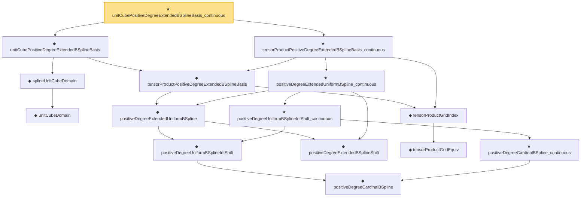

# Proof narrative — unitCubePositiveDegreeExtendedBSplineBasis_continuous

Root: **unitCubePositiveDegreeExtendedBSplineBasis_continuous** (theorem) `Statlib/Nonparametric/Approximation/SplineFacts.lean:2139` · topic `Nonparametric`
Closure: 15 declarations across 3 files. Generated from `proof_graph.json` — no files were moved.

Reading order (foundations first, headline last):

      ◆ `unitCubeDomain` — abbrev · `Statlib/Nonparametric/Vocabulary/FunctionClasses.lean:52`  _(also used by 4: unit_cube_dyadic_grid_finite_measurable_cover_basis_rate, unit_cube_haar_selector_zero_order_uniform_sieve_holder_approximation_rate, unit_cube_haar_selector_positive_holder_uniform_sieve_approximation_rate, …)_
    ◆ `splineUnitCubeDomain` — abbrev · `Statlib/Nonparametric/Vocabulary/Spline.lean:170`  _(also used by 36: unit_cube_bspline_sieve_approximation_error_bound_of_local_error, unit_cube_bspline_uniform_sieve_holder_approximation_error_bound_of_local_error, unit_cube_bspline_uniform_sieve_holder_approximation_grid_rate, …)_
          ◆ `positiveDegreeCardinalBSpline` — noncomputable def · `Statlib/Nonparametric/Vocabulary/Spline.lean:82`  _(also used by 14: positiveDegreeCardinalBSpline_eq_zero_of_nonpos, positiveDegreeCardinalBSpline_eq_zero_of_ge_degree_plus_two, positiveDegreeExtendedUniformBSpline_linearIndependent_on_Icc, …)_
        ◆ `positiveDegreeUniformBSplineIntShift` — noncomputable def · `Statlib/Nonparametric/Vocabulary/Spline.lean:113`  _(also used by 12: positiveDegreeUniformBSplineIntShift_eq_zero_of_scaled_le_shift, positiveDegreeUniformBSplineIntShift_eq_zero_of_shift_add_degree_plus_two_le_scaled, positiveDegreeExtendedUniformBSpline_eq_zero_of_shift_add_degree_plus_two_le_scaled, …)_
      ◆ `positiveDegreeExtendedBSplineShift` — def · `Statlib/Nonparametric/Vocabulary/Spline.lean:120`  _(also used by 13: positiveDegreeExtendedUniformBSpline_eq_zero_of_shift_add_degree_plus_two_le_scaled, positiveDegreeExtendedUniformBSpline_ne_zero_imp_scaled_mem_Ioo, positiveDegreeExtendedUniformBSpline_linearIndependent_on_Icc, …)_
      ◆ `positiveDegreeExtendedUniformBSpline` — noncomputable def · `Statlib/Nonparametric/Vocabulary/Spline.lean:126`  _(also used by 17: positiveDegreeExtendedUniformBSpline_eq_zero_of_shift_add_degree_plus_two_le_scaled, positiveDegreeExtendedUniformBSpline_ne_zero_imp_scaled_mem_Ioo, positiveDegreeExtendedUniformBSpline_linearIndependent_on_Icc, …)_
        ◆ `tensorProductGridEquiv` — noncomputable def · `Statlib/Nonparametric/Vocabulary/Spline.lean:46`  _(also used by 9: unitCubePositiveDegreeExtendedBSplineBasis_linearIndependent_oneDim, sum_tensorProductPositiveDegreeExtendedBSplineBasis_eq_prod_sum, unitCubeBSplineTensorDual_polynomialReproduction, …)_
    ◆ `tensorProductGridIndex` — noncomputable def · `Statlib/Nonparametric/Vocabulary/Spline.lean:52`  _(also used by 21: tensorProductLinearBSplineBasis_continuous, tensorProductPositiveDegreeBSplineBasis_continuous, tensorProductPositiveDegreeBSplineBasis_eq_zero_of_exists_scaled_le_index, …)_
    ◆ `tensorProductPositiveDegreeExtendedBSplineBasis` — noncomputable def · `Statlib/Nonparametric/Vocabulary/Spline.lean:133`  _(also used by 14: unitCubePositiveDegreeExtendedBSplineBasis_linearIndependent_oneDim, tensorProductPositiveDegreeExtendedBSplineBasis_eq_zero_of_exists_scaled_le_shift, tensorProductPositiveDegreeExtendedBSplineBasis_eq_zero_of_exists_shift_add_degree_plus_two_le_scaled, …)_
  ◆ `unitCubePositiveDegreeExtendedBSplineBasis` — noncomputable def · `Statlib/Nonparametric/Vocabulary/Spline.lean:187`  _(also used by 14: unitCubePositiveDegreeExtendedBSplineBasis_linearIndependent_oneDim, unitCubePositiveDegreeExtendedBSplineDual_polynomialEval_fin_linear, unitCubePositiveDegreeExtendedBSplineBasis_ne_zero_imp_coord_scaled_mem_Ioo, …)_
        ★ `positiveDegreeCardinalBSpline_continuous` — theorem · `Statlib/Nonparametric/Approximation/SplineFacts.lean:27`  _(also used by 1: positiveDegreeUniformBSpline_continuous)_
      ★ `positiveDegreeUniformBSplineIntShift_continuous` — theorem · `Statlib/Nonparametric/Approximation/SplineFacts.lean:310`
    ★ `positiveDegreeExtendedUniformBSpline_continuous` — theorem · `Statlib/Nonparametric/Approximation/SplineFacts.lean:336`  _(also used by 1: unitCubePositiveDegreeExtendedBSplineDual_exists_reproducing_degreeSucc_localStability)_
  ★ `tensorProductPositiveDegreeExtendedBSplineBasis_continuous` — theorem · `Statlib/Nonparametric/Approximation/SplineFacts.lean:1153`
★ `unitCubePositiveDegreeExtendedBSplineBasis_continuous` — theorem · `Statlib/Nonparametric/Approximation/SplineFacts.lean:2139` **← headline**

## Dependency diagram

