# Proof narrative — unitCubePositiveDegreeExtendedBSplineSystem_support_radius_degree_plus_two_div

Root: **unitCubePositiveDegreeExtendedBSplineSystem_support_radius_degree_plus_two_div** (theorem) `Statlib/Nonparametric/Approximation/SplineFacts.lean:2164` · topic `Nonparametric`
Closure: 22 declarations across 3 files. Generated from `proof_graph.json` — no files were moved.

Reading order (foundations first, headline last):

    ▣ `TensorProductSplineSystem` — structure · `Statlib/Nonparametric/Vocabulary/Spline.lean:21`  _(also used by 21: tensor_product_spline_sieve_series_function_measurable, tensor_product_spline_sieve_holder_smooth_approximation_bound_of_exists_pointwise_series, tensor_product_spline_sieve_holder_smooth_approximation_bound_of_pointwise_approximation, …)_
      ◆ `unitCubeDomain` — abbrev · `Statlib/Nonparametric/Vocabulary/FunctionClasses.lean:52`  _(also used by 4: unit_cube_dyadic_grid_finite_measurable_cover_basis_rate, unit_cube_haar_selector_zero_order_uniform_sieve_holder_approximation_rate, unit_cube_haar_selector_positive_holder_uniform_sieve_approximation_rate, …)_
  ◆ `splineUnitCubeDomain` — abbrev · `Statlib/Nonparametric/Vocabulary/Spline.lean:170`  _(also used by 31: unit_cube_bspline_sieve_approximation_error_bound_of_local_error, unit_cube_bspline_uniform_sieve_holder_approximation_error_bound_of_local_error, unit_cube_bspline_uniform_sieve_holder_approximation_grid_rate, …)_
    ◆ `positiveDegreeCardinalBSpline` — noncomputable def · `Statlib/Nonparametric/Vocabulary/Spline.lean:82`  _(also used by 12: positiveDegreeCardinalBSpline_continuous, positiveDegreeExtendedUniformBSpline_linearIndependent_on_Icc, positiveDegreeCardinalBSpline_succ_eq_weighted_adjacent, …)_
    ◆ `positiveDegreeUniformBSplineIntShift` — noncomputable def · `Statlib/Nonparametric/Vocabulary/Spline.lean:113`  _(also used by 10: positiveDegreeUniformBSplineIntShift_continuous, positiveDegreeUniformBSplineIntShift_eq_zero_of_scaled_le_shift, positiveDegreeUniformBSplineIntShift_eq_zero_of_shift_add_degree_plus_two_le_scaled, …)_
  ◆ `positiveDegreeExtendedBSplineShift` — def · `Statlib/Nonparametric/Vocabulary/Spline.lean:120`  _(also used by 9: positiveDegreeExtendedUniformBSpline_continuous, positiveDegreeExtendedUniformBSpline_eq_zero_of_shift_add_degree_plus_two_le_scaled, positiveDegreeExtendedUniformBSpline_ne_zero_imp_scaled_mem_Ioo, …)_
    ◆ `positiveDegreeExtendedUniformBSpline` — noncomputable def · `Statlib/Nonparametric/Vocabulary/Spline.lean:126`  _(also used by 15: positiveDegreeExtendedUniformBSpline_continuous, positiveDegreeExtendedUniformBSpline_eq_zero_of_shift_add_degree_plus_two_le_scaled, positiveDegreeExtendedUniformBSpline_ne_zero_imp_scaled_mem_Ioo, …)_
          ◆ `tensorProductGridEquiv` — noncomputable def · `Statlib/Nonparametric/Vocabulary/Spline.lean:46`  _(also used by 9: unitCubePositiveDegreeExtendedBSplineBasis_linearIndependent_oneDim, sum_tensorProductPositiveDegreeExtendedBSplineBasis_eq_prod_sum, unitCubeBSplineTensorDual_polynomialReproduction, …)_
  ◆ `tensorProductGridIndex` — noncomputable def · `Statlib/Nonparametric/Vocabulary/Spline.lean:52`  _(also used by 17: tensorProductLinearBSplineBasis_continuous, tensorProductPositiveDegreeBSplineBasis_continuous, tensorProductPositiveDegreeBSplineBasis_eq_zero_of_exists_scaled_le_index, …)_
    ◆ `tensorProductPositiveDegreeExtendedBSplineBasis` — noncomputable def · `Statlib/Nonparametric/Vocabulary/Spline.lean:133`  _(also used by 12: unitCubePositiveDegreeExtendedBSplineBasis_linearIndependent_oneDim, tensorProductPositiveDegreeExtendedBSplineBasis_continuous, tensorProductPositiveDegreeExtendedBSplineBasis_ne_zero_imp_coord_scaled_mem_Ioo, …)_
  ◆ `unitCubePositiveDegreeExtendedBSplineBasis` — noncomputable def · `Statlib/Nonparametric/Vocabulary/Spline.lean:187`  _(also used by 12: unitCubePositiveDegreeExtendedBSplineBasis_linearIndependent_oneDim, unitCubePositiveDegreeExtendedBSplineDual_polynomialEval_fin_linear, unitCubePositiveDegreeExtendedBSplineBasis_continuous, …)_
  ◆ `unitCubePositiveDegreeExtendedBSplineSystem` — noncomputable def · `Statlib/Nonparametric/Vocabulary/Spline.lean:193`  _(also used by 28: unit_cube_bspline_sieve_approximation_error_bound_of_local_error, unit_cube_bspline_uniform_sieve_holder_approximation_error_bound_of_local_error, unit_cube_bspline_uniform_sieve_holder_approximation_grid_rate, …)_
  ◆ `tensorProductSplineSieve` — def · `Statlib/Nonparametric/Vocabulary/Spline.lean:158`  _(also used by 53: tensor_product_spline_sieve_series_function_measurable, unit_cube_bspline_sieve_approximation_error_bound_of_local_error, unit_cube_bspline_uniform_sieve_holder_approximation_error_bound_of_local_error, …)_
  ◆ `unitCubePositiveDegreeExtendedBSplineSupportNode` — noncomputable def · `Statlib/Nonparametric/Vocabulary/Spline.lean:214`  _(also used by 4: unit_cube_bspline_uniform_sieve_holder_approximation_grid_rate, unit_cube_bspline_zero_order_holder_projection_rate_of_support_node, unitCubeBSplineQuasiInterpolantCertificate_exists_of_taylorStability, …)_
  ★ `splineUnitCubeDomain_dist_le_of_forall_coord_abs_sub_le` — theorem · `Statlib/Nonparametric/Approximation/SplineFacts.lean:2105`  _(also used by 1: unitCubePositiveDegreeExtendedBSplineSystem_mesh_support_radius_degree_plus_two)_
      ★ `positiveDegreeCardinalBSpline_eq_zero_of_nonpos` — theorem · `Statlib/Nonparametric/Approximation/SplineFacts.lean:32`  _(also used by 6: positiveDegreeUniformBSpline_eq_zero_of_scaled_le_index, positiveDegreeUniformBSplineIntShift_eq_zero_of_scaled_le_shift, positiveDegreeCardinalBSpline_succ_eq_weighted_adjacent, …)_
    ★ `tensorProductPositiveDegreeExtendedBSplineBasis_eq_zero_of_exists_scaled_le_shift` — theorem · `Statlib/Nonparametric/Approximation/SplineFacts.lean:1165`  _(also used by 1: tensorProductPositiveDegreeExtendedBSplineBasis_ne_zero_imp_coord_scaled_mem_Ioo)_
      ★ `positiveDegreeCardinalBSpline_eq_zero_of_ge_degree_plus_two` — theorem · `Statlib/Nonparametric/Approximation/SplineFacts.lean:52`  _(also used by 6: positiveDegreeUniformBSplineIntShift_eq_zero_of_shift_add_degree_plus_two_le_scaled, positiveDegreeExtendedUniformBSpline_eq_zero_of_shift_add_degree_plus_two_le_scaled, positiveDegreeCardinalBSpline_succ_eq_weighted_adjacent, …)_
    ★ `tensorProductPositiveDegreeExtendedBSplineBasis_eq_zero_of_exists_shift_add_degree_plus_two_le_scaled` — theorem · `Statlib/Nonparametric/Approximation/SplineFacts.lean:1181`  _(also used by 1: tensorProductPositiveDegreeExtendedBSplineBasis_ne_zero_imp_coord_scaled_mem_Ioo)_
  ★ `unitCubePositiveDegreeExtendedBSplineBasis_ne_zero_imp_coord_scaled_mem_Ioo` — theorem · `Statlib/Nonparametric/Approximation/SplineFacts.lean:2117`  _(also used by 2: unitCubePositiveDegreeExtendedBSplineSystem_mesh_support_radius_degree_plus_two, unitCubePositiveDegreeExtendedBSplineDual_exists_uniform_reproducing_degreeSucc_localStability)_
  ★ `abs_sub_unitInterval_clamp_left_div_le_of_scaled_mem_Ioo` — theorem · `Statlib/Nonparametric/Approximation/SplineFacts.lean:2048`  _(also used by 1: unitCubePositiveDegreeExtendedBSplineSystem_mesh_support_radius_degree_plus_two)_
★ `unitCubePositiveDegreeExtendedBSplineSystem_support_radius_degree_plus_two_div` — theorem · `Statlib/Nonparametric/Approximation/SplineFacts.lean:2164` **← headline**

## Dependency diagram

```mermaid
flowchart TD
  n0["▣ TensorProductSplineSystem"]
  n1["◆ unitCubeDomain"]
  n2["◆ splineUnitCubeDomain"]
  n3["◆ positiveDegreeCardinalBSpline"]
  n4["◆ positiveDegreeUniformBSplineIntShift"]
  n5["◆ positiveDegreeExtendedBSplineShift"]
  n6["◆ positiveDegreeExtendedUniformBSpline"]
  n7["◆ tensorProductGridEquiv"]
  n8["◆ tensorProductGridIndex"]
  n9["◆ tensorProductPositiveDegreeExtendedBSplineBasis"]
  n10["◆ unitCubePositiveDegreeExtendedBSplineBasis"]
  n11["◆ unitCubePositiveDegreeExtendedBSplineSystem"]
  n12["◆ tensorProductSplineSieve"]
  n13["◆ unitCubePositiveDegreeExtendedBSplineSupportNode"]
  n14["★ splineUnitCubeDomain_dist_le_of_forall_coord_abs_sub_le"]
  n15["★ positiveDegreeCardinalBSpline_eq_zero_of_nonpos"]
  n16["★ tensorProductPositiveDegreeExtendedBSplineBasis_eq_zero_of_exists_scaled_le_shift"]
  n17["★ positiveDegreeCardinalBSpline_eq_zero_of_ge_degree_plus_two"]
  n18["★ tensorProductPositiveDegreeExtendedBSplineBasis_eq_zero_of_exists_shift_add_degree_plus_two_le_scaled"]
  n19["★ unitCubePositiveDegreeExtendedBSplineBasis_ne_zero_imp_coord_scaled_mem_Ioo"]
  n20["★ abs_sub_unitInterval_clamp_left_div_le_of_scaled_mem_Ioo"]
  n21["★ unitCubePositiveDegreeExtendedBSplineSystem_support_radius_degree_plus_two_div"]
  n2 --> n1
  n4 --> n3
  n6 --> n4
  n6 --> n5
  n8 --> n7
  n9 --> n6
  n9 --> n8
  n10 --> n2
  n10 --> n9
  n11 --> n0
  n11 --> n2
  n11 --> n10
  n11 --> n9
  n11 --> n6
  n11 --> n4
  n11 --> n3
  n12 --> n0
  n13 --> n11
  n13 --> n2
  n13 --> n5
  n13 --> n8
  n14 --> n2
  n15 --> n3
  n16 --> n5
  n16 --> n8
  n16 --> n9
  n16 --> n6
  n16 --> n4
  n16 --> n15
  n17 --> n3
  n18 --> n5
  n18 --> n8
  n18 --> n9
  n18 --> n6
  n18 --> n4
  n18 --> n17
  n19 --> n2
  n19 --> n10
  n19 --> n5
  n19 --> n8
  n19 --> n16
  n19 --> n18
  n21 --> n11
  n21 --> n2
  n21 --> n12
  n21 --> n13
  n21 --> n10
  n21 --> n14
  n21 --> n5
  n21 --> n8
  n21 --> n19
  n21 --> n20
  class n21 headline;
  classDef headline fill:#ffe08a,stroke:#d4a017,stroke-width:2px;
  classDef axiomNode fill:#ffd0d0,stroke:#c0392b,stroke-dasharray:4 2;
```

