# Proof narrative — unit_cube_bspline_trace_zero_order_uniform_sieve_holder_approximation_rate_explicit

Root: **unit_cube_bspline_trace_zero_order_uniform_sieve_holder_approximation_rate_explicit** (theorem) `Statlib/Nonparametric/Approximation/Spline.lean:859` · topic `Nonparametric`
Closure: 58 declarations across 10 files. Generated from `proof_graph.json` — no files were moved.

Reading order (foundations first, headline last):

    ◆ `unitCubeDomain` — abbrev · `Statlib/Nonparametric/Vocabulary/FunctionClasses.lean:52`  _(also used by 4: unit_cube_dyadic_grid_finite_measurable_cover_basis_rate, unit_cube_haar_selector_zero_order_uniform_sieve_holder_approximation_rate, unit_cube_haar_selector_positive_holder_uniform_sieve_approximation_rate, …)_
  ◆ `splineUnitCubeDomain` — abbrev · `Statlib/Nonparametric/Vocabulary/Spline.lean:170`  _(also used by 22: unit_cube_bspline_sieve_approximation_error_bound_of_local_error, unit_cube_bspline_uniform_sieve_holder_approximation_error_bound_of_local_error, unit_cube_bspline_uniform_sieve_holder_approximation_grid_rate, …)_
    ◆ `FunctionClass` — abbrev · `Statlib/Nonparametric/Vocabulary/FunctionClasses.lean:16`  _(also used by 22: holder_class_approximation_error_le_of_net_member, kernel_smoother_classApproximationError_le_of_holder_bias_member, kernel_smoother_classApproximationError_le_of_holder_bias_rate, …)_
    ◆ `IsHolderFunction` — def · `Statlib/Nonparametric/Vocabulary/FunctionClasses.lean:44`  _(also used by 19: holder_net_sup_approximation_bound, holder_net_integrated_squared_error_bound, holder_class_approximation_error_le_of_net_member, …)_
    ◆ `IsHolderSmoothFunction` — def · `Statlib/Nonparametric/Vocabulary/FunctionClasses.lean:73`  _(also used by 1: tensor_product_linear_bspline_holder_projection_rate_of_local_partition)_
      ◆ `holderBall` — def · `Statlib/Nonparametric/Vocabulary/FunctionClasses.lean:60`  _(also used by 14: holder_ball_class_approximation_error_self_le_zero, selector_indicator_uniform_sieve_holder_approximation_bound, exists_selector_indicator_sieve_holder_approximation_bound_of_finite_net, …)_
    ◆ `holderSmoothBall` — def · `Statlib/Nonparametric/Vocabulary/FunctionClasses.lean:86`  _(also used by 75: holderSmoothBall_taylor_remainder_bound_on_box, holderSmoothBall_finite_centered_coordinate_polynomial_error_on_norm_ball, exists_fullyConnectedReLUNet_holderSmooth_local_approx_on_centered_box_with_size_bound, …)_
  ◆ `unitCubeTraceHolderSmoothBall` — def · `Statlib/Nonparametric/Vocabulary/Spline.lean:177`  _(also used by 3: unit_cube_bspline_trace_zero_order_uniform_sieve_holder_approximation_rate, unit_cube_bspline_trace_holder_smooth_uniform_sieve_approximation_rate, unit_cube_bspline_high_order_holder_smooth_uniform_sieve_approximation_rate)_
    ◆ `integratedSquaredError` — noncomputable def · `Statlib/Nonparametric/Vocabulary/Risk.lean:60`  _(also used by 30: supNormBall_classApproximationError_self_le_zero, holder_net_integrated_squared_error_bound, holder_class_approximation_error_le_of_net_member, …)_
    ◆ `seriesFunction` — noncomputable def · `Statlib/Nonparametric/Vocabulary/Sieve.lean:27`  _(also used by 60: selector_indicator_holder_series_pointwise_approximation_bound, selector_indicator_holder_series_integrated_squared_error_bound, selector_indicator_holder_class_approximation_error_le_of_net, …)_
  ◆ `sieveApproximationError` — noncomputable def · `Statlib/Nonparametric/Vocabulary/Sieve.lean:42`  _(also used by 57: selector_indicator_holder_sieve_approximation_error_le_of_net, selector_indicator_uniform_sieve_holder_approximation_bound, exists_selector_indicator_sieve_holder_approximation_bound_of_finite_net, …)_
    ▣ `TensorProductSplineSystem` — structure · `Statlib/Nonparametric/Vocabulary/Spline.lean:21`  _(also used by 18: tensor_product_spline_sieve_holder_smooth_approximation_bound_of_exists_pointwise_series, tensor_product_spline_sieve_holder_smooth_approximation_bound_of_pointwise_approximation, tensor_product_spline_sieve_holder_smooth_approximation_bound_of_resolution_rate, …)_
    ◆ `positiveDegreeCardinalBSpline` — noncomputable def · `Statlib/Nonparametric/Vocabulary/Spline.lean:82`  _(also used by 9: positiveDegreeCardinalBSpline_continuous, positiveDegreeExtendedUniformBSpline_linearIndependent_on_Icc, positiveDegreeCardinalBSpline_marsdenIdentity, …)_
    ◆ `positiveDegreeUniformBSplineIntShift` — noncomputable def · `Statlib/Nonparametric/Vocabulary/Spline.lean:113`  _(also used by 8: positiveDegreeUniformBSplineIntShift_continuous, positiveDegreeUniformBSplineIntShift_eq_zero_of_scaled_le_shift, positiveDegreeUniformBSplineIntShift_eq_zero_of_shift_add_degree_plus_two_le_scaled, …)_
      ◆ `positiveDegreeExtendedBSplineShift` — def · `Statlib/Nonparametric/Vocabulary/Spline.lean:120`  _(also used by 8: positiveDegreeExtendedUniformBSpline_continuous, positiveDegreeExtendedUniformBSpline_eq_zero_of_shift_add_degree_plus_two_le_scaled, positiveDegreeExtendedUniformBSpline_ne_zero_imp_scaled_mem_Ioo, …)_
    ◆ `positiveDegreeExtendedUniformBSpline` — noncomputable def · `Statlib/Nonparametric/Vocabulary/Spline.lean:126`  _(also used by 11: positiveDegreeExtendedUniformBSpline_continuous, positiveDegreeExtendedUniformBSpline_eq_zero_of_shift_add_degree_plus_two_le_scaled, positiveDegreeExtendedUniformBSpline_ne_zero_imp_scaled_mem_Ioo, …)_
          ◆ `tensorProductGridEquiv` — noncomputable def · `Statlib/Nonparametric/Vocabulary/Spline.lean:46`  _(also used by 8: unitCubePositiveDegreeExtendedBSplineBasis_linearIndependent_oneDim, unitCubeBSplineTensorDual_polynomialReproduction, unitCubeBSplineTensorDual_polynomialReproduction_degreeSucc, …)_
      ◆ `tensorProductGridIndex` — noncomputable def · `Statlib/Nonparametric/Vocabulary/Spline.lean:52`  _(also used by 16: tensorProductLinearBSplineBasis_continuous, tensorProductPositiveDegreeBSplineBasis_continuous, tensorProductPositiveDegreeBSplineBasis_eq_zero_of_exists_scaled_le_index, …)_
    ◆ `tensorProductPositiveDegreeExtendedBSplineBasis` — noncomputable def · `Statlib/Nonparametric/Vocabulary/Spline.lean:133`  _(also used by 9: unitCubePositiveDegreeExtendedBSplineBasis_linearIndependent_oneDim, tensorProductPositiveDegreeExtendedBSplineBasis_continuous, tensorProductPositiveDegreeExtendedBSplineBasis_ne_zero_imp_coord_scaled_mem_Ioo, …)_
    ◆ `unitCubePositiveDegreeExtendedBSplineBasis` — noncomputable def · `Statlib/Nonparametric/Vocabulary/Spline.lean:187`  _(also used by 10: unitCubePositiveDegreeExtendedBSplineBasis_linearIndependent_oneDim, unitCubePositiveDegreeExtendedBSplineDual_polynomialEval_fin_linear, unitCubePositiveDegreeExtendedBSplineBasis_continuous, …)_
  ◆ `unitCubePositiveDegreeExtendedBSplineSystem` — noncomputable def · `Statlib/Nonparametric/Vocabulary/Spline.lean:193`  _(also used by 21: unit_cube_bspline_sieve_approximation_error_bound_of_local_error, unit_cube_bspline_uniform_sieve_holder_approximation_error_bound_of_local_error, unit_cube_bspline_uniform_sieve_holder_approximation_grid_rate, …)_
  ◆ `tensorProductSplineSieve` — def · `Statlib/Nonparametric/Vocabulary/Spline.lean:158`  _(also used by 44: unit_cube_bspline_sieve_approximation_error_bound_of_local_error, unit_cube_bspline_uniform_sieve_holder_approximation_error_bound_of_local_error, unit_cube_bspline_uniform_sieve_holder_approximation_grid_rate, …)_
  ◆ `HasUnitCubePositiveDegreeExtendedBSplineTraceHolderSmoothProjectionRate` — def · `Statlib/Nonparametric/Vocabulary/Spline.lean:262`  _(also used by 2: unit_cube_bspline_trace_zero_order_uniform_sieve_holder_approximation_rate, exists_unit_cube_bspline_sieve_holder_smooth_projection_rate_of_quasi_interpolant)_
    ◆ `unitCubePositiveDegreeExtendedBSplineSupportNode` — noncomputable def · `Statlib/Nonparametric/Vocabulary/Spline.lean:214`  _(also used by 3: unit_cube_bspline_uniform_sieve_holder_approximation_grid_rate, unitCubeBSplineQuasiInterpolantCertificate_exists_of_taylorStability, unitCubePositiveDegreeExtendedBSplineSystem_support_radius_degree_plus_two_div)_
      ★ `splineUnitCubeDomain_dist_le_of_forall_coord_abs_sub_le` — theorem · `Statlib/Nonparametric/Approximation/SplineFacts.lean:2105`  _(also used by 1: unitCubePositiveDegreeExtendedBSplineSystem_support_radius_degree_plus_two_div)_
          ★ `positiveDegreeCardinalBSpline_eq_zero_of_nonpos` — theorem · `Statlib/Nonparametric/Approximation/SplineFacts.lean:32`  _(also used by 3: positiveDegreeUniformBSpline_eq_zero_of_scaled_le_index, positiveDegreeUniformBSplineIntShift_eq_zero_of_scaled_le_shift, positiveDegreeCardinalBSpline_marsdenIdentity)_
        ★ `tensorProductPositiveDegreeExtendedBSplineBasis_eq_zero_of_exists_scaled_le_shift` — theorem · `Statlib/Nonparametric/Approximation/SplineFacts.lean:1165`  _(also used by 1: tensorProductPositiveDegreeExtendedBSplineBasis_ne_zero_imp_coord_scaled_mem_Ioo)_
          ★ `positiveDegreeCardinalBSpline_eq_zero_of_ge_degree_plus_two` — theorem · `Statlib/Nonparametric/Approximation/SplineFacts.lean:52`  _(also used by 3: positiveDegreeUniformBSplineIntShift_eq_zero_of_shift_add_degree_plus_two_le_scaled, positiveDegreeExtendedUniformBSpline_eq_zero_of_shift_add_degree_plus_two_le_scaled, positiveDegreeCardinalBSpline_marsdenIdentity)_
        ★ `tensorProductPositiveDegreeExtendedBSplineBasis_eq_zero_of_exists_shift_add_degree_plus_two_le_scaled` — theorem · `Statlib/Nonparametric/Approximation/SplineFacts.lean:1181`  _(also used by 1: tensorProductPositiveDegreeExtendedBSplineBasis_ne_zero_imp_coord_scaled_mem_Ioo)_
      ★ `unitCubePositiveDegreeExtendedBSplineBasis_ne_zero_imp_coord_scaled_mem_Ioo` — theorem · `Statlib/Nonparametric/Approximation/SplineFacts.lean:2117`  _(also used by 2: unitCubePositiveDegreeExtendedBSplineSystem_support_radius_degree_plus_two_div, unitCubePositiveDegreeExtendedBSplineDual_exists_uniform_reproducing_degreeSucc_localStability)_
      ★ `abs_sub_unitInterval_clamp_left_div_le_of_scaled_mem_Ioo` — theorem · `Statlib/Nonparametric/Approximation/SplineFacts.lean:2048`  _(also used by 1: unitCubePositiveDegreeExtendedBSplineSystem_support_radius_degree_plus_two_div)_
    ★ `unitCubePositiveDegreeExtendedBSplineSystem_mesh_support_radius_degree_plus_two` — theorem · `Statlib/Nonparametric/Approximation/SplineFacts.lean:2198`  _(also used by 2: unit_cube_bspline_uniform_sieve_holder_approximation_grid_rate, unitCubeBSplineQuasiInterpolantCertificate_exists_of_taylorStability)_
    ★ `partition_of_unity_series_pointwise_approximation_error_bound` — theorem · `Statlib/Nonparametric/Approximation/Sieve.lean:29`  _(also used by 2: unit_cube_bspline_sieve_approximation_error_bound_of_local_error, tensor_product_linear_bspline_holder_projection_rate_of_local_partition)_
            ◆ `bias` — noncomputable def · `Statlib/Nonparametric/Vocabulary/Estimator.lean:28`  _(also used by 24: exists_fullyConnectedReLUNet_mul_approx_on_box, exists_fullyConnectedReLUNet_linear_combination_two, exists_fullyConnectedReLUNet_coordinate_mul_approx_on_box, …)_
            ▣ `DenseLayer` — structure · `Statlib/Nonparametric/Vocabulary/NeuralNetwork.lean:23`  _(also used by 16: exists_fullyConnectedReLUNet_finite_linear_combination_approx, exists_fullyConnectedReLUNet_product_of_depth_one_approximants_on_box, exists_fullyConnectedReLUNet_finite_centered_monomial_polynomial_approx_on_box, …)_
      ◆ `apply` — noncomputable def · `Statlib/Nonparametric/Vocabulary/NeuralNetwork.lean:30`  _(also used by 77: unit_cube_grid_finite_measurable_cover, kernel_holder_bias_integratedSquaredError_bound, classApproximationError_le_of_exists_pointwise_bound, …)_
            ★ `positiveDegreeCardinalBSpline_succ_eq_weighted_adjacent` — theorem · `Statlib/Nonparametric/Approximation/SplineFacts.lean:1228`  _(also used by 2: positiveDegreeCardinalBSpline_marsdenIdentity, positiveDegreeCardinalBSpline_ne_zero_of_pos)_
          ★ `positiveDegreeCardinalBSpline_nonneg` — theorem · `Statlib/Nonparametric/Approximation/SplineFacts.lean:1937`  _(also used by 2: tensorProductPositiveDegreeBSplineBasis_nonneg, positiveDegreeCardinalBSpline_ne_zero_of_pos)_
        ★ `tensorProductPositiveDegreeExtendedBSplineBasis_nonneg` — theorem · `Statlib/Nonparametric/Approximation/SplineFacts.lean:2006`
      ★ `unitCubePositiveDegreeExtendedBSplineBasis_nonneg` — theorem · `Statlib/Nonparametric/Approximation/SplineFacts.lean:2146`
    ★ `unitCubePositiveDegreeExtendedBSplineSystem_basis_nonneg` — theorem · `Statlib/Nonparametric/Approximation/SplineFacts.lean:2247`  _(also used by 2: unit_cube_bspline_sieve_approximation_error_bound_of_local_error, unitCubeBSplineQuasiInterpolantCertificate_exists_of_taylorStability)_
          ★ `sum_tensorProductPositiveDegreeExtendedBSplineBasis_eq_prod_sum` — theorem · `Statlib/Nonparametric/Approximation/SplineFacts.lean:2016`
          ★ `sum_positiveDegreeExtendedUniformBSpline_eq_one_of_mem_Icc` — theorem · `Statlib/Nonparametric/Approximation/SplineFacts.lean:1697`
        ★ `sum_tensorProductPositiveDegreeExtendedBSplineBasis_eq_one_of_mem_Icc` — theorem · `Statlib/Nonparametric/Approximation/SplineFacts.lean:2033`
      ★ `sum_unitCubePositiveDegreeExtendedBSplineBasis_eq_one` — theorem · `Statlib/Nonparametric/Approximation/SplineFacts.lean:2153`
    ★ `sum_unitCubePositiveDegreeExtendedBSplineSystem_basis_eq_one` — theorem · `Statlib/Nonparametric/Approximation/SplineFacts.lean:2256`  _(also used by 2: unit_cube_bspline_sieve_approximation_error_bound_of_local_error, unitCubeBSplineQuasiInterpolantCertificate_exists_of_taylorStability)_
  ★ `unit_cube_bspline_zero_order_holder_projection_rate_of_support_node` — theorem · `Statlib/Nonparametric/Approximation/Spline.lean:705`  _(also used by 2: unit_cube_bspline_trace_zero_order_uniform_sieve_holder_approximation_rate, exists_unit_cube_bspline_sieve_holder_smooth_projection_rate_of_quasi_interpolant)_
      ★ `series_function_measurable_of_basis_measurable` — theorem · `Statlib/Nonparametric/Approximation/Sieve.lean:156`  _(also used by 1: wavelet_sieve_series_function_measurable_of_system)_
        ★ `tensorProductSplineSieve_continuous` — theorem · `Statlib/Nonparametric/Approximation/SplineFacts.lean:1216`
      ★ `tensorProductSplineSieve_measurable` — theorem · `Statlib/Nonparametric/Approximation/SplineFacts.lean:1221`
    ★ `tensor_product_spline_sieve_series_function_measurable` — theorem · `Statlib/Nonparametric/Approximation/Spline.lean:14`  _(also used by 2: unit_cube_bspline_uniform_sieve_holder_approximation_grid_rate, tensor_product_spline_sieve_holder_smooth_approximation_bound_of_pointwise_approximation)_
      ★ `integratedSquaredError_le_of_pointwise_bound` — theorem · `Statlib/Nonparametric/Approximation/Metric.lean:10`  _(also used by 11: holder_net_integrated_squared_error_bound, holder_class_approximation_error_le_of_net_member, selector_indicator_holder_series_integrated_squared_error_bound, …)_
      ★ `sieve_approximation_error_le_of_coefficients` — theorem · `Statlib/Nonparametric/Approximation/Sieve.lean:165`
    ★ `sieve_approximation_error_le_of_pointwise_series_approximation` — theorem · `Statlib/Nonparametric/Approximation/Sieve.lean:306`  _(also used by 3: selector_indicator_holder_sieve_approximation_error_le_of_net, sieve_approximation_error_le_of_exists_pointwise_series_approximation, unit_cube_bspline_sieve_approximation_error_bound_of_local_error)_
    ★ `sieve_approximation_error_range_bddBelow` — theorem · `Statlib/Nonparametric/Approximation/Sieve.lean:179`  _(also used by 2: sieve_approximation_error_le_of_exists_pointwise_series_approximation, unit_cube_bspline_sieve_approximation_error_bound_of_local_error)_
    ★ `unit_cube_bspline_basis_count_rate_factor_bound` — theorem · `Statlib/Nonparametric/Approximation/Spline.lean:432`
  ★ `unit_cube_bspline_trace_uniform_sieve_holder_smooth_approximation_rate_of_projection` — theorem · `Statlib/Nonparametric/Approximation/Spline.lean:604`  _(also used by 2: unit_cube_bspline_trace_zero_order_uniform_sieve_holder_approximation_rate, unit_cube_bspline_trace_holder_smooth_uniform_sieve_approximation_rate)_
★ `unit_cube_bspline_trace_zero_order_uniform_sieve_holder_approximation_rate_explicit` — theorem · `Statlib/Nonparametric/Approximation/Spline.lean:859` **← headline**

## Dependency diagram

```mermaid
flowchart TD
  n0["◆ unitCubeDomain"]
  n1["◆ splineUnitCubeDomain"]
  n2["◆ FunctionClass"]
  n3["◆ IsHolderFunction"]
  n4["◆ IsHolderSmoothFunction"]
  n5["◆ holderBall"]
  n6["◆ holderSmoothBall"]
  n7["◆ unitCubeTraceHolderSmoothBall"]
  n8["◆ integratedSquaredError"]
  n9["◆ seriesFunction"]
  n10["◆ sieveApproximationError"]
  n11["▣ TensorProductSplineSystem"]
  n12["◆ positiveDegreeCardinalBSpline"]
  n13["◆ positiveDegreeUniformBSplineIntShift"]
  n14["◆ positiveDegreeExtendedBSplineShift"]
  n15["◆ positiveDegreeExtendedUniformBSpline"]
  n16["◆ tensorProductGridEquiv"]
  n17["◆ tensorProductGridIndex"]
  n18["◆ tensorProductPositiveDegreeExtendedBSplineBasis"]
  n19["◆ unitCubePositiveDegreeExtendedBSplineBasis"]
  n20["◆ unitCubePositiveDegreeExtendedBSplineSystem"]
  n21["◆ tensorProductSplineSieve"]
  n22["◆ HasUnitCubePositiveDegreeExtendedBSplineTraceHolderSmoothProjectionRate"]
  n23["◆ unitCubePositiveDegreeExtendedBSplineSupportNode"]
  n24["★ splineUnitCubeDomain_dist_le_of_forall_coord_abs_sub_le"]
  n25["★ positiveDegreeCardinalBSpline_eq_zero_of_nonpos"]
  n26["★ tensorProductPositiveDegreeExtendedBSplineBasis_eq_zero_of_exists_scaled_le_shift"]
  n27["★ positiveDegreeCardinalBSpline_eq_zero_of_ge_degree_plus_two"]
  n28["★ tensorProductPositiveDegreeExtendedBSplineBasis_eq_zero_of_exists_shift_add_degree_plus_two_le_scaled"]
  n29["★ unitCubePositiveDegreeExtendedBSplineBasis_ne_zero_imp_coord_scaled_mem_Ioo"]
  n30["★ abs_sub_unitInterval_clamp_left_div_le_of_scaled_mem_Ioo"]
  n31["★ unitCubePositiveDegreeExtendedBSplineSystem_mesh_support_radius_degree_plus_two"]
  n32["★ partition_of_unity_series_pointwise_approximation_error_bound"]
  n33["◆ bias"]
  n34["▣ DenseLayer"]
  n35["◆ apply"]
  n36["★ positiveDegreeCardinalBSpline_succ_eq_weighted_adjacent"]
  n37["★ positiveDegreeCardinalBSpline_nonneg"]
  n38["★ tensorProductPositiveDegreeExtendedBSplineBasis_nonneg"]
  n39["★ unitCubePositiveDegreeExtendedBSplineBasis_nonneg"]
  n40["★ unitCubePositiveDegreeExtendedBSplineSystem_basis_nonneg"]
  n41["★ sum_tensorProductPositiveDegreeExtendedBSplineBasis_eq_prod_sum"]
  n42["★ sum_positiveDegreeExtendedUniformBSpline_eq_one_of_mem_Icc"]
  n43["★ sum_tensorProductPositiveDegreeExtendedBSplineBasis_eq_one_of_mem_Icc"]
  n44["★ sum_unitCubePositiveDegreeExtendedBSplineBasis_eq_one"]
  n45["★ sum_unitCubePositiveDegreeExtendedBSplineSystem_basis_eq_one"]
  n46["★ unit_cube_bspline_zero_order_holder_projection_rate_of_support_node"]
  n47["★ series_function_measurable_of_basis_measurable"]
  n48["★ tensorProductSplineSieve_continuous"]
  n49["★ tensorProductSplineSieve_measurable"]
  n50["★ tensor_product_spline_sieve_series_function_measurable"]
  n51["★ integratedSquaredError_le_of_pointwise_bound"]
  n52["★ sieve_approximation_error_le_of_coefficients"]
  n53["★ sieve_approximation_error_le_of_pointwise_series_approximation"]
  n54["★ sieve_approximation_error_range_bddBelow"]
  n55["★ unit_cube_bspline_basis_count_rate_factor_bound"]
  n56["★ unit_cube_bspline_trace_uniform_sieve_holder_smooth_approximation_rate_of_projection"]
  n57["★ unit_cube_bspline_trace_zero_order_uniform_sieve_holder_approximation_rate_explicit"]
  n1 --> n0
  n4 --> n3
  n5 --> n2
  n5 --> n3
  n6 --> n2
  n6 --> n4
  n6 --> n3
  n6 --> n5
  n7 --> n2
  n7 --> n1
  n7 --> n6
  n10 --> n8
  n10 --> n9
  n13 --> n12
  n15 --> n13
  n15 --> n14
  n17 --> n16
  n18 --> n15
  n18 --> n17
  n19 --> n1
  n19 --> n18
  n20 --> n11
  n20 --> n1
  n20 --> n19
  n20 --> n18
  n20 --> n15
  n20 --> n13
  n20 --> n12
  n21 --> n11
  n22 --> n6
  n22 --> n20
  n22 --> n1
  n22 --> n9
  n22 --> n21
  n23 --> n20
  n23 --> n1
  n23 --> n14
  n23 --> n17
  n24 --> n1
  n25 --> n12
  n26 --> n14
  n26 --> n17
  n26 --> n18
  n26 --> n15
  n26 --> n13
  n26 --> n25
  n27 --> n12
  n28 --> n14
  n28 --> n17
  n28 --> n18
  n28 --> n15
  n28 --> n13
  n28 --> n27
  n29 --> n1
  n29 --> n19
  n29 --> n14
  n29 --> n17
  n29 --> n26
  n29 --> n28
  n31 --> n20
  n31 --> n1
  n31 --> n21
  n31 --> n23
  n31 --> n19
  n31 --> n24
  n31 --> n14
  n31 --> n17
  n31 --> n29
  n31 --> n30
  n32 --> n9
  n34 --> n33
  n35 --> n34
  n35 --> n33
  n36 --> n12
  n36 --> n25
  n36 --> n35
  n36 --> n27
  n37 --> n12
  n37 --> n25
  n37 --> n27
  n37 --> n36
  n38 --> n18
  n38 --> n15
  n38 --> n13
  n38 --> n37
  n39 --> n1
  n39 --> n19
  n39 --> n38
  n40 --> n20
  n40 --> n1
  n40 --> n21
  n40 --> n39
  n41 --> n18
  n41 --> n15
  n41 --> n16
  n41 --> n17
  n42 --> n15
  n42 --> n12
  n42 --> n13
  n42 --> n14
  n42 --> n25
  n42 --> n27
  n42 --> n36
  n43 --> n18
  n43 --> n41
  n43 --> n15
  n43 --> n42
  n44 --> n1
  n44 --> n19
  n44 --> n43
  n45 --> n1
  n45 --> n20
  n45 --> n21
  n45 --> n44
  n46 --> n22
  n46 --> n23
  n46 --> n3
  n46 --> n4
  n46 --> n20
  n46 --> n1
  n46 --> n21
  n46 --> n31
  n46 --> n32
  n46 --> n40
  n46 --> n45
  n47 --> n9
  n48 --> n11
  n48 --> n21
  n49 --> n11
  n49 --> n21
  n49 --> n48
  n50 --> n11
  n50 --> n9
  n50 --> n21
  n50 --> n47
  n50 --> n49
  n51 --> n8
  n52 --> n8
  n52 --> n9
  n52 --> n10
  n53 --> n9
  n53 --> n8
  n53 --> n10
  n53 --> n51
  n53 --> n52
  n54 --> n8
  n54 --> n9
  n54 --> n35
  n55 --> n20
  n55 --> n35
  n56 --> n1
  n56 --> n7
  n56 --> n22
  n56 --> n10
  n56 --> n20
  n56 --> n21
  n56 --> n9
  n56 --> n50
  n56 --> n53
  n56 --> n54
  n56 --> n55
  n57 --> n1
  n57 --> n7
  n57 --> n10
  n57 --> n20
  n57 --> n21
  n57 --> n22
  n57 --> n46
  n57 --> n56
  class n57 headline;
  classDef headline fill:#ffe08a,stroke:#d4a017,stroke-width:2px;
  classDef axiomNode fill:#ffd0d0,stroke:#c0392b,stroke-dasharray:4 2;
```

