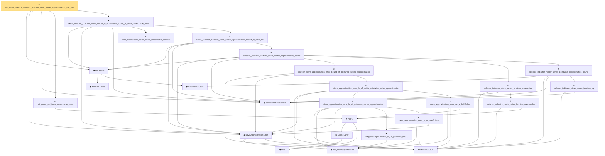

# Proof narrative — unit_cube_selector_indicator_uniform_sieve_holder_approximation_grid_rate

Root: **unit_cube_selector_indicator_uniform_sieve_holder_approximation_grid_rate** (theorem) `Statlib/Nonparametric/Approximation/Holder.lean:744` · topic `Nonparametric`
Closure: 26 declarations across 8 files. Generated from `proof_graph.json` — no files were moved.

Reading order (foundations first, headline last):

    ◆ `FunctionClass` — abbrev · `Statlib/Nonparametric/Vocabulary/FunctionClasses.lean:16`  _(also used by 24: holder_class_approximation_error_le_of_net_member, kernel_smoother_classApproximationError_le_of_holder_bias_member, kernel_smoother_classApproximationError_le_of_holder_bias_rate, …)_
    ◆ `IsHolderFunction` — def · `Statlib/Nonparametric/Vocabulary/FunctionClasses.lean:44`  _(also used by 21: holder_net_sup_approximation_bound, holder_net_integrated_squared_error_bound, holder_class_approximation_error_le_of_net_member, …)_
  ◆ `holderBall` — def · `Statlib/Nonparametric/Vocabulary/FunctionClasses.lean:60`  _(also used by 11: holder_ball_class_approximation_error_self_le_zero, exists_selector_indicator_sieve_holder_approximation_bound, exists_selector_indicator_sieve_uniform_holder_approximation_rate_of_cover, …)_
    ◆ `integratedSquaredError` — noncomputable def · `Statlib/Nonparametric/Vocabulary/Risk.lean:60`  _(also used by 30: supNormBall_classApproximationError_self_le_zero, holder_net_integrated_squared_error_bound, holder_class_approximation_error_le_of_net_member, …)_
    ◆ `seriesFunction` — noncomputable def · `Statlib/Nonparametric/Vocabulary/Sieve.lean:27`  _(also used by 59: selector_indicator_holder_series_integrated_squared_error_bound, selector_indicator_holder_class_approximation_error_le_of_net, selector_indicator_holder_sieve_approximation_error_le_of_net, …)_
  ◆ `sieveApproximationError` — noncomputable def · `Statlib/Nonparametric/Vocabulary/Sieve.lean:42`  _(also used by 53: selector_indicator_holder_sieve_approximation_error_le_of_net, exists_selector_indicator_sieve_holder_approximation_bound, exists_selector_indicator_sieve_uniform_holder_approximation_rate_of_cover, …)_
  ◆ `selectorIndicatorSieve` — def · `Statlib/Nonparametric/Approximation/Sieve.lean:459`  _(also used by 11: selector_indicator_holder_series_integrated_squared_error_bound, selector_indicator_holder_class_approximation_error_le_of_net, selector_indicator_holder_sieve_approximation_error_le_of_net, …)_
      ◆ `bias` — noncomputable def · `Statlib/Nonparametric/Vocabulary/Estimator.lean:28`  _(also used by 24: exists_fullyConnectedReLUNet_mul_approx_on_box, exists_fullyConnectedReLUNet_linear_combination_two, exists_fullyConnectedReLUNet_coordinate_mul_approx_on_box, …)_
      ▣ `DenseLayer` — structure · `Statlib/Nonparametric/Vocabulary/NeuralNetwork.lean:23`  _(also used by 16: exists_fullyConnectedReLUNet_finite_linear_combination_approx, exists_fullyConnectedReLUNet_product_of_depth_one_approximants_on_box, exists_fullyConnectedReLUNet_finite_centered_monomial_polynomial_approx_on_box, …)_
    ◆ `apply` — noncomputable def · `Statlib/Nonparametric/Vocabulary/NeuralNetwork.lean:30`  _(also used by 77: kernel_holder_bias_integratedSquaredError_bound, classApproximationError_le_of_exists_pointwise_bound, integratedSquaredError_nonneg, …)_
  ★ `unit_cube_grid_finite_measurable_cover` — theorem · `Statlib/Nonparametric/Approximation/Holder.lean:551`  _(also used by 1: unit_cube_dyadic_grid_finite_measurable_cover_basis_rate)_
    ★ `finite_measurable_cover_exists_measurable_selector` — theorem · `Statlib/Nonparametric/Approximation/Sieve.lean:379`  _(also used by 1: exists_selector_indicator_sieve_uniform_holder_approximation_rate_of_finite_measurable_cover)_
            ★ `integratedSquaredError_le_of_pointwise_bound` — theorem · `Statlib/Nonparametric/Approximation/Metric.lean:10`  _(also used by 11: holder_net_integrated_squared_error_bound, holder_class_approximation_error_le_of_net_member, selector_indicator_holder_series_integrated_squared_error_bound, …)_
            ★ `sieve_approximation_error_le_of_coefficients` — theorem · `Statlib/Nonparametric/Approximation/Sieve.lean:165`
            ★ `sieve_approximation_error_le_of_pointwise_series_approximation` — theorem · `Statlib/Nonparametric/Approximation/Sieve.lean:306`  _(also used by 3: selector_indicator_holder_sieve_approximation_error_le_of_net, unit_cube_bspline_sieve_approximation_error_bound_of_local_error, unit_cube_bspline_trace_uniform_sieve_holder_smooth_approximation_rate_of_projection)_
            ★ `sieve_approximation_error_range_bddBelow` — theorem · `Statlib/Nonparametric/Approximation/Sieve.lean:179`  _(also used by 2: unit_cube_bspline_sieve_approximation_error_bound_of_local_error, unit_cube_bspline_trace_uniform_sieve_holder_smooth_approximation_rate_of_projection)_
          ★ `sieve_approximation_error_le_of_exists_pointwise_series_approximation` — theorem · `Statlib/Nonparametric/Approximation/Sieve.lean:327`
        ★ `uniform_sieve_approximation_error_bound_of_pointwise_series_approximation` — theorem · `Statlib/Nonparametric/Approximation/Sieve.lean:343`  _(also used by 3: exists_uniform_sieve_approximation_error_bound_of_pointwise_series_approximation, tensor_product_spline_sieve_holder_smooth_approximation_bound_of_exists_pointwise_series, wavelet_sieve_holder_smooth_approximation_bound_of_exists_pointwise_series)_
          ★ `selector_indicator_basis_series_function_measurable` — theorem · `Statlib/Nonparametric/Approximation/Sieve.lean:463`
        ★ `selector_indicator_sieve_series_function_measurable` — theorem · `Statlib/Nonparametric/Approximation/Sieve.lean:480`
          ★ `selector_indicator_sieve_series_function_eq` — theorem · `Statlib/Nonparametric/Approximation/Sieve.lean:486`  _(also used by 4: selector_indicator_holder_class_approximation_error_le_of_net, selector_indicator_holder_sieve_approximation_error_le_of_net, selector_indicator_basis_series_function_eq, …)_
        ★ `selector_indicator_holder_series_pointwise_approximation_bound` — theorem · `Statlib/Nonparametric/Approximation/Holder.lean:116`  _(also used by 1: selector_indicator_holder_series_integrated_squared_error_bound)_
      ★ `selector_indicator_uniform_sieve_holder_approximation_bound` — theorem · `Statlib/Nonparametric/Approximation/Holder.lean:271`
    ★ `exists_selector_indicator_sieve_holder_approximation_bound_of_finite_net` — theorem · `Statlib/Nonparametric/Approximation/Holder.lean:299`  _(also used by 2: exists_selector_indicator_sieve_holder_approximation_bound, exists_selector_indicator_sieve_uniform_holder_approximation_rate_of_cover)_
  ★ `exists_selector_indicator_sieve_holder_approximation_bound_of_finite_measurable_cover` — theorem · `Statlib/Nonparametric/Approximation/Holder.lean:319`
★ `unit_cube_selector_indicator_uniform_sieve_holder_approximation_grid_rate` — theorem · `Statlib/Nonparametric/Approximation/Holder.lean:744` **← headline**

## Dependency diagram

