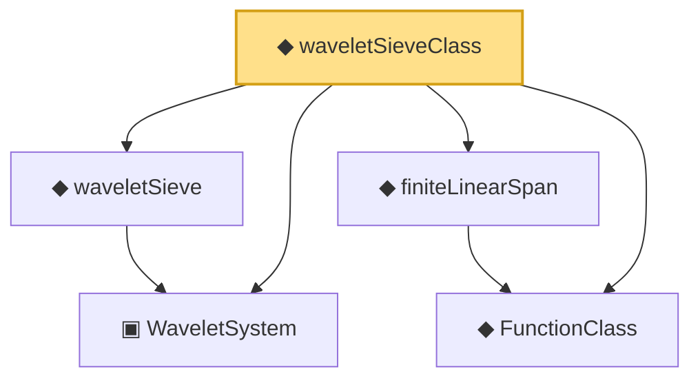

# Proof narrative — waveletSieveClass

Root: **waveletSieveClass** (noncomputable def) `Statlib/Nonparametric/Vocabulary/Wavelet.lean:25` · topic `Nonparametric`
Closure: 5 declarations across 3 files. Generated from `proof_graph.json` — no files were moved.

Reading order (foundations first, headline last):

  ▣ `WaveletSystem` — structure · `Statlib/Nonparametric/Vocabulary/Wavelet.lean:14`  _(also used by 14: HasWaveletHolderSmoothPointwiseRate, HasWaveletHolderSmoothProjectionRate, hasWaveletHolderSmoothPointwiseRate_of_projectionRate, …)_
  ◆ `FunctionClass` — abbrev · `Statlib/Nonparametric/Vocabulary/FunctionClasses.lean:16`  _(also used by 20: holder_classApproximationError_le_of_net_member, kernel_smoother_classApproximationError_le_of_holder_bias_member, kernel_smoother_classApproximationError_le_of_holder_bias_rate, …)_
  ◆ `finiteLinearSpan` — noncomputable def · `Statlib/Nonparametric/Vocabulary/Sieve.lean:23`  _(also used by 10: finiteLinearSpan_classApproximationError_le_of_holder_selector_net, holder_selector_net_classApproximationError_le_rate, seriesFunction_mem_finiteLinearSpan, …)_
  ◆ `waveletSieve` — def · `Statlib/Nonparametric/Vocabulary/Wavelet.lean:20`  _(also used by 11: HasWaveletHolderSmoothPointwiseRate, HasWaveletHolderSmoothProjectionRate, waveletSieve_seriesFunction_measurable_of_system, …)_
◆ `waveletSieveClass` — noncomputable def · `Statlib/Nonparametric/Vocabulary/Wavelet.lean:25` **← headline**

## Dependency diagram

