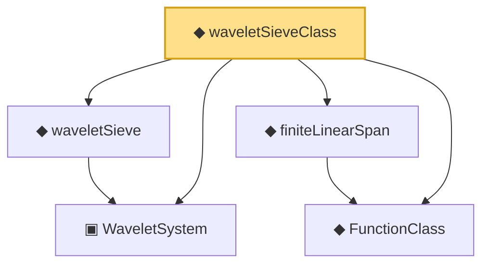

# Proof narrative — waveletSieveClass

Root: **waveletSieveClass** (noncomputable def) `Statlib/Nonparametric/Vocabulary/Wavelet.lean:77` · topic `Nonparametric`
Closure: 5 declarations across 3 files. Generated from `proof_graph.json` — no files were moved.

Reading order (foundations first, headline last):

  ▣ `WaveletSystem` — structure · `Statlib/Nonparametric/Vocabulary/Wavelet.lean:16`  _(also used by 22: wavelet_sieve_series_function_measurable_of_system, wavelet_sieve_holder_smooth_approximation_bound_of_exists_pointwise_series, wavelet_sieve_holder_smooth_approximation_bound_of_pointwise_approximation, …)_
  ◆ `FunctionClass` — abbrev · `Statlib/Nonparametric/Vocabulary/FunctionClasses.lean:16`  _(also used by 23: holder_class_approximation_error_le_of_net_member, kernel_smoother_classApproximationError_le_of_holder_bias_member, kernel_smoother_classApproximationError_le_of_holder_bias_rate, …)_
  ◆ `finiteLinearSpan` — noncomputable def · `Statlib/Nonparametric/Vocabulary/Sieve.lean:23`  _(also used by 10: selector_indicator_holder_class_approximation_error_le_of_net, selector_indicator_holder_class_approximation_error_le_rate, series_function_mem_finite_linear_span, …)_
  ◆ `waveletSieve` — def · `Statlib/Nonparametric/Vocabulary/Wavelet.lean:72`  _(also used by 24: wavelet_sieve_series_function_measurable_of_system, wavelet_sieve_holder_smooth_approximation_bound_of_exists_pointwise_series, wavelet_sieve_holder_smooth_approximation_bound_of_pointwise_approximation, …)_
◆ `waveletSieveClass` — noncomputable def · `Statlib/Nonparametric/Vocabulary/Wavelet.lean:77` **← headline**

## Dependency diagram

```mermaid
flowchart TD
  n0["▣ WaveletSystem"]
  n1["◆ FunctionClass"]
  n2["◆ finiteLinearSpan"]
  n3["◆ waveletSieve"]
  n4["◆ waveletSieveClass"]
  n2 --> n1
  n3 --> n0
  n4 --> n0
  n4 --> n1
  n4 --> n2
  n4 --> n3
  class n4 headline;
  classDef headline fill:#ffe08a,stroke:#d4a017,stroke-width:2px;
  classDef axiomNode fill:#ffd0d0,stroke:#c0392b,stroke-dasharray:4 2;
```
