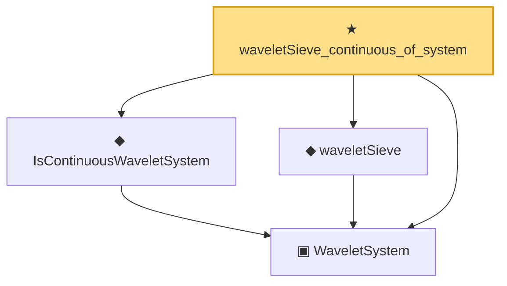

# Proof narrative — waveletSieve_continuous_of_system

Root: **waveletSieve_continuous_of_system** (theorem) `Statlib/Nonparametric/Vocabulary/Wavelet.lean:45` · topic `Nonparametric`
Closure: 4 declarations across 1 files. Generated from `proof_graph.json` — no files were moved.

Reading order (foundations first, headline last):

  ▣ `WaveletSystem` — structure · `Statlib/Nonparametric/Vocabulary/Wavelet.lean:14`  _(also used by 13: HasWaveletHolderSmoothPointwiseRate, HasWaveletHolderSmoothProjectionRate, hasWaveletHolderSmoothPointwiseRate_of_projectionRate, …)_
  ◆ `IsContinuousWaveletSystem` — def · `Statlib/Nonparametric/Vocabulary/Wavelet.lean:35`
  ◆ `waveletSieve` — def · `Statlib/Nonparametric/Vocabulary/Wavelet.lean:20`  _(also used by 11: HasWaveletHolderSmoothPointwiseRate, HasWaveletHolderSmoothProjectionRate, waveletSieve_seriesFunction_measurable_of_system, …)_
★ `waveletSieve_continuous_of_system` — theorem · `Statlib/Nonparametric/Vocabulary/Wavelet.lean:45` **← headline**

## Dependency diagram

