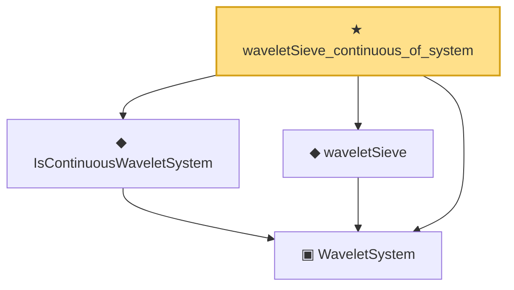

# Proof narrative — waveletSieve_continuous_of_system

Root: **waveletSieve_continuous_of_system** (theorem) `Statlib/Nonparametric/Approximation/WaveletFacts.lean:44` · topic `Nonparametric`
Closure: 4 declarations across 2 files. Generated from `proof_graph.json` — no files were moved.

Reading order (foundations first, headline last):

  ▣ `WaveletSystem` — structure · `Statlib/Nonparametric/Vocabulary/Wavelet.lean:16`  _(also used by 21: wavelet_sieve_series_function_measurable_of_system, wavelet_sieve_holder_smooth_approximation_bound_of_exists_pointwise_series, wavelet_sieve_holder_smooth_approximation_bound_of_pointwise_approximation, …)_
  ◆ `IsContinuousWaveletSystem` — def · `Statlib/Nonparametric/Vocabulary/Wavelet.lean:87`
  ◆ `waveletSieve` — def · `Statlib/Nonparametric/Vocabulary/Wavelet.lean:72`  _(also used by 24: wavelet_sieve_series_function_measurable_of_system, wavelet_sieve_holder_smooth_approximation_bound_of_exists_pointwise_series, wavelet_sieve_holder_smooth_approximation_bound_of_pointwise_approximation, …)_
★ `waveletSieve_continuous_of_system` — theorem · `Statlib/Nonparametric/Approximation/WaveletFacts.lean:44` **← headline**

## Dependency diagram

```mermaid
flowchart TD
  n0["▣ WaveletSystem"]
  n1["◆ IsContinuousWaveletSystem"]
  n2["◆ waveletSieve"]
  n3["★ waveletSieve_continuous_of_system"]
  n1 --> n0
  n2 --> n0
  n3 --> n0
  n3 --> n1
  n3 --> n2
  class n3 headline;
  classDef headline fill:#ffe08a,stroke:#d4a017,stroke-width:2px;
  classDef axiomNode fill:#ffd0d0,stroke:#c0392b,stroke-dasharray:4 2;
```
