# Proof narrative — waveletSieve_holderSmoothBall_error_bound_of_has_pointwise_rate_and_exact_basisCount

Root: **waveletSieve_holderSmoothBall_error_bound_of_has_pointwise_rate_and_exact_basisCount** (theorem) `Statlib/Nonparametric/Approximation/Wavelet.lean:176` · topic `Nonparametric`
Closure: 30 declarations across 9 files. Generated from `proof_graph.json` — no files were moved.

Reading order (foundations first, headline last):

  ▣ `WaveletSystem` — structure · `Statlib/Nonparametric/Vocabulary/Wavelet.lean:14`  _(also used by 5: HasWaveletHolderSmoothProjectionRate, hasWaveletHolderSmoothPointwiseRate_of_projectionRate, waveletSieveClass, …)_
  ◆ `IsMeasurableWaveletSystem` — def · `Statlib/Nonparametric/Vocabulary/Wavelet.lean:30`
    ◆ `FunctionClass` — abbrev · `Statlib/Nonparametric/Vocabulary/FunctionClasses.lean:16`  _(also used by 20: holder_classApproximationError_le_of_net_member, kernel_smoother_classApproximationError_le_of_holder_bias_member, kernel_smoother_classApproximationError_le_of_holder_bias_rate, …)_
    ◆ `IsHolderFunction` — def · `Statlib/Nonparametric/Vocabulary/FunctionClasses.lean:44`  _(also used by 16: holder_net_approx_sup_bound, holder_net_integratedSquaredError_bound, holder_classApproximationError_le_of_net_member, …)_
    ◆ `IsHolderSmoothFunction` — def · `Statlib/Nonparametric/Vocabulary/FunctionClasses.lean:69`
    ◆ `holderBall` — def · `Statlib/Nonparametric/Vocabulary/FunctionClasses.lean:56`  _(also used by 9: holderBall_classApproximationError_self_le_zero, holderBall_selectorIndicator_sieveApproximationError_uniform_bound, exists_selectorIndicatorSieve_for_holderBall_of_finite_net, …)_
  ◆ `holderSmoothBall` — def · `Statlib/Nonparametric/Vocabulary/FunctionClasses.lean:82`  _(also used by 9: HasTensorProductSplineHolderSmoothPointwiseRate, HasTensorProductSplineHolderSmoothProjectionRate, tensorProductSplineSieve_holderSmoothBall_error_bound_of_exists_pointwise_series, …)_
    ◆ `seriesFunction` — noncomputable def · `Statlib/Nonparametric/Vocabulary/Sieve.lean:27`  _(also used by 28: holder_selectorIndicator_series_pointwise_bound, holder_selectorIndicator_series_integratedSquaredError_bound, finiteLinearSpan_classApproximationError_le_of_holder_selector_net, …)_
  ◆ `waveletSieve` — def · `Statlib/Nonparametric/Vocabulary/Wavelet.lean:20`  _(also used by 3: HasWaveletHolderSmoothProjectionRate, waveletSieveClass, waveletSieve_continuous_of_system)_
  ◆ `HasWaveletHolderSmoothPointwiseRate` — def · `Statlib/Nonparametric/Approximation/Wavelet.lean:17`  _(also used by 1: hasWaveletHolderSmoothPointwiseRate_of_projectionRate)_
    ◆ `integratedSquaredError` — noncomputable def · `Statlib/Nonparametric/Vocabulary/Risk.lean:60`  _(also used by 30: supNormBall_classApproximationError_self_le_zero, holder_net_integratedSquaredError_bound, holder_classApproximationError_le_of_net_member, …)_
  ◆ `sieveApproximationError` — noncomputable def · `Statlib/Nonparametric/Vocabulary/Sieve.lean:42`  _(also used by 17: sieveApproximationError_le_of_holder_selector_net, holderBall_selectorIndicator_sieveApproximationError_uniform_bound, exists_selectorIndicatorSieve_for_holderBall_of_finite_net, …)_
    ◆ `bias` — noncomputable def · `Statlib/Nonparametric/Vocabulary/Estimator.lean:28`
    ▣ `DenseLayer` — structure · `Statlib/Nonparametric/Vocabulary/NeuralNetwork.lean:23`  _(also used by 2: reluApply, OneHiddenReLUNet)_
  ◆ `apply` — noncomputable def · `Statlib/Nonparametric/Vocabulary/NeuralNetwork.lean:30`  _(also used by 11: unitCube_grid_finite_measurable_cover, kernel_holder_bias_integratedSquaredError_bound, classApproximationError_le_of_exists_pointwise_bound, …)_
            ★ `integratedSquaredError_le_of_pointwise_bound` — theorem · `Statlib/Nonparametric/Approximation/Metric.lean:10`  _(also used by 11: holder_net_integratedSquaredError_bound, holder_classApproximationError_le_of_net_member, holder_selectorIndicator_series_integratedSquaredError_bound, …)_
            ★ `sieveApproximationError_le_of_coefficients` — theorem · `Statlib/Nonparametric/Approximation/Sieve.lean:107`
            ★ `sieveApproximationError_le_of_pointwise_series_bound` — theorem · `Statlib/Nonparametric/Approximation/Sieve.lean:248`  _(also used by 1: sieveApproximationError_le_of_holder_selector_net)_
            ★ `sieveApproximationError_range_bddBelow` — theorem · `Statlib/Nonparametric/Approximation/Sieve.lean:121`
            ★ `sieveApproximationError_le_of_exists_pointwise_series` — theorem · `Statlib/Nonparametric/Approximation/Sieve.lean:269`
            ★ `sieveApproximationError_uniform_bound_of_exists_pointwise_series` — theorem · `Statlib/Nonparametric/Approximation/Sieve.lean:285`  _(also used by 3: holderBall_selectorIndicator_sieveApproximationError_uniform_bound, exists_sieveApproximationError_uniform_bound_of_exists_pointwise_series, tensorProductSplineSieve_holderSmoothBall_error_bound_of_exists_pointwise_series)_
          ★ `waveletSieve_holderSmoothBall_error_bound_of_exists_pointwise_series` — theorem · `Statlib/Nonparametric/Approximation/Wavelet.lean:63`
            ★ `seriesFunction_measurable_of_basis_measurable` — theorem · `Statlib/Nonparametric/Approximation/Sieve.lean:98`  _(also used by 1: tensorProductSplineSieve_seriesFunction_measurable)_
            ★ `waveletSieve_measurable_of_system` — theorem · `Statlib/Nonparametric/Vocabulary/Wavelet.lean:39`
          ★ `waveletSieve_seriesFunction_measurable_of_system` — theorem · `Statlib/Nonparametric/Approximation/Wavelet.lean:52`
        ★ `waveletSieve_holderSmoothBall_error_bound_of_pointwise_approx` — theorem · `Statlib/Nonparametric/Approximation/Wavelet.lean:83`
      ★ `waveletSieve_holderSmoothBall_error_bound_of_level_rate` — theorem · `Statlib/Nonparametric/Approximation/Wavelet.lean:106`
    ★ `waveletSieve_holderSmoothBall_error_bound_of_has_pointwise_rate` — theorem · `Statlib/Nonparametric/Approximation/Wavelet.lean:130`
  ★ `waveletSieve_holderSmoothBall_error_bound_of_has_pointwise_rate_and_basisCount_rate` — theorem · `Statlib/Nonparametric/Approximation/Wavelet.lean:148`
★ `waveletSieve_holderSmoothBall_error_bound_of_has_pointwise_rate_and_exact_basisCount` — theorem · `Statlib/Nonparametric/Approximation/Wavelet.lean:176` **← headline**

## Dependency diagram

```mermaid
flowchart TD
  n0["▣ WaveletSystem"]
  n1["◆ IsMeasurableWaveletSystem"]
  n2["◆ FunctionClass"]
  n3["◆ IsHolderFunction"]
  n4["◆ IsHolderSmoothFunction"]
  n5["◆ holderBall"]
  n6["◆ holderSmoothBall"]
  n7["◆ seriesFunction"]
  n8["◆ waveletSieve"]
  n9["◆ HasWaveletHolderSmoothPointwiseRate"]
  n10["◆ integratedSquaredError"]
  n11["◆ sieveApproximationError"]
  n12["◆ bias"]
  n13["▣ DenseLayer"]
  n14["◆ apply"]
  n15["★ integratedSquaredError_le_of_pointwise_bound"]
  n16["★ sieveApproximationError_le_of_coefficients"]
  n17["★ sieveApproximationError_le_of_pointwise_series_bound"]
  n18["★ sieveApproximationError_range_bddBelow"]
  n19["★ sieveApproximationError_le_of_exists_pointwise_series"]
  n20["★ sieveApproximationError_uniform_bound_of_exists_pointwise_series"]
  n21["★ waveletSieve_holderSmoothBall_error_bound_of_exists_pointwise_series"]
  n22["★ seriesFunction_measurable_of_basis_measurable"]
  n23["★ waveletSieve_measurable_of_system"]
  n24["★ waveletSieve_seriesFunction_measurable_of_system"]
  n25["★ waveletSieve_holderSmoothBall_error_bound_of_pointwise_approx"]
  n26["★ waveletSieve_holderSmoothBall_error_bound_of_level_rate"]
  n27["★ waveletSieve_holderSmoothBall_error_bound_of_has_pointwise_rate"]
  n28["★ waveletSieve_holderSmoothBall_error_bound_of_has_pointwise_rate_and_basisCount_rate"]
  n29["★ waveletSieve_holderSmoothBall_error_bound_of_has_pointwise_rate_and_exact_basisCount"]
  n1 --> n0
  n4 --> n3
  n5 --> n2
  n5 --> n3
  n6 --> n2
  n6 --> n4
  n6 --> n3
  n6 --> n5
  n8 --> n0
  n9 --> n0
  n9 --> n6
  n9 --> n7
  n9 --> n8
  n11 --> n10
  n11 --> n7
  n13 --> n12
  n14 --> n13
  n14 --> n12
  n15 --> n10
  n16 --> n10
  n16 --> n7
  n16 --> n11
  n17 --> n7
  n17 --> n10
  n17 --> n11
  n17 --> n15
  n17 --> n16
  n18 --> n10
  n18 --> n7
  n18 --> n14
  n19 --> n7
  n19 --> n11
  n19 --> n17
  n19 --> n18
  n20 --> n7
  n20 --> n11
  n20 --> n19
  n21 --> n0
  n21 --> n6
  n21 --> n7
  n21 --> n8
  n21 --> n11
  n21 --> n20
  n22 --> n7
  n23 --> n0
  n23 --> n1
  n23 --> n8
  n24 --> n0
  n24 --> n1
  n24 --> n7
  n24 --> n8
  n24 --> n22
  n24 --> n23
  n25 --> n0
  n25 --> n1
  n25 --> n6
  n25 --> n7
  n25 --> n8
  n25 --> n11
  n25 --> n21
  n25 --> n24
  n26 --> n0
  n26 --> n1
  n26 --> n6
  n26 --> n7
  n26 --> n8
  n26 --> n11
  n26 --> n25
  n27 --> n0
  n27 --> n1
  n27 --> n6
  n27 --> n9
  n27 --> n11
  n27 --> n8
  n27 --> n26
  n28 --> n0
  n28 --> n1
  n28 --> n6
  n28 --> n9
  n28 --> n11
  n28 --> n8
  n28 --> n27
  n29 --> n0
  n29 --> n1
  n29 --> n6
  n29 --> n9
  n29 --> n11
  n29 --> n8
  n29 --> n14
  n29 --> n28
  class n29 headline;
  classDef headline fill:#ffe08a,stroke:#d4a017,stroke-width:2px;
  classDef axiomNode fill:#ffd0d0,stroke:#c0392b,stroke-dasharray:4 2;
```

