# Proof narrative — wavelet_sieve_holder_smooth_approximation_exact_basis_count_of_projection_certificate

Root: **wavelet_sieve_holder_smooth_approximation_exact_basis_count_of_projection_certificate** (theorem) `Statlib/Nonparametric/Approximation/Wavelet.lean:277` · topic `Nonparametric`
Closure: 34 declarations across 10 files. Generated from `proof_graph.json` — no files were moved.

Reading order (foundations first, headline last):

  ▣ `WaveletSystem` — structure · `Statlib/Nonparametric/Vocabulary/Wavelet.lean:16`  _(also used by 9: wavelet_sieve_holder_smooth_approximation_bound_of_approximation_sieve, wavelet_high_order_holder_smooth_uniform_sieve_approximation_rate_of_approximation_sieve, wavelet_high_order_holder_smooth_uniform_sieve_approximation_rate_of_projection_certificate, …)_
  ◆ `IsMeasurableWaveletSystem` — def · `Statlib/Nonparametric/Vocabulary/Wavelet.lean:82`  _(also used by 4: wavelet_high_order_holder_smooth_uniform_sieve_approximation_rate_of_projection_certificate, dyadic_wavelet_high_order_holder_smooth_uniform_sieve_approximation_rate_of_projection_error, haarScalingWaveletSystem_isMeasurable, …)_
    ◆ `FunctionClass` — abbrev · `Statlib/Nonparametric/Vocabulary/FunctionClasses.lean:16`  _(also used by 23: holder_class_approximation_error_le_of_net_member, kernel_smoother_classApproximationError_le_of_holder_bias_member, kernel_smoother_classApproximationError_le_of_holder_bias_rate, …)_
    ◆ `IsHolderFunction` — def · `Statlib/Nonparametric/Vocabulary/FunctionClasses.lean:44`  _(also used by 20: holder_net_sup_approximation_bound, holder_net_integrated_squared_error_bound, holder_class_approximation_error_le_of_net_member, …)_
    ◆ `IsHolderSmoothFunction` — def · `Statlib/Nonparametric/Vocabulary/FunctionClasses.lean:73`  _(also used by 2: unit_cube_bspline_zero_order_holder_projection_rate_of_support_node, tensor_product_linear_bspline_holder_projection_rate_of_local_partition)_
    ◆ `holderBall` — def · `Statlib/Nonparametric/Vocabulary/FunctionClasses.lean:60`  _(also used by 14: holder_ball_class_approximation_error_self_le_zero, selector_indicator_uniform_sieve_holder_approximation_bound, exists_selector_indicator_sieve_holder_approximation_bound_of_finite_net, …)_
  ◆ `holderSmoothBall` — def · `Statlib/Nonparametric/Vocabulary/FunctionClasses.lean:86`  _(also used by 66: holderSmoothBall_taylor_remainder_bound_on_box, holderSmoothBall_finite_centered_coordinate_polynomial_error_on_norm_ball, exists_fullyConnectedReLUNet_holderSmooth_local_approx_on_centered_box_with_size_bound, …)_
    ◆ `seriesFunction` — noncomputable def · `Statlib/Nonparametric/Vocabulary/Sieve.lean:27`  _(also used by 55: selector_indicator_holder_series_pointwise_approximation_bound, selector_indicator_holder_series_integrated_squared_error_bound, selector_indicator_holder_class_approximation_error_le_of_net, …)_
  ◆ `waveletSieve` — def · `Statlib/Nonparametric/Vocabulary/Wavelet.lean:72`  _(also used by 12: wavelet_sieve_holder_smooth_approximation_bound_of_approximation_sieve, wavelet_high_order_holder_smooth_uniform_sieve_approximation_rate_of_approximation_sieve, wavelet_high_order_holder_smooth_uniform_sieve_approximation_rate_of_projection_certificate, …)_
  ▣ `WaveletProjectionCertificate` — structure · `Statlib/Nonparametric/Vocabulary/Wavelet.lean:125`  _(also used by 4: wavelet_high_order_holder_smooth_uniform_sieve_approximation_rate_of_projection_certificate, dyadic_wavelet_holder_smooth_approximation_bound_of_projection_certificate, dyadic_wavelet_high_order_holder_smooth_uniform_sieve_approximation_rate_of_projection_certificate, …)_
    ◆ `integratedSquaredError` — noncomputable def · `Statlib/Nonparametric/Vocabulary/Risk.lean:60`  _(also used by 30: supNormBall_classApproximationError_self_le_zero, holder_net_integrated_squared_error_bound, holder_class_approximation_error_le_of_net_member, …)_
  ◆ `sieveApproximationError` — noncomputable def · `Statlib/Nonparametric/Vocabulary/Sieve.lean:42`  _(also used by 49: selector_indicator_holder_sieve_approximation_error_le_of_net, selector_indicator_uniform_sieve_holder_approximation_bound, exists_selector_indicator_sieve_holder_approximation_bound_of_finite_net, …)_
    ◆ `HasWaveletHolderSmoothProjectionRate` — def · `Statlib/Nonparametric/Vocabulary/Wavelet.lean:110`  _(also used by 3: dyadic_wavelet_holder_smooth_approximation_bound_of_projection_rate, haar_wavelet_zero_order_holder_projection_rate_of_cell_selector, IsWaveletHolderSmoothApproximationSieve)_
      ◆ `HasWaveletHolderSmoothPointwiseRate` — def · `Statlib/Nonparametric/Vocabulary/Wavelet.lean:96`
        ◆ `bias` — noncomputable def · `Statlib/Nonparametric/Vocabulary/Estimator.lean:28`  _(also used by 24: exists_fullyConnectedReLUNet_mul_approx_on_box, exists_fullyConnectedReLUNet_linear_combination_two, exists_fullyConnectedReLUNet_coordinate_mul_approx_on_box, …)_
        ▣ `DenseLayer` — structure · `Statlib/Nonparametric/Vocabulary/NeuralNetwork.lean:23`  _(also used by 16: exists_fullyConnectedReLUNet_finite_linear_combination_approx, exists_fullyConnectedReLUNet_product_of_depth_one_approximants_on_box, exists_fullyConnectedReLUNet_finite_centered_monomial_polynomial_approx_on_box, …)_
      ◆ `apply` — noncomputable def · `Statlib/Nonparametric/Vocabulary/NeuralNetwork.lean:30`  _(also used by 78: unit_cube_grid_finite_measurable_cover, kernel_holder_bias_integratedSquaredError_bound, classApproximationError_le_of_exists_pointwise_bound, …)_
            ★ `integratedSquaredError_le_of_pointwise_bound` — theorem · `Statlib/Nonparametric/Approximation/Metric.lean:10`  _(also used by 11: holder_net_integrated_squared_error_bound, holder_class_approximation_error_le_of_net_member, selector_indicator_holder_series_integrated_squared_error_bound, …)_
            ★ `sieve_approximation_error_le_of_coefficients` — theorem · `Statlib/Nonparametric/Approximation/Sieve.lean:165`
            ★ `sieve_approximation_error_le_of_pointwise_series_approximation` — theorem · `Statlib/Nonparametric/Approximation/Sieve.lean:306`  _(also used by 3: selector_indicator_holder_sieve_approximation_error_le_of_net, unit_cube_bspline_sieve_approximation_error_bound_of_local_error, unit_cube_bspline_trace_uniform_sieve_holder_smooth_approximation_rate_of_projection)_
            ★ `sieve_approximation_error_range_bddBelow` — theorem · `Statlib/Nonparametric/Approximation/Sieve.lean:179`  _(also used by 2: unit_cube_bspline_sieve_approximation_error_bound_of_local_error, unit_cube_bspline_trace_uniform_sieve_holder_smooth_approximation_rate_of_projection)_
            ★ `sieve_approximation_error_le_of_exists_pointwise_series_approximation` — theorem · `Statlib/Nonparametric/Approximation/Sieve.lean:327`
            ★ `uniform_sieve_approximation_error_bound_of_pointwise_series_approximation` — theorem · `Statlib/Nonparametric/Approximation/Sieve.lean:343`  _(also used by 3: selector_indicator_uniform_sieve_holder_approximation_bound, exists_uniform_sieve_approximation_error_bound_of_pointwise_series_approximation, tensor_product_spline_sieve_holder_smooth_approximation_bound_of_exists_pointwise_series)_
            ★ `wavelet_sieve_holder_smooth_approximation_bound_of_exists_pointwise_series` — theorem · `Statlib/Nonparametric/Approximation/Wavelet.lean:25`
            ★ `series_function_measurable_of_basis_measurable` — theorem · `Statlib/Nonparametric/Approximation/Sieve.lean:156`  _(also used by 1: tensor_product_spline_sieve_series_function_measurable)_
            ★ `waveletSieve_measurable_of_system` — theorem · `Statlib/Nonparametric/Approximation/WaveletFacts.lean:38`
            ★ `wavelet_sieve_series_function_measurable_of_system` — theorem · `Statlib/Nonparametric/Approximation/Wavelet.lean:14`
            ★ `wavelet_sieve_holder_smooth_approximation_bound_of_pointwise_approximation` — theorem · `Statlib/Nonparametric/Approximation/Wavelet.lean:45`
          ★ `wavelet_sieve_holder_smooth_approximation_bound_of_level_rate` — theorem · `Statlib/Nonparametric/Approximation/Wavelet.lean:68`
        ★ `wavelet_sieve_holder_smooth_approximation_bound_of_pointwise_rate` — theorem · `Statlib/Nonparametric/Approximation/Wavelet.lean:92`
      ★ `wavelet_sieve_holder_smooth_approximation_basis_count_rate` — theorem · `Statlib/Nonparametric/Approximation/Wavelet.lean:110`
    ★ `wavelet_sieve_holder_smooth_approximation_exact_basis_count` — theorem · `Statlib/Nonparametric/Approximation/Wavelet.lean:138`
  ★ `wavelet_sieve_holder_smooth_approximation_exact_basis_count_of_projection_rate` — theorem · `Statlib/Nonparametric/Approximation/Wavelet.lean:251`  _(also used by 1: wavelet_sieve_holder_smooth_approximation_bound_of_approximation_sieve)_
★ `wavelet_sieve_holder_smooth_approximation_exact_basis_count_of_projection_certificate` — theorem · `Statlib/Nonparametric/Approximation/Wavelet.lean:277` **← headline**

## Dependency diagram

```mermaid
flowchart TD
  n0["▣ WaveletSystem"]
  n1["◆ IsMeasurableWaveletSystem"]
  n2["◆ FunctionClass"]
  n3["◆ IsHolderFunction"]
  n4["◆ IsHolderSmoothFunction"]
  n5["◆ holderBall"]
  n6["◆ holderSmoothBall"]
  n7["◆ seriesFunction"]
  n8["◆ waveletSieve"]
  n9["▣ WaveletProjectionCertificate"]
  n10["◆ integratedSquaredError"]
  n11["◆ sieveApproximationError"]
  n12["◆ HasWaveletHolderSmoothProjectionRate"]
  n13["◆ HasWaveletHolderSmoothPointwiseRate"]
  n14["◆ bias"]
  n15["▣ DenseLayer"]
  n16["◆ apply"]
  n17["★ integratedSquaredError_le_of_pointwise_bound"]
  n18["★ sieve_approximation_error_le_of_coefficients"]
  n19["★ sieve_approximation_error_le_of_pointwise_series_approximation"]
  n20["★ sieve_approximation_error_range_bddBelow"]
  n21["★ sieve_approximation_error_le_of_exists_pointwise_series_approximation"]
  n22["★ uniform_sieve_approximation_error_bound_of_pointwise_series_approximation"]
  n23["★ wavelet_sieve_holder_smooth_approximation_bound_of_exists_pointwise_series"]
  n24["★ series_function_measurable_of_basis_measurable"]
  n25["★ waveletSieve_measurable_of_system"]
  n26["★ wavelet_sieve_series_function_measurable_of_system"]
  n27["★ wavelet_sieve_holder_smooth_approximation_bound_of_pointwise_approximation"]
  n28["★ wavelet_sieve_holder_smooth_approximation_bound_of_level_rate"]
  n29["★ wavelet_sieve_holder_smooth_approximation_bound_of_pointwise_rate"]
  n30["★ wavelet_sieve_holder_smooth_approximation_basis_count_rate"]
  n31["★ wavelet_sieve_holder_smooth_approximation_exact_basis_count"]
  n32["★ wavelet_sieve_holder_smooth_approximation_exact_basis_count_of_projection_rate"]
  n33["★ wavelet_sieve_holder_smooth_approximation_exact_basis_count_of_projection_certificate"]
  n1 --> n0
  n4 --> n3
  n5 --> n2
  n5 --> n3
  n6 --> n2
  n6 --> n4
  n6 --> n3
  n6 --> n5
  n8 --> n0
  n9 --> n0
  n9 --> n6
  n9 --> n7
  n9 --> n8
  n11 --> n10
  n11 --> n7
  n12 --> n0
  n12 --> n6
  n12 --> n7
  n12 --> n8
  n13 --> n0
  n13 --> n6
  n13 --> n7
  n13 --> n8
  n15 --> n14
  n16 --> n15
  n16 --> n14
  n17 --> n10
  n18 --> n10
  n18 --> n7
  n18 --> n11
  n19 --> n7
  n19 --> n10
  n19 --> n11
  n19 --> n17
  n19 --> n18
  n20 --> n10
  n20 --> n7
  n20 --> n16
  n21 --> n7
  n21 --> n11
  n21 --> n19
  n21 --> n20
  n22 --> n7
  n22 --> n11
  n22 --> n21
  n23 --> n0
  n23 --> n6
  n23 --> n7
  n23 --> n8
  n23 --> n11
  n23 --> n22
  n24 --> n7
  n25 --> n0
  n25 --> n1
  n25 --> n8
  n26 --> n0
  n26 --> n1
  n26 --> n7
  n26 --> n8
  n26 --> n24
  n26 --> n25
  n27 --> n0
  n27 --> n1
  n27 --> n6
  n27 --> n7
  n27 --> n8
  n27 --> n11
  n27 --> n23
  n27 --> n26
  n28 --> n0
  n28 --> n1
  n28 --> n6
  n28 --> n7
  n28 --> n8
  n28 --> n11
  n28 --> n27
  n29 --> n0
  n29 --> n1
  n29 --> n6
  n29 --> n13
  n29 --> n11
  n29 --> n8
  n29 --> n28
  n30 --> n0
  n30 --> n1
  n30 --> n6
  n30 --> n13
  n30 --> n11
  n30 --> n8
  n30 --> n29
  n31 --> n0
  n31 --> n1
  n31 --> n6
  n31 --> n13
  n31 --> n11
  n31 --> n8
  n31 --> n16
  n31 --> n30
  n32 --> n0
  n32 --> n1
  n32 --> n6
  n32 --> n12
  n32 --> n11
  n32 --> n8
  n32 --> n31
  n33 --> n0
  n33 --> n1
  n33 --> n6
  n33 --> n9
  n33 --> n11
  n33 --> n8
  n33 --> n32
  class n33 headline;
  classDef headline fill:#ffe08a,stroke:#d4a017,stroke-width:2px;
  classDef axiomNode fill:#ffd0d0,stroke:#c0392b,stroke-dasharray:4 2;
```

