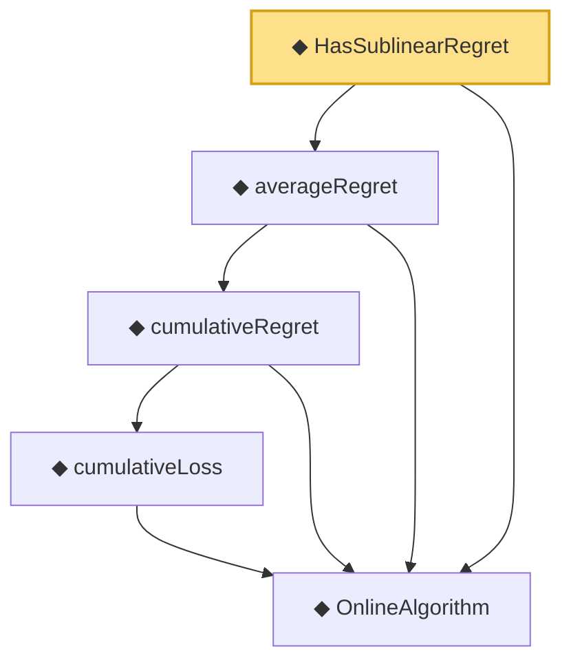

# Proof narrative — HasSublinearRegret

Root: **HasSublinearRegret** (def) `Statlib/OnlineLearning/HasSublinearRegret.lean:13` · topic `OnlineLearning`
Closure: 5 declarations across 5 files. Generated from `proof_graph.json` — no files were moved.

Reading order (foundations first, headline last):

  ◆ `OnlineAlgorithm` — def · `Statlib/OnlineLearning/OnlineAlgorithm.lean:16`  _(also used by 2: cumulativeLoss_zero, ogd_regret_bound)_
      ◆ `cumulativeLoss` — def · `Statlib/OnlineLearning/cumulativeLoss.lean:11`  _(also used by 2: cumulativeLoss_zero, cumulativeRegret_const)_
    ◆ `cumulativeRegret` — def · `Statlib/OnlineLearning/cumulativeRegret.lean:12`  _(also used by 3: const_algorithm_zero_regret, cumulativeRegret_const, ogd_regret_bound)_
  ◆ `averageRegret` — noncomputable def · `Statlib/OnlineLearning/averageRegret.lean:11`
◆ `HasSublinearRegret` — def · `Statlib/OnlineLearning/HasSublinearRegret.lean:13` **← headline**

## Dependency diagram

