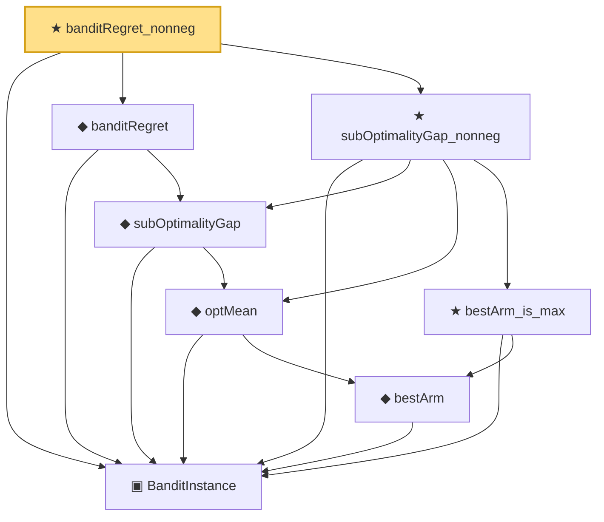

# Proof narrative — banditRegret_nonneg

Root: **banditRegret_nonneg** (theorem) `Statlib/OnlineLearning/banditRegret_nonneg.lean:13` · topic `OnlineLearning`
Closure: 8 declarations across 8 files. Generated from `proof_graph.json` — no files were moved.

Reading order (foundations first, headline last):

  ▣ `BanditInstance` — structure · `Statlib/OnlineLearning/BanditInstance.lean:13`  _(also used by 2: subOptimalityGap_bestArm_eq_zero, ucb1_regret_bound)_
      ◆ `bestArm` — noncomputable def · `Statlib/OnlineLearning/bestArm.lean:13`  _(also used by 1: subOptimalityGap_bestArm_eq_zero)_
    ◆ `optMean` — noncomputable def · `Statlib/OnlineLearning/optMean.lean:12`  _(also used by 1: subOptimalityGap_bestArm_eq_zero)_
    ◆ `subOptimalityGap` — noncomputable def · `Statlib/OnlineLearning/subOptimalityGap.lean:12`  _(also used by 2: subOptimalityGap_bestArm_eq_zero, ucb1_regret_bound)_
  ◆ `banditRegret` — noncomputable def · `Statlib/OnlineLearning/banditRegret.lean:15`  _(also used by 1: ucb1_regret_bound)_
    ★ `bestArm_is_max` — theorem · `Statlib/OnlineLearning/bestArm_is_max.lean:13`
  ★ `subOptimalityGap_nonneg` — theorem · `Statlib/OnlineLearning/subOptimalityGap_nonneg.lean:14`
★ `banditRegret_nonneg` — theorem · `Statlib/OnlineLearning/banditRegret_nonneg.lean:13` **← headline**

## Dependency diagram

