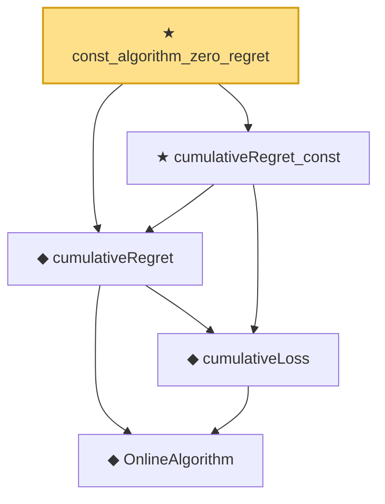

# Proof narrative — const_algorithm_zero_regret

Root: **const_algorithm_zero_regret** (theorem) `Statlib/OnlineLearning/const_algorithm_zero_regret.lean:12` · topic `OnlineLearning`
Closure: 5 declarations across 5 files. Generated from `proof_graph.json` — no files were moved.

Reading order (foundations first, headline last):

    ◆ `OnlineAlgorithm` — def · `Statlib/OnlineLearning/OnlineAlgorithm.lean:16`  _(also used by 4: HasSublinearRegret, averageRegret, cumulativeLoss_zero, …)_
    ◆ `cumulativeLoss` — def · `Statlib/OnlineLearning/cumulativeLoss.lean:11`  _(also used by 1: cumulativeLoss_zero)_
  ◆ `cumulativeRegret` — def · `Statlib/OnlineLearning/cumulativeRegret.lean:12`  _(also used by 2: averageRegret, ogd_regret_bound)_
  ★ `cumulativeRegret_const` — theorem · `Statlib/OnlineLearning/cumulativeRegret_const.lean:12`
★ `const_algorithm_zero_regret` — theorem · `Statlib/OnlineLearning/const_algorithm_zero_regret.lean:12` **← headline**

## Dependency diagram

