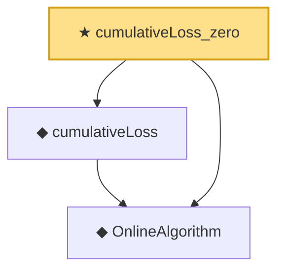

# Proof narrative — cumulativeLoss_zero

Root: **cumulativeLoss_zero** (theorem) `Statlib/OnlineLearning/cumulativeLoss_zero.lean:11` · topic `OnlineLearning`
Closure: 3 declarations across 3 files. Generated from `proof_graph.json` — no files were moved.

Reading order (foundations first, headline last):

  ◆ `OnlineAlgorithm` — def · `Statlib/OnlineLearning/OnlineAlgorithm.lean:16`  _(also used by 4: HasSublinearRegret, averageRegret, cumulativeRegret, …)_
  ◆ `cumulativeLoss` — def · `Statlib/OnlineLearning/cumulativeLoss.lean:11`  _(also used by 2: cumulativeRegret, cumulativeRegret_const)_
★ `cumulativeLoss_zero` — theorem · `Statlib/OnlineLearning/cumulativeLoss_zero.lean:11` **← headline**

## Dependency diagram

