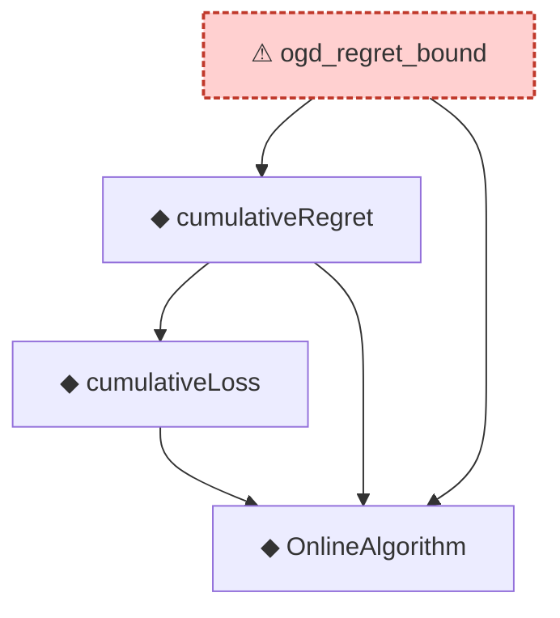

# Proof narrative — ogd_regret_bound

Root: **ogd_regret_bound** (axiom) `Statlib/OnlineLearning/ogd_regret_bound.lean:23` · topic `OnlineLearning`
Closure: 4 declarations across 4 files. Generated from `proof_graph.json` — no files were moved.

Reading order (foundations first, headline last):

  ◆ `OnlineAlgorithm` — def · `Statlib/OnlineLearning/OnlineAlgorithm.lean:16`  _(also used by 3: HasSublinearRegret, averageRegret, cumulativeLoss_zero)_
    ◆ `cumulativeLoss` — def · `Statlib/OnlineLearning/cumulativeLoss.lean:11`  _(also used by 2: cumulativeLoss_zero, cumulativeRegret_const)_
  ◆ `cumulativeRegret` — def · `Statlib/OnlineLearning/cumulativeRegret.lean:12`  _(also used by 3: averageRegret, const_algorithm_zero_regret, cumulativeRegret_const)_
⚠ `ogd_regret_bound` — axiom · `Statlib/OnlineLearning/ogd_regret_bound.lean:23` **← headline**

## Dependency diagram

> ⚠ `ogd_regret_bound` is an **axiom** (no proof body), so its closure only covers declarations referenced in its *statement*. Supporting lemmas in `OnlineLearning/` that were meant to prove it are not edge-connected — a signal that the proof line was atomised then axiomatised apart.
