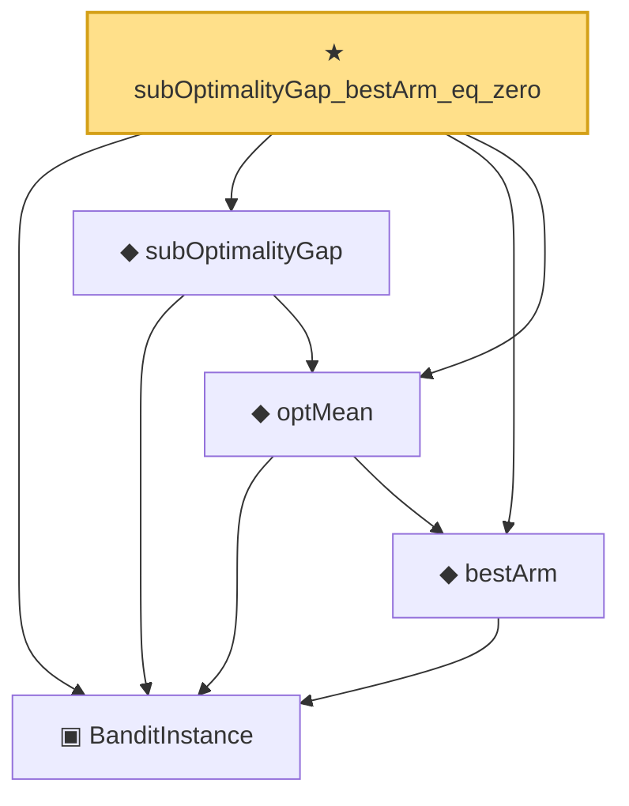

# Proof narrative — subOptimalityGap_bestArm_eq_zero

Root: **subOptimalityGap_bestArm_eq_zero** (theorem) `Statlib/OnlineLearning/subOptimalityGap_bestArm_eq_zero.lean:14` · topic `OnlineLearning`
Closure: 5 declarations across 5 files. Generated from `proof_graph.json` — no files were moved.

Reading order (foundations first, headline last):

  ▣ `BanditInstance` — structure · `Statlib/OnlineLearning/BanditInstance.lean:13`  _(also used by 5: banditRegret, banditRegret_nonneg, bestArm_is_max, …)_
  ◆ `bestArm` — noncomputable def · `Statlib/OnlineLearning/bestArm.lean:13`  _(also used by 1: bestArm_is_max)_
  ◆ `optMean` — noncomputable def · `Statlib/OnlineLearning/optMean.lean:12`  _(also used by 1: subOptimalityGap_nonneg)_
  ◆ `subOptimalityGap` — noncomputable def · `Statlib/OnlineLearning/subOptimalityGap.lean:12`  _(also used by 3: banditRegret, subOptimalityGap_nonneg, ucb1_regret_bound)_
★ `subOptimalityGap_bestArm_eq_zero` — theorem · `Statlib/OnlineLearning/subOptimalityGap_bestArm_eq_zero.lean:14` **← headline**

## Dependency diagram

