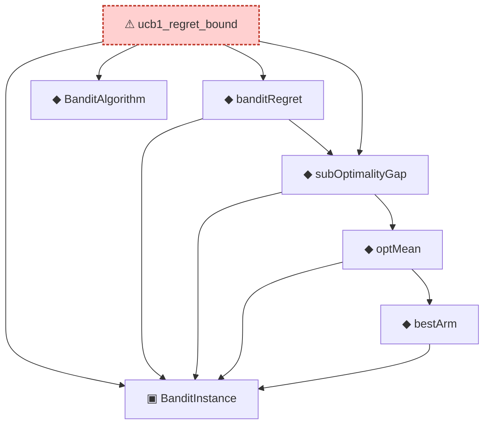

# Proof narrative — ucb1_regret_bound

Root: **ucb1_regret_bound** (axiom) `Statlib/OnlineLearning/ucb1_regret_bound.lean:25` · topic `OnlineLearning`
Closure: 7 declarations across 7 files. Generated from `proof_graph.json` — no files were moved.

Reading order (foundations first, headline last):

  ▣ `BanditInstance` — structure · `Statlib/OnlineLearning/BanditInstance.lean:13`  _(also used by 4: banditRegret_nonneg, bestArm_is_max, subOptimalityGap_bestArm_eq_zero, …)_
  ◆ `BanditAlgorithm` — def · `Statlib/OnlineLearning/BanditAlgorithm.lean:15`
        ◆ `bestArm` — noncomputable def · `Statlib/OnlineLearning/bestArm.lean:13`  _(also used by 2: bestArm_is_max, subOptimalityGap_bestArm_eq_zero)_
      ◆ `optMean` — noncomputable def · `Statlib/OnlineLearning/optMean.lean:12`  _(also used by 2: subOptimalityGap_bestArm_eq_zero, subOptimalityGap_nonneg)_
  ◆ `subOptimalityGap` — noncomputable def · `Statlib/OnlineLearning/subOptimalityGap.lean:12`  _(also used by 2: subOptimalityGap_bestArm_eq_zero, subOptimalityGap_nonneg)_
  ◆ `banditRegret` — noncomputable def · `Statlib/OnlineLearning/banditRegret.lean:15`  _(also used by 1: banditRegret_nonneg)_
⚠ `ucb1_regret_bound` — axiom · `Statlib/OnlineLearning/ucb1_regret_bound.lean:25` **← headline**

## Dependency diagram

> ⚠ `ucb1_regret_bound` is an **axiom** (no proof body), so its closure only covers declarations referenced in its *statement*. Supporting lemmas in `OnlineLearning/` that were meant to prove it are not edge-connected — a signal that the proof line was atomised then axiomatised apart.
