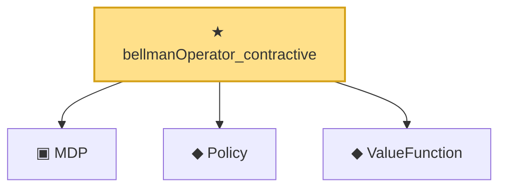

# Proof narrative — bellmanOperator_contractive

Root: **bellmanOperator_contractive** (theorem) `Statlib/RL/bellmanOperator_contractive.lean:19` · topic `RL`
Closure: 4 declarations across 4 files. Generated from `proof_graph.json` — no files were moved.

Reading order (foundations first, headline last):

  ▣ `MDP` — structure · `Statlib/RL/MDP.lean:41`  _(also used by 4: bellmanOperator, bellmanOperator_const, bellmanOperator_monotone, …)_
  ◆ `Policy` — def · `Statlib/RL/Policy.lean:9`  _(also used by 4: bellmanOperator, bellmanOperator_const, bellmanOperator_monotone, …)_
  ◆ `ValueFunction` — def · `Statlib/RL/ValueFunction.lean:9`  _(also used by 3: bellmanOperator, bellmanOperator_monotone, zeroValue)_
★ `bellmanOperator_contractive` — theorem · `Statlib/RL/bellmanOperator_contractive.lean:19` **← headline**

## Dependency diagram

