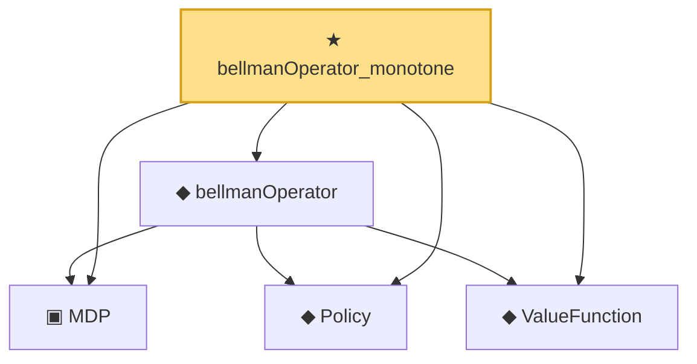

# Proof narrative — bellmanOperator_monotone

Root: **bellmanOperator_monotone** (theorem) `Statlib/RL/bellmanOperator_monotone.lean:14` · topic `RL`
Closure: 5 declarations across 5 files. Generated from `proof_graph.json` — no files were moved.

Reading order (foundations first, headline last):

  ▣ `MDP` — structure · `Statlib/RL/MDP.lean:41`  _(also used by 3: bellmanOperator_const, bellmanOperator_contractive, bellmanOperator_zero)_
  ◆ `Policy` — def · `Statlib/RL/Policy.lean:9`  _(also used by 3: bellmanOperator_const, bellmanOperator_contractive, bellmanOperator_zero)_
  ◆ `ValueFunction` — def · `Statlib/RL/ValueFunction.lean:9`  _(also used by 2: bellmanOperator_contractive, zeroValue)_
  ◆ `bellmanOperator` — def · `Statlib/RL/bellmanOperator.lean:13`  _(also used by 2: bellmanOperator_const, bellmanOperator_zero)_
★ `bellmanOperator_monotone` — theorem · `Statlib/RL/bellmanOperator_monotone.lean:14` **← headline**

## Dependency diagram

