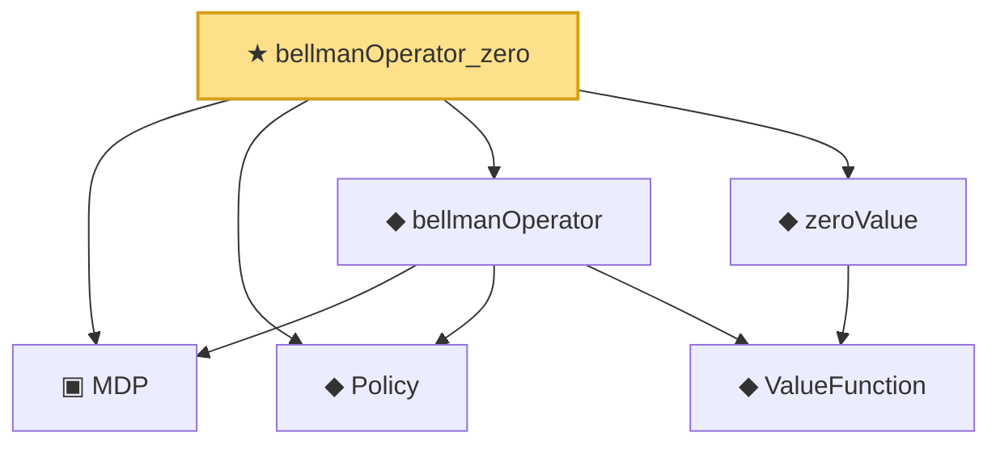

# Proof narrative — bellmanOperator_zero

Root: **bellmanOperator_zero** (theorem) `Statlib/RL/bellmanOperator_zero.lean:14` · topic `RL`
Closure: 6 declarations across 6 files. Generated from `proof_graph.json` — no files were moved.

Reading order (foundations first, headline last):

  ▣ `MDP` — structure · `Statlib/RL/MDP.lean:41`  _(also used by 3: bellmanOperator_const, bellmanOperator_contractive, bellmanOperator_monotone)_
  ◆ `Policy` — def · `Statlib/RL/Policy.lean:9`  _(also used by 3: bellmanOperator_const, bellmanOperator_contractive, bellmanOperator_monotone)_
    ◆ `ValueFunction` — def · `Statlib/RL/ValueFunction.lean:9`  _(also used by 2: bellmanOperator_contractive, bellmanOperator_monotone)_
  ◆ `bellmanOperator` — def · `Statlib/RL/bellmanOperator.lean:13`  _(also used by 2: bellmanOperator_const, bellmanOperator_monotone)_
  ◆ `zeroValue` — def · `Statlib/RL/zeroValue.lean:10`
★ `bellmanOperator_zero` — theorem · `Statlib/RL/bellmanOperator_zero.lean:14` **← headline**

## Dependency diagram

