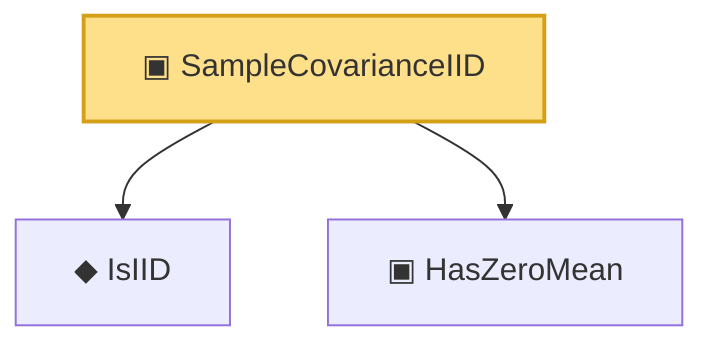

# Proof narrative — SampleCovarianceIID

Root: **SampleCovarianceIID** (structure) `Statlib/RandomMatrix/Vocabulary/Ensemble.lean:84` · topic `RandomMatrix`
Closure: 3 declarations across 3 files. Generated from `proof_graph.json` — no files were moved.

Reading order (foundations first, headline last):

  ◆ `IsIID` — def · `Statlib/StatFoundation/Vocabulary/Independence.lean:15`
  ▣ `HasZeroMean` — structure · `Statlib/HighDim/Vocabulary/RandomMatrix.lean:62`  _(also used by 9: matrix_integral_eq_zero_of_hasZeroMean, single_exp_integral_le_quadratic_matrix, single_trace_exp_integral_le_quadratic, …)_
▣ `SampleCovarianceIID` — structure · `Statlib/RandomMatrix/Vocabulary/Ensemble.lean:84` **← headline**

## Dependency diagram

