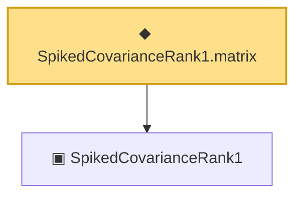

# Proof narrative — SpikedCovarianceRank1.matrix

Root: **SpikedCovarianceRank1.matrix** (noncomputable def) `Statlib/RandomMatrix/SpikedCovarianceRank1_matrix.lean:14` · topic `RandomMatrix`
Closure: 2 declarations across 2 files. Generated from `proof_graph.json` — no files were moved.

Reading order (foundations first, headline last):

  ▣ `SpikedCovarianceRank1` — structure · `Statlib/RandomMatrix/SpikedCovarianceRank1.lean:13`
◆ `SpikedCovarianceRank1.matrix` — noncomputable def · `Statlib/RandomMatrix/SpikedCovarianceRank1_matrix.lean:14` **← headline**

## Dependency diagram

