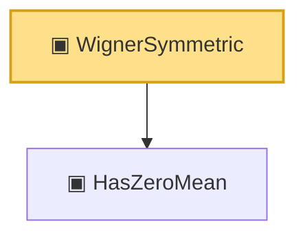

# Proof narrative — WignerSymmetric

Root: **WignerSymmetric** (structure) `Statlib/RandomMatrix/Vocabulary/Ensemble.lean:52` · topic `RandomMatrix`
Closure: 2 declarations across 2 files. Generated from `proof_graph.json` — no files were moved.

Reading order (foundations first, headline last):

  ▣ `HasZeroMean` — structure · `Statlib/HighDim/Vocabulary/RandomMatrix.lean:62`  _(also used by 9: matrix_integral_eq_zero_of_hasZeroMean, single_exp_integral_le_quadratic_matrix, single_trace_exp_integral_le_quadratic, …)_
▣ `WignerSymmetric` — structure · `Statlib/RandomMatrix/Vocabulary/Ensemble.lean:52` **← headline**

## Dependency diagram

