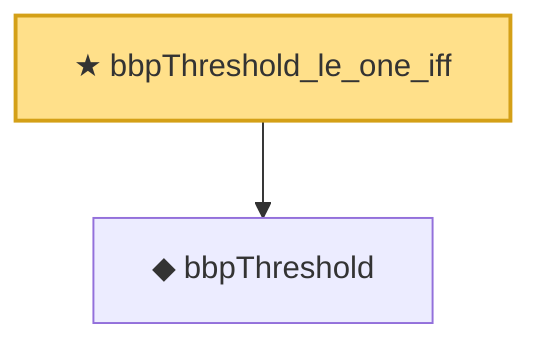

# Proof narrative — bbpThreshold_le_one_iff

Root: **bbpThreshold_le_one_iff** (theorem) `Statlib/RandomMatrix/bbpThreshold_le_one_iff.lean:12` · topic `RandomMatrix`
Closure: 2 declarations across 2 files. Generated from `proof_graph.json` — no files were moved.

Reading order (foundations first, headline last):

  ◆ `bbpThreshold` — noncomputable def · `Statlib/RandomMatrix/bbpThreshold.lean:13`  _(also used by 1: bbpThreshold_nonneg)_
★ `bbpThreshold_le_one_iff` — theorem · `Statlib/RandomMatrix/bbpThreshold_le_one_iff.lean:12` **← headline**

## Dependency diagram

