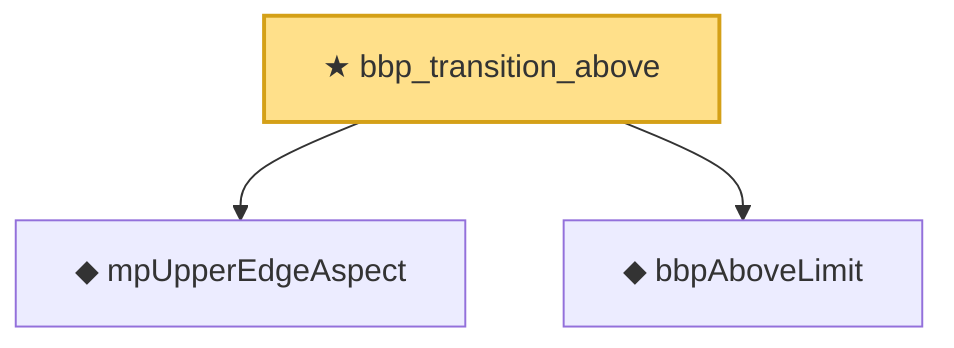

# Proof narrative — bbp_transition_above

Root: **bbp_transition_above** (theorem) `Statlib/RandomMatrix/bbp_transition_above.lean:19` · topic `RandomMatrix`
Closure: 3 declarations across 3 files. Generated from `proof_graph.json` — no files were moved.

Reading order (foundations first, headline last):

  ◆ `mpUpperEdgeAspect` — noncomputable def · `Statlib/RandomMatrix/mpUpperEdgeAspect.lean:13`  _(also used by 3: bbp_above_strictly_above_edge_of_spike_separated, mpUpperEdgeAspect_nonneg, mpUpperEdgeAspect_pos)_
  ◆ `bbpAboveLimit` — noncomputable def · `Statlib/RandomMatrix/bbpAboveLimit.lean:12`  _(also used by 1: bbp_above_strictly_above_edge_of_spike_separated)_
★ `bbp_transition_above` — theorem · `Statlib/RandomMatrix/bbp_transition_above.lean:19` **← headline**

## Dependency diagram

