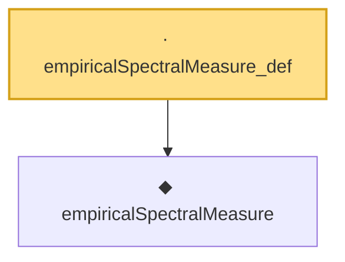

# Proof narrative — empiricalSpectralMeasure_def

Root: **empiricalSpectralMeasure_def** (lemma) `Statlib/RandomMatrix/empiricalSpectralMeasure_def.lean:18` · topic `RandomMatrix`
Closure: 2 declarations across 2 files. Generated from `proof_graph.json` — no files were moved.

Reading order (foundations first, headline last):

  ◆ `empiricalSpectralMeasure` — noncomputable def · `Statlib/RandomMatrix/empiricalSpectralMeasure.lean:20`  _(also used by 4: empiricalSpectralMeasure_isProbabilityMeasure, empiricalSpectralMeasure_zero, marchenko_pastur_convergence, …)_
· `empiricalSpectralMeasure_def` — lemma · `Statlib/RandomMatrix/empiricalSpectralMeasure_def.lean:18` **← headline**

## Dependency diagram

