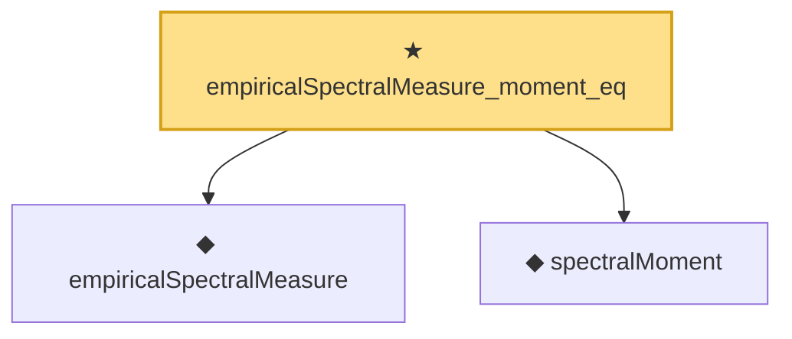

# Proof narrative — empiricalSpectralMeasure_moment_eq

Root: **empiricalSpectralMeasure_moment_eq** (theorem) `Statlib/RandomMatrix/SpectralMoment.lean:126` · topic `RandomMatrix`
Closure: 3 declarations across 3 files. Generated from `proof_graph.json` — no files were moved.

Reading order (foundations first, headline last):

  ◆ `empiricalSpectralMeasure` — noncomputable def · `Statlib/RandomMatrix/Vocabulary/SpectralMeasure.lean:43`
  ◆ `spectralMoment` — noncomputable def · `Statlib/RandomMatrix/Vocabulary/StieltjesTransform.lean:69`  _(also used by 1: spectralMoment_eq_trace_div_n)_
★ `empiricalSpectralMeasure_moment_eq` — theorem · `Statlib/RandomMatrix/SpectralMoment.lean:126` **← headline**

## Dependency diagram

