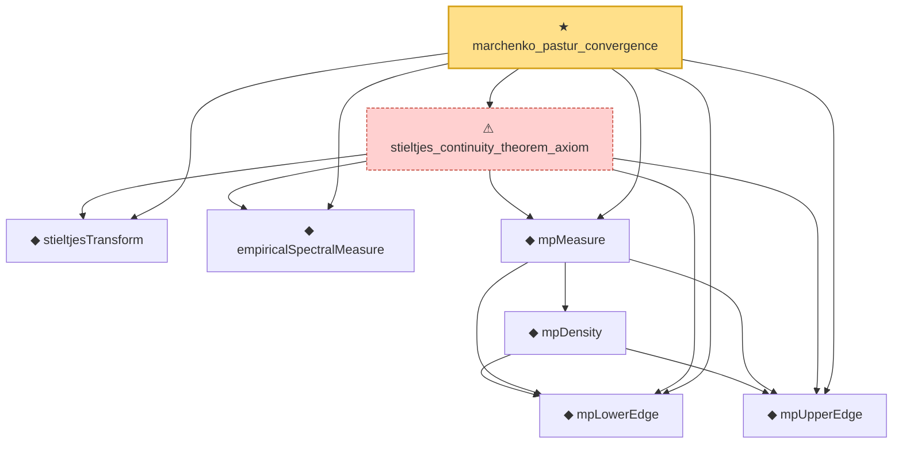

# Proof narrative — marchenko_pastur_convergence

Root: **marchenko_pastur_convergence** (theorem) `Statlib/RandomMatrix/marchenko_pastur_convergence.lean:35` · topic `RandomMatrix`
Closure: 8 declarations across 8 files. Generated from `proof_graph.json` — no files were moved.

Reading order (foundations first, headline last):

  ◆ `mpLowerEdge` — noncomputable def · `Statlib/RandomMatrix/mpLowerEdge.lean:17`  _(also used by 8: mpDensity_eq_zero_of_lt_lower, mpDensity_eq_zero_of_not_mem, mpDensity_nonneg, …)_
  ◆ `mpUpperEdge` — noncomputable def · `Statlib/RandomMatrix/mpUpperEdge.lean:17`  _(also used by 9: mpDensity_eq_zero_of_gt_upper, mpDensity_eq_zero_of_not_mem, mpDensity_nonneg, …)_
  ◆ `stieltjesTransform` — noncomputable def · `Statlib/RandomMatrix/stieltjesTransform.lean:18`  _(also used by 5: mpStieltjes_fixed_point, mpStieltjes_fixed_point_axiom, stieltjesTransform_dirac, …)_
  ◆ `empiricalSpectralMeasure` — noncomputable def · `Statlib/RandomMatrix/empiricalSpectralMeasure.lean:20`  _(also used by 3: empiricalSpectralMeasure_def, empiricalSpectralMeasure_isProbabilityMeasure, empiricalSpectralMeasure_zero)_
    ◆ `mpDensity` — noncomputable def · `Statlib/RandomMatrix/mpDensity.lean:20`  _(also used by 6: mpDensity_eq_zero_of_gt_upper, mpDensity_eq_zero_of_lt_lower, mpDensity_eq_zero_of_nonpos, …)_
  ◆ `mpMeasure` — noncomputable def · `Statlib/RandomMatrix/mpMeasure.lean:22`  _(also used by 4: mpMeasure_isProbabilityMeasure, mpMeasure_isProbabilityMeasure_axiom, mpStieltjes_fixed_point, …)_
  ⚠ `stieltjes_continuity_theorem_axiom` — axiom · `Statlib/RandomMatrix/stieltjes_continuity_theorem_axiom.lean:30`
★ `marchenko_pastur_convergence` — theorem · `Statlib/RandomMatrix/marchenko_pastur_convergence.lean:35` **← headline**

## Dependency diagram

