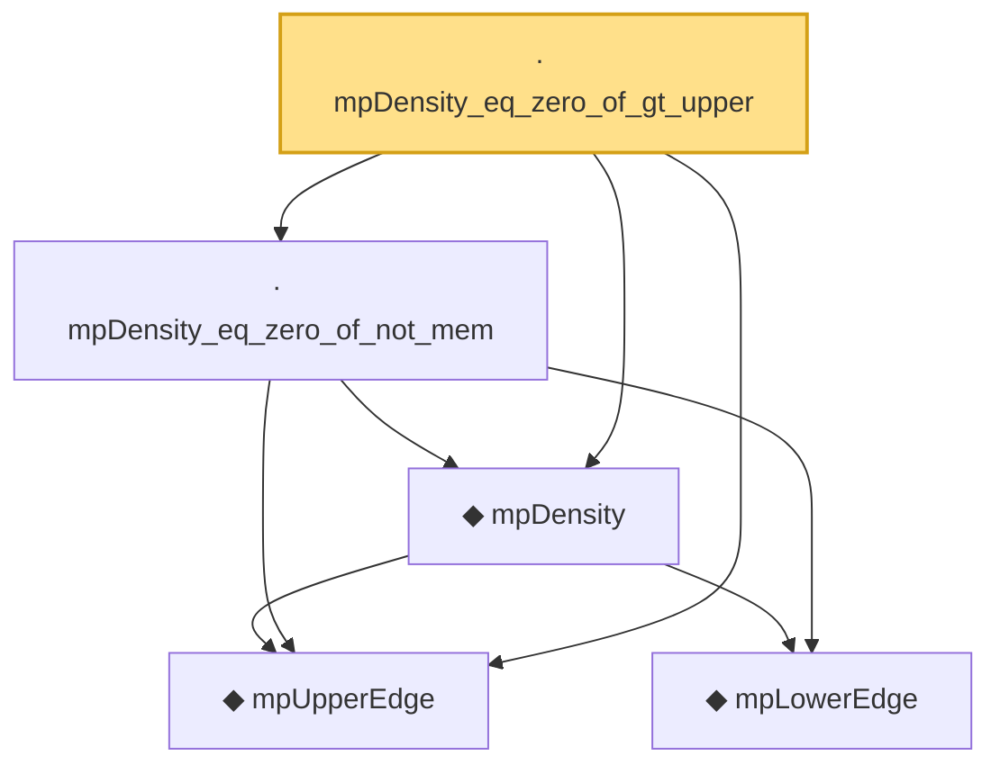

# Proof narrative — mpDensity_eq_zero_of_gt_upper

Root: **mpDensity_eq_zero_of_gt_upper** (lemma) `Statlib/RandomMatrix/mpDensity_eq_zero_of_gt_upper.lean:20` · topic `RandomMatrix`
Closure: 5 declarations across 5 files. Generated from `proof_graph.json` — no files were moved.

Reading order (foundations first, headline last):

  ◆ `mpUpperEdge` — noncomputable def · `Statlib/RandomMatrix/mpUpperEdge.lean:17`  _(also used by 10: marchenko_pastur_convergence, mpDensity_nonneg, mpDensity_zero_of_gamma_zero, …)_
    ◆ `mpLowerEdge` — noncomputable def · `Statlib/RandomMatrix/mpLowerEdge.lean:17`  _(also used by 10: marchenko_pastur_convergence, mpDensity_eq_zero_of_lt_lower, mpDensity_nonneg, …)_
  ◆ `mpDensity` — noncomputable def · `Statlib/RandomMatrix/mpDensity.lean:20`  _(also used by 5: mpDensity_eq_zero_of_lt_lower, mpDensity_eq_zero_of_nonpos, mpDensity_nonneg, …)_
  · `mpDensity_eq_zero_of_not_mem` — lemma · `Statlib/RandomMatrix/mpDensity_eq_zero_of_not_mem.lean:20`  _(also used by 2: mpDensity_eq_zero_of_lt_lower, mpDensity_eq_zero_of_nonpos)_
· `mpDensity_eq_zero_of_gt_upper` — lemma · `Statlib/RandomMatrix/mpDensity_eq_zero_of_gt_upper.lean:20` **← headline**

## Dependency diagram

